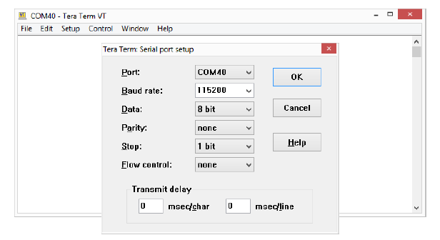

<table class="sphinxhide">
 <tr>
   <td align="center"><h1> ZCU670 Evaluation Kit Tutorial </h1>
   </td>
 </tr>
 <tr>
 <td align="center"><h1> Board Setup and Application Deployment</h1>

 </td>
 </tr>
</table>

Setting up the Board and Application Deployment
===============================================

Introduction
------------
This document shows how to set up the board and run the ZCU670 Ethernet TRD application with prebuilt images.

###  Prerequisites

 * Reference design package `zcu670_ethernet_trd_2023.1.zip` file
 
 * ZCU670 Evaluation Board with power cable - 2 No.
 
 * Micro-USB cable for the terminal emulation.

 * Micro SD card
 
 * UART Driver (FTDI CDM ).

 * Terminal emulator, for example:

      Windows: teraterm (Refer to <a href="https://docs.xilinx.com/v/u/en-US/ug1036-tera-term-install">UG1036 </a> regarding Tera Term installation)

      Linux: picocom (https://github.com/npat-efault/picocom/releases)

 * 25G SFP28 copper cable.
  
 * Iperf3 (v 3.9) application.
 
 * ptp4l (v 3.1.1)
 
### Board Setup

The following figure shows the ZCU670 evaluation board set up.


  **Board jumper and switch settings**

This is a one-time setup and the board should have been delivered to you with this default setting, however it is good to double check for the first time when you get the board.

* Setup Boot Mode switch SW2 to (ON,OFF,OFF,OFF) from switch bits 1 to 4 as shown in the above image to set the board in SD BOOT mode.

* Connect SFP28 cable between the SFP28 port of Board-1 and SFP28 port of Board-2.
 
### Flash the SD Card
 
  1. Unzip the package and save it on your computer. 
  
  2. Navigate to the `../zcu670-ethernet-trd-2023.1/prebuilt` folder.
  
  3. Prepare the SD card. There are many options to format the SD Card in the windows tool. But, always format with FAT32 option. Use the SD Card Formatter tool to format the SD card <a href="https://www.sdcard.org/downloads/formatter_4/">SD Card Formatter </a> 
	 
	 .
  
  4. Copy `BOOT.BIN, image.ub and boot.scr` to microSD card.
  
  5. Connect the microSD card to the Board.  
  
  6. Repeat steps 3 , 4 and 5 for the second Board. 
    
### GT Reference clocks

The GT Reference clocks required for the design are configured by the Renesas IDT drivers while booting. The 8A34001 chip is the clock source for IEEE 1588 and Synchronous Ethernet (SyncE) based clocks.


### UART Driver Install

Prior to connecting and powering on the ZCU670, install the FTDI CDM Drivers <a href="https://www.ftdichip.com/Drivers/CDM/CDM21228_Setup.zip">FTDI CDM Driver </a>  
 
 


### SD Boot Mode:
 
  * Connect the power supply to the ZCU670 (J52) port and Power on the board

> * Note: Ensure the Boot Mode switch SW2 to (ON,OFF,OFF,OFF).

**Serial console settings**

ZCU670 comes with a micro USB connector for JTAG+UART. Connect a Type-A to micro USB cable between the USB UART JTAG (FTDI) connector (J83) of the ZCU670 board and the PC. 

The PC will enumerate and shows three COM ports.

* UART0 (PS)

* UART1 (PL)

* System Controller UART

In a terminal emulator, connect to UART0 using the following settings:

* Baud Rate: 115200

* Data: 8 bit

* Parity: None

* Stop: 1 bit

* Flow Control: None



* After a successful boot, a shell prompt will appear as shown below.
   ```  
   zcu670-xilinx-2023.1 login: 
   ```   
* Login with the username ‘petalinux’ and create a New password when prompted.

* To configure the Ethernet interfaces, make sure to log in as super user using the New password created.
   ```
  zcu670-xilinx-2023.1:~$:sudo su
   ```  
### Running the applications on board

Once the zcu670 boards are booted, set up an IP address for the interface (in this case eth1) and make sure the Ethernet link is established between boards. Do not proceed until you are able to ping between boards.

> * Note: If the link is not established, use the below commands once and ensure the link is up.
   ```  	
	ifconfig <interface_name> down	
	ifconfig <interface_name> <IP-address> up
   ```  
By default the interface links up at **25G**. 

> * Note: While making the interface up, make sure a valid IP address is set for the interface.


## PTP commands

### Phase Synchronization
	
**Master:**
   
   * Run ptp4l in master mode:
   ```     
	Board-1 > ptp4l -i <interface-name> -f  /usr/bin/linkpartner_G.8275.1.cfg -m
   ```
**ptp4l master side log** :
	
   ``` 
	ptp4l[422.355]: selected /dev/ptp1 as PTP clock
	xilinx-zcu670-20231:/home/petalinux# ptp4l[422.392]: port 1: INITIALIZING to LISTENING on INIT_COMPLETE
	ptp4l[422.392]: port 0: INITIALIZING to LISTENING on INIT_COMPLETE
	ptp4l[422.817]: port 1: LISTENING to MASTER on ANNOUNCE_RECEIPT_TIMEOUT_EXPIRES
	ptp4l[422.817]: selected local clock 9a11bc.fffe.62d209 as best master
	ptp4l[422.817]: port 1: assuming the grand master role
  ``` 

**Slave:**	
   
   * Run ts2phc between Renesas ClockMatrix PHC and Xilinx Timer-Syncer PHC in background:
   ``` 
    Board-2 > ts2phc -m -c <interface-name> -s /dev/ptp0 -f /usr/bin/ts2phc.cfg &
   ``` 
**ts2phc log** :	
	
   ``` 
	PTP_PIN_SETFUNC2 failed: Invalid argument
	ts2phc[521.912]: Failed to set the pin. Continuing bravely on...
   ``` 

> * **Note: This message can be ignored because the Renesas ClockMatrix PHC driver does not support dynamic PTP_PIN_SETFUNC. For more details refer [Renesas Phase Adjust quick start manual](https://www.renesas.com/us/en/document/mas/linux-ptp-using-phc-adjust-phase-quick-start-manual) or Use -l option.**
   
   * Run ptp4l in slave mode:

> * Note: Ensure that only one instance of ptp4l master is running in Link partner.   

   ``` 	
	Board-2 > ptp4l -m -q -p /dev/ptp0 -s -f /usr/bin/standalone_G.8275.1.cfg
   ```     

   **ptp4l phase synchronization log** :	

   ``` 
	ptp4l[530.543]: selected /dev/ptp0 as PTP clock
	ptp4l[530.546]: port 1: taking /dev/ptp0 from the command line, not the attached ptp1
	xilinx-zcu670-20231:/home/petalinux# ptp4l[530.588]: port 1: INITIALIZING to LISTENING on INIT_COMPLETE
	ptp4l[530.588]: port 0: INITIALIZING to LISTENING on INIT_COMPLETE
	ptp4l[530.673]: port 1: new foreign master 9a11bc.fffe.62d209-1
	ptp4l[530.923]: selected best master clock 9a11bc.fffe.62d209
	ptp4l[530.923]: port 1: LISTENING to UNCALIBRATED on RS_SLAVE
	ptp4l[531.303]: port 1: UNCALIBRATED to SLAVE on MASTER_CLOCK_SELECTED
	ptp4l[531.990]: rms 937470829990502912 max 1676998802225530368 freq  -1588 +/- 63277 delay -59892814365198016 +/- 215946613225567776
	ptp4l[532.991]: rms 2629 max 3787 freq  +5008 +/- 3793 delay   167 +/-  94
	ptp4l[533.991]: rms 3208 max 3803 freq  -2030 +/- 660 delay    52 +/-  19
	ptp4l[534.991]: rms 1209 max 2025 freq  -1957 +/- 389 delay    52 +/-  17
	ptp4l[535.991]: rms  169 max  270 freq   -687 +/- 290 delay    66 +/-   6
	ptp4l[536.992]: rms  226 max  255 freq   -112 +/-  63 delay    74 +/-   2
	ptp4l[537.992]: rms   99 max  159 freq    -78 +/-  23 delay    75 +/-   2
	ptp4l[538.992]: rms   13 max   30 freq   -166 +/-  22 delay    74 +/-   1
	ptp4l[539.993]: rms   16 max   18 freq   -211 +/-   6 delay    73 +/-   1
	ptp4l[540.993]: rms    8 max   12 freq   -217 +/-   1 delay    73 +/-   0
	ptp4l[541.993]: rms    1 max    2 freq    -13 +/-  51 delay    73 +/-   0
   ```

### Frequency Synchronization

> * **Note: Before running frequency syncronization kill all instance of ts2phc running background.**

* Run ptp4l in master mode:
  ``` 
  Board -1 > ptp4l -i <interface-name> -m
  
  or vice versa
  ``` 
 
**ptp4l master side log**:
   ```
	ptp4l[6195.490]: selected /dev/ptp1 as PTP clock
	ptp4l[6195.491]: port 1: INITIALIZING to LISTENING on INIT_COMPLETE
	ptp4l[6195.492]: port 0: INITIALIZING to LISTENING on INIT_COMPLETE
	ptp4l[6203.369]: port 1: LISTENING to MASTER on ANNOUNCE_RECEIPT_TIMEOUT_EXPIRES
	ptp4l[6203.370]: selected local clock 9a11bc.fffe.62d209 as best master
	ptp4l[6203.370]: port 1: assuming the grand master role
   ```

* Run ptp4l in slave mode:
   ```
    Board -2 > ptp4l -i <interface_name> -m -s
	
	or vice versa
   ```
**ptp4l frequency synchronization slave side log**:
   ```
    ptp4l[6276.202]: selected /dev/ptp1 as PTP clock
	ptp4l[6276.203]: port 1: INITIALIZING to LISTENING on INIT_COMPLETE
	ptp4l[6276.204]: port 0: INITIALIZING to LISTENING on INIT_COMPLETE
	ptp4l[6277.829]: port 1: new foreign master 9a11bc.fffe.62d209-1
	ptp4l[6281.829]: selected best master clock 9a11bc.fffe.62d209
	ptp4l[6281.829]: port 1: LISTENING to UNCALIBRATED on RS_SLAVE
	ptp4l[6284.829]: master offset    -429840 s0 freq      +0 path delay       101
	ptp4l[6285.829]: master offset    -430012 s1 freq    -172 path delay       119
	ptp4l[6286.829]: master offset         20 s2 freq    -152 path delay       119
	ptp4l[6286.829]: port 1: UNCALIBRATED to SLAVE on MASTER_CLOCK_SELECTED
	ptp4l[6287.829]: master offset         36 s2 freq    -130 path delay       101
	ptp4l[6288.829]: master offset         37 s2 freq    -118 path delay        77
	ptp4l[6289.829]: master offset         -3 s2 freq    -147 path delay        82
	ptp4l[6290.829]: master offset         -4 s2 freq    -149 path delay        77
	ptp4l[6291.829]: master offset         -8 s2 freq    -154 path delay        77
	ptp4l[6292.829]: master offset         -5 s2 freq    -154 path delay        76
	ptp4l[6293.829]: master offset         -4 s2 freq    -154 path delay        75
	ptp4l[6294.829]: master offset         -3 s2 freq    -154 path delay        74
	ptp4l[6295.829]: master offset         -1 s2 freq    -153 path delay        73
   ```
> * **Note: For more details refer [Linux PTP Project source files and Documentation](https://linuxptp.sourceforge.net/)**
   
## Iperf Commands

> * **Note: Make sure to apply taskset to appropriate CPU core while running iperf traffic as shown in below commands.**

> * While running iperf traffic and ptp4l simultaneously, run either of the one in background.


**TCP TX** 

* Sender:
   ``` 	
   echo 2 > /proc/irq/<tx-irq-no>/smp_affinity 
   taskset -c 2 iperf3 -c <Link partner IP> -T s1 -p 5301 -t 60 -i 60 -b 1850M &
   taskset -c 3 iperf3 -c <Link partner IP> -T s2 -p 5302 -t 60 -i 60 -b 1850M &
   ``` 
* Receiver:
   ```
   iperf3 -s -p 5301 &  
   iperf3 -s -p 5302 &
   
   echo 2 > /proc/irq/<rx-irq-no>/smp_affinity
   echo 32768 > /proc/sys/net/core/rps_sock_flow_entries
   echo 2048 > /sys/class/net/eth1/queues/rx-0/rps_flow_cnt
   echo 2048 > /sys/class/net/eth1/queues/rx-1/rps_flow_cnt
   
   ```  
**UDP TX** 

* Sender:
   ``` 	
   echo 2 > /proc/irq/<tx-irq-no>/smp_affinity 
   taskset -c 0 iperf3 -u -c <Link partner IP> -T s1 -p 5301 -t 60 -i 60 -b 450M &
   taskset -c 1 iperf3 -u -c <Link partner IP> -T s2 -p 5302 -t 60 -i 60 -b 450M &
   taskset -c 2 iperf3 -u -c <Link partner IP> -T s3 -p 5303 -t 60 -i 60 -b 450M &
   taskset -c 3 iperf3 -u -c <Link partner IP> -T s4 -p 5304 -t 60 -i 60 -b 450M &
   ```
* Receiver:
   ``` 
   iperf3 -s -p 5301 &  
   iperf3 -s -p 5302 &
   iperf3 -s -p 5303 &  
   iperf3 -s -p 5304 &
   
   echo 2 > /proc/irq/<rx-irq-no>/smp_affinity
   echo 32768 > /proc/sys/net/core/rps_sock_flow_entries
   echo 2048 > /sys/class/net/eth1/queues/rx-0/rps_flow_cnt
   echo 2048 > /sys/class/net/eth1/queues/rx-1/rps_flow_cnt
   ```
**TCP RX** 

* Sender:
   ``` 	
   echo 2 > /proc/irq/<tx-irq-no>/smp_affinity 
   taskset -c 2 iperf3 -c <Link partner IP> -P 2 -T s1 -p 5301 -t 60 -i 60 -b 500M &
   taskset -c 3 iperf3 -c <Link partner IP> -P 2 -T s2 -p 5302 -t 60 -i 60 -b 500M &
   ``` 
* Receiver:
   ``` 
   taskset -c 2 iperf3 -s -p 5301 &  
   taskset -c 3 iperf3 -s -p 5302 &
   
   echo 2 > /proc/irq/<rx-irq-no>/smp_affinity
   echo 32768 > /proc/sys/net/core/rps_sock_flow_entries
   echo 2048 > /sys/class/net/eth1/queues/rx-0/rps_flow_cnt
   echo 2048 > /sys/class/net/eth1/queues/rx-1/rps_flow_cnt
   ```
 
**UDP RX** 
* Sender:
   ```
   echo 2 > /proc/irq/<tx-irq-no>/smp_affinity 
   taskset -c 2 iperf3 -c <Link partner IP> -u -P 2 -T s1 -p 5301 -t 60 -i 60 -b 2500M -l 1448 &
   taskset -c 3 iperf3 -c <Link partner IP> -u -P 2 -T s2 -p 5302 -t 60 -i 60 -b 2500M -l 1448 &
   ```    
* Receiver:
   ``` 
   taskset -c 2 iperf3 -s -p 5301 &  
   taskset -c 3 iperf3 -s -p 5302 &
   
   echo 2 > /proc/irq/<rx-irq-no>/smp_affinity
   echo 32768 > /proc/sys/net/core/rps_sock_flow_entries
   echo 2048 > /sys/class/net/eth1/queues/rx-0/rps_flow_cnt
   echo 2048 > /sys/class/net/eth1/queues/rx-1/rps_flow_cnt   
   ```  

### Next Steps

* [Building the TRD source Files](build_vivado_design.md)
* Go back to the [zcu670 Targeted Reference Designs start page](../platform_landing.md)

**References**

* ZYNQ ULTRASCALE+ ZCU670 Quick Start Guide ([ZCU670](https://xilinx-wiki.atlassian.net/wiki/spaces/A/pages/1887797340/ZCU670+Quick+Start+Guide))

## License

Licensed under the Apache License, Version 2.0 (the "License"); you may not use this file except in compliance with the License.

You may obtain a copy of the License at
[http://www.apache.org/licenses/LICENSE-2.0](http://www.apache.org/licenses/LICENSE-2.0)

Unless required by applicable law or agreed to in writing, software distributed under the License is distributed on an "AS IS" BASIS, WITHOUT WARRANTIES OR CONDITIONS OF ANY KIND, either express or implied. See the License for the specific language governing permissions and limitations under the License.

<p align="center">Copyright&copy; 2023 Xilinx</p>
