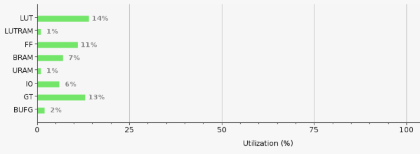

<table class="sphinxhide">
 <tr>
   <td align="center"><h1> RFSoC-ZCU670 Evaluation Kit Tutorial </h1>
   </td>
 </tr>
 <tr>
 <td align="center"><h1> Hardware Architecture of the Platform </h1>

 </td>
 </tr>
</table>

Hardware Architecture of the Platform
=====================================

Introduction
---------------
 This section describes the hardware architecture of the design implemented on the ZCU670 board. The following figure shows the top level hardware architecture of the reference design. The details of various components used in the platform is described in the following section.

* Processor Subsystem (PS):
The PS present in RFSoC devices contains high performance ARM A53 processors. On-chip and cache memory are included along with a suite of hardened communication peripherals. ARM A53 device can access the 2GBytes of DDR RAM.

* Programmable Logic (PL)
This contains the following main IP:

  * XXV Media Access Control (XXV MAC) 
  
    The XXV MAC IP has AXI stream ports at the transmit and receive ends. The ethernet packets are transmitted/received via these AXI streaming ports. It has an AXI-Lite interface for accessing the control information of the IP.

  * Quad Base Gigabit Transceiver Interface (GTY) 
  
    The Quad Base GT receives ethernet data from the external world and transmits it to the XXV MAC IP. It also takes the Ethernet data from XXV MAC and transmits it to the outside     world.

  * AXI Direct Memory Access (AXI-MCDMA) 
  
    This is a standard AXI Multi Channel Direct Memory Access IP used in the PL. This facilitates the transfer of the Ethernet packets to the XXV MAC for MAC processing.

  * Tx PTP HW Master on the Transmission path to detect PTP packet and store timestamp in memory.

  * Rx PTP logic to detect PTP packets and prepend the PTP Timestamps to all received packets. 
  
The following is the packet flow for the normal Ethernet packets in both direction:

* Transmit:

  o The Ethernet data generated and stored in the memory.

  o This data is transferred to the XXV MAC via AXI MCDMA MM2S interface.

  o The XXV MAC, after processing the packets transmits it to the GTY.

  o The GTY Transmits this data to the output onto the Ethernet link.

  o The GTY output is connected to an external Link partner . This Link partner receives the ethernet packets.

* Receive:

  o The External Link partner generates Ethernet packets.
	
  o This data is received at the GT interface.
	
  o From the GT, the data is transferred to XXV MAC.
	
  o The XXV MAC sends this data via the streaming interface to the S2MM port of AXI MCDMA.
	
  o The AXI MCDMA writes this data onto the memory.
  
* For the PTP Packets, the PL based PTP Packet processors are used in both Transmit and Receive directions.

* In the Transmit direction, the PTP Packet processor is present between AXI MCDMA control stream and XXV MAC Tx interfaces.

* In the Receive direction, the PTP Packet processor is present between XXV MAC Rx and AXI MCDMA S2MM interfaces.

* Further details on the PTP Packet processors can be found in this page. [Hardware Architecture of the PTP Packet Processor](hw_arch_ptp_pkt_proc.md)

Resource Utilization
--------------------------

 

**Next Steps**

* [Hardware Architecture of the PTP Packet Processor](hw_arch_ptp_pkt_proc.md)
* Go back to the [ZCU670 Ethernet TRD design start page](../platform_landing.md)

**License**

Licensed under the Apache License, Version 2.0 (the "License"); you may not use this file except in compliance with the License.

You may obtain a copy of the License at
[http://www.apache.org/licenses/LICENSE-2.0](http://www.apache.org/licenses/LICENSE-2.0)

Unless required by applicable law or agreed to in writing, software distributed under the License is distributed on an "AS IS" BASIS, WITHOUT WARRANTIES OR CONDITIONS OF ANY KIND, either express or implied. See the License for the specific language governing permissions and limitations under the License.

Copyright&copy; 2023 Xilinx

