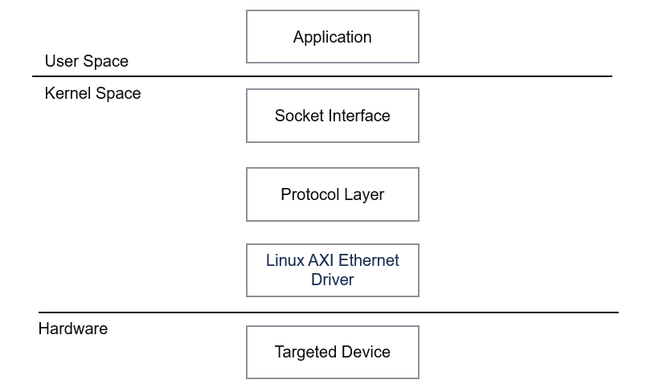

<table class="sphinxhide">
 <tr>
   <td align="center"><h1> ZCU670 Evaluation Kit Tutorial</h1>
   </td>
 </tr>
 <tr>
 <td align="center"><h1> Software Architecture of the Platform </h1>

 </td>
 </tr>
</table>

Software Architecture of the Platform
======================================

Introduction
-------------------

The ZCU670 Ethernet platform design uses the AXI Ethernet driver present in Linux kernel to configure XXV MAC and initialize a lane of 25G ethernet rate. The driver initializes MCDMA’s S2MM and MM2S channel descriptors and enables them to transfer data to and from system memory. The driver also does interrupt handling when a packet is received or transmitted via DMA.

>Note: Please refer [AXI Ethernet driver](https://xilinx-wiki.atlassian.net/wiki/spaces/A/pages/18842485/Linux+AXI+Ethernet+driver) for more details.

* This AXI Ethernet driver supports 1588 functionality with Xilinx PTP timer-syncer driver (drivers/ptp/ptp_xilinx.c).
* The Ethernet driver handles HW timestamps. PTP timer-syncer driver initializes the timer-syncer IP and also adjusts the same for synchronization (when device is PTP client).
* Xilinx timer-syncer supports 1PPS input from an external device (Renesas 8A34001 in this case, on zcu670 board). A timer snapshot is provided (via registers) at the time of the  1PPS HW event and an interrupt is generated, if so configured.
* PTP driver ( ptp_xilinx.c ) supports this 1PPS event via an interrupt handler and reads the corresponding timer snapshot. 
* `ts2phc` application uses the 1PPS capabilities of Timer-syncer and on board Renesas device and time-synchronizes both the timers.
* ZCU670 TRD uses this complete solution to synchronize with an external grand master clock. This includes phase synchronization. For more details refer [Renesas Phase Adjust quick start manual](https://www.renesas.com/us/en/document/mas/linux-ptp-using-phc-adjust-phase-quick-start-manual).
* This solution is supported with the standard linuxptp user space application.
* The TRD supports a PL based PTP packet processing solution where HW shares Transmit timestamp via DMA control stream/USR-APP fields and Receive timestamp in-band via data stream. 

Timestamp Handling for PL based PTP Packet Processing solution
----------------------------------------------------------------------------

* Transmit Timestamp Handling:
	1) Software provides required metadata information as per PTP needs in USR-APP fields of the descriptor when queuing a PTP packet. This implementation chooses APP2 as the destination for Timestamps.
	2) Upon transmit completion, SW checks for PTP packets and the corresponding qualifier bit in USR-APP fields and takes necessary action, including passing the TS to higher layers.

* Receive Timestamp Handling:
	1) SW processes received packets and checks for PTP packet qualifier bit to be set. The timestamp is then extracted from the first 16 bytes of datastream and passed to the upper layers.
	2) SW discards this dummy precursor bytes for all non-PTP packets.
 
 
**Next Steps**

You can choose any of the following next steps:

* Go to the [Application deployment page](app_deployment.md)
* Go back to the [ZCU670 Ethernet TRD start page](../platform_landing.md)

**License**

Licensed under the Apache License, Version 2.0 (the "License"); you may not use this file except in compliance with the License.

You may obtain a copy of the License at
[http://www.apache.org/licenses/LICENSE-2.0](http://www.apache.org/licenses/LICENSE-2.0)

Unless required by applicable law or agreed to in writing, software distributed under the License is distributed on an "AS IS" BASIS, WITHOUT WARRANTIES OR CONDITIONS OF ANY KIND, either express or implied. See the License for the specific language governing permissions and limitations under the License.

Copyright&copy; 2023 Xilinx

