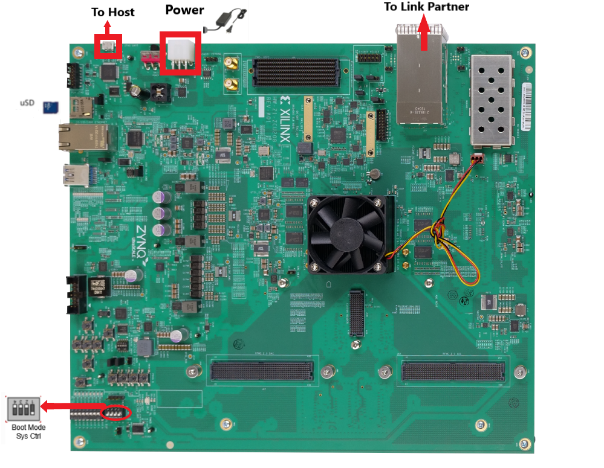
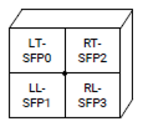
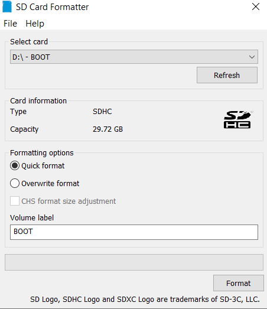
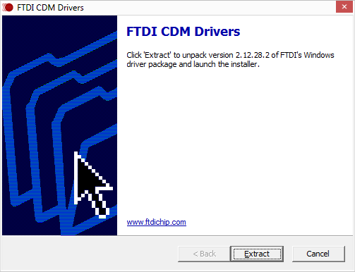
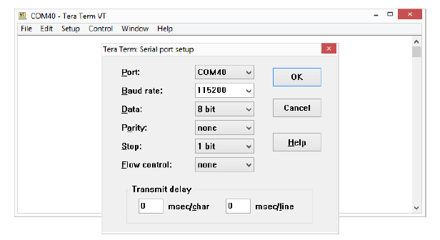
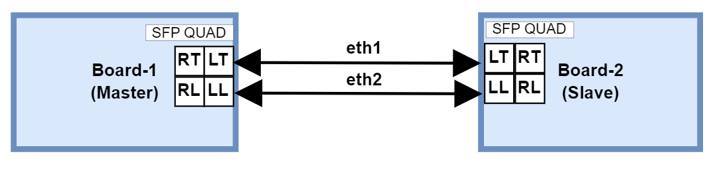
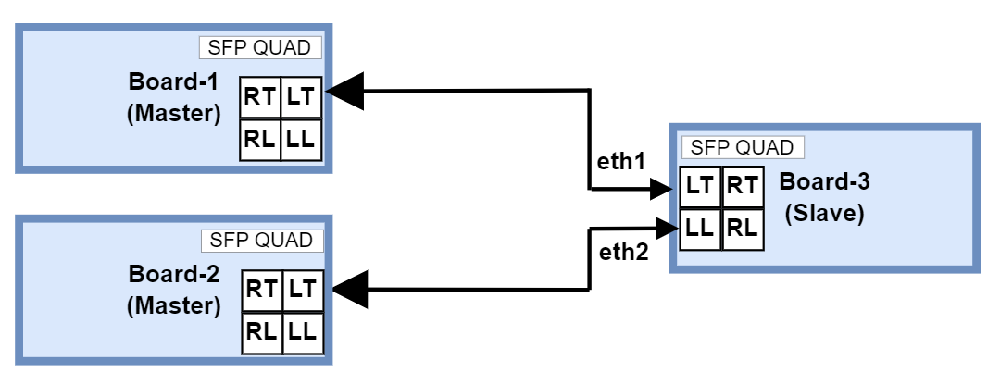

<table class="sphinxhide">
 <tr>
   <td align="center"><h1> ZCU670 Evaluation Kit Tutorial </h1>
   </td>
 </tr>
 <tr>
 <td align="center"><h1> Board Setup and Application Deployment</h1>

 </td>
 </tr>
</table>

Setting up the Board and Application Deployment
===============================================

Introduction
------------
This document shows how to set up the board and run the ZCU670 Ethernet TRD application with prebuilt images.

###  Prerequisites

 * Reference design package `zcu670_ethernet_trd_2024.1.zip` file
 
 * ZCU670 Evaluation Board with power cable - 3 nos.
 
 * Micro-USB cables for the terminal emulation.

 * Micro SD cards
 
 * UART Driver (FTDI CDM).

 * Terminal emulator, for example:

      Windows: teraterm (Refer to <a href="https://docs.xilinx.com/v/u/en-US/ug1036-tera-term-install">UG1036 </a> regarding Tera Term installation)

      Linux: picocom <a href="https://github.com/npat-efault/picocom/releases">Picocom </a>

 * 25G SFP28 copper cable - 3 nos  ([SFP28 cable](https://www.fs.com/products/65868.html?attribute=9360&id=2018970))
  
 * Iperf3 (v 3.12) application.
 
 * ptp4l (v 4.3)
 
### Board Setup

The following figure shows the ZCU670 evaluation board.



  **Board jumper and switch settings**

This is a one-time setup and the board should have been delivered to you with this default setting, however it is good to double check for the first time when you get the board.

* Setup Boot Mode switch **SW2** to (ON,OFF,OFF,OFF) from switch bits 1 to 4 as shown in the above image to set the board in SD BOOT mode.

* Connect two SFP28 cables between Board-1 and Board-2, connecting the Left Top (LT) slot of one board to other board using a cable and the Left Low (LL) slot of one board to other board using an another cable. The SFP quad (J29) layout diagram is shown below.

 
 
### Flash the SD Card
 
  1. Unzip the package and save it on your computer. 
  
  2. Navigate to the `../zcu670-ethernet-trd-2024.1/prebuilt` folder.
  
  3. Prepare the SD card. There are many options to format the SD Card in the windows tool. But, always format with FAT32 option. Use the SD Card Formatter tool to format the SD card <a href="https://www.sdcard.org/downloads/formatter_4/">SD Card Formatter </a> 
	 
	 .
  
  4. Navigate to ``zcu670_25G_PTP_subsys`` or ``zcu670_10G_PTP_subsys`` folder to Copy `BOOT.BIN, image.ub and boot.scr` to microSD card.
  
  5. Connect the microSD card to the Board.  
  
  6. Repeat steps 3 , 4 and 5 for the second Board. 
    
### GT Reference clocks

The  Renesas 8A34001 synchronization management unit (SMU) chip is the clock source for GT, IEEE 1588 PTP and Synchronous Ethernet (SyncE).  For more details on programming and controlling the 8A34001 chip, refer 8A34001 <a href="https://www.renesas.com/en/products/clocks-timing/application-specific-clocks/network-synchronization/ieee-1588-and-synchronous-ethernet-clocks/8a34001-system-synchronizer-ieee-1588-eight-channels"> Data sheet. </a> 

The GT Reference clock and other clocks required for PTP, syncE are configured by the IDT drivers while booting. The clock configuration files and the binaries used for configuring 8A34001 chip is given in `../zcu670-ethernet-trd-2024.1/IDT` folder.

### UART Driver Install

Prior to connecting and powering on the ZCU670, install the FTDI CDM Drivers <a href="https://www.ftdichip.com/Drivers/CDM/CDM21228_Setup.zip">FTDI CDM Driver </a>  
 
 


### SD Boot Mode:
 
  * Connect the power supply to the ZCU670 (J52) port and Power on the board

> * **Note:** Ensure the Boot Mode switch SW2 to (ON,OFF,OFF,OFF).

**Serial console settings**

ZCU670 comes with a micro USB connector for JTAG+UART. Connect a Type-A to micro USB cable between the USB UART JTAG (FTDI) connector (J83) of the ZCU670 board and the PC. 

The PC will enumerate and shows three COM ports.

* UART0 (PS)

* UART1 (PL)

* System Controller UART

In a terminal emulator, connect to UART0 using the following settings:

* Baud Rate: 115200

* Data: 8 bit

* Parity: None

* Stop: 1 bit

* Flow Control: None



* After a successful boot, a shell prompt will appear as shown below.
   ```  
   xilinx-zcu670-20241 login:: 
   ```   
* Login with the username **petalinux** and create a new password when prompted.

* To configure the Ethernet interfaces, make sure to log in as super user using the new password created.
   ```
  xilinx-zcu670-20241:~$:sudo su
   ```  
### Running the applications on board

Once the zcu670 boards are booted, set up an IP address for the interface (in this case eth1 and eth2) and make sure the Ethernet link is established between boards. Do not proceed until you are able to ping between boards.

> * **Note:** If the link is not established, use the below commands once and ensure the link is up.
   ```  	
	ifconfig <interface_name> down	
	ifconfig <interface_name> <IP-address> up
   ```  
> * **Note:** While making the interface up, make sure a valid IP address is set for the interface.

###  Synchronous Ethernet (SyncE) commands
> * **Note:** SyncE test can be performed between ZCU670 and an external protocol tester or other SyncE compatible device.

#### SyncE master slave Test:
In this test two zcu670 boards are used to test the transfer of Synchronization Status Message (SSM) between two boards over the SyncE Ethernet Synchronization Message Channel (ESMC). The test assumes one board as master (Board-1) and the second board (Board-2) as slave.



**SyncE Master:** 

* Run synced on master board.
```     
Board-1 > synced -f /usr/bin/synced_master.cfg
```
> * **Note:** To validate the transfer of SSM messages between master and slave boards, Quality level (QL) of master side clock is configured as Primary Reference Time Clock (PRTC) and slave side as Synchronous Equipment Clock (SEC) in order to make the slave device locked to master clock. For more details about syncE configurations refer [Renesas SyncE Source](https://github.com/renesas/synced/tree/main).

**synced master side log** :

The synced log is given below.

<details>
<summary>Click to expand </summary>

```
xilinx-zcu670-20241:/home/petalinux# synced -f /usr/bin/synced_master.cfg
synced[30032.894]: ---Started synced (version: 2.0.5.310964.b166f770 Mar 21 2024 20:32:02)---
synced[30032.894]: Opened configuration file /usr/bin/synced_master.cfg:
# amd_zcu670.cfg

#
# Global parameters
#
[global]
net_opt 1
no_ql_en 0
synce_forced_ql_en 1
lo_ql PRTC
lo_pri 255
max_msg_lvl 7
stdout_en 1
syslog_en 0
# Device configuration file path (applicable for generic device)
device_cfg_file ""
device_name /dev/rsmu0
synce_dpll_idx 0
holdover_ql PRTC 
holdover_tmr 10
hoff_tmr 300
wtr_tmr 10
advanced_holdover_en 0
pcm4l_if_en 1
pcm4l_if_ip_addr 127.0.0.1
pcm4l_if_port_num 2400
mng_if_en 1
mng_if_ip_addr 127.0.0.2
mng_if_port_num 2401

#
# Sync-E clock port
#
[eth1]
clk_idx 1
pri 1
tx_en 1
rx_en 1
tx_bundle_num 0
init_ql PRTC

[eth2]
#clk_idx 255 
pri 2
tx_en 1
rx_en 1
tx_bundle_num 0
init_ql PRTC
synced[30032.895]: No QL mode is disabled
synced[30032.895]: eth1 (2E:E6:17:3A:42:2) is Sync-E clock port
synced[30032.895]: eth2 (1E:0D:31:0B:5F:D) is Sync-E monitoring port
synced[30032.895]: Set ESMC network option to 1
synced[30032.895]: Set LO QL to QL-PRTC (1)
synced[30032.895]: Created ESMC configuration
synced[30032.895]: Set Sync-E DPLL index to 0
synced[30032.895]: Created device configuration
synced[30032.895]: Forced QL for Sync-E ports is enabled
synced[30032.895]: Set LO priority to 255
synced[30032.895]: Set hold-off timer to 300 milliseconds
synced[30032.895]: Set wait-to-restore timer to 10 seconds
synced[30032.895]: Set number of syncs to 2
synced[30032.895]: Created control configuration
synced[30032.895]: Set holdover QL to QL-PRTC (1)
synced[30032.895]: Set holdover timer to 10 seconds
synced[30032.895]: Set advanced holdover enable to 0
synced[30032.895]: Created monitor configuration
synced[30032.895]: Initialized management
synced[30032.895]: Initialized device adaptor
synced[30032.895]: Initialized Sync-E DPLL
synced[30032.896]: eth1 is already assigned to clock index 1
synced[30032.896]: management_example_ext_mux_control: selected port eth1 on external mux 0 for primary clock index 1
synced[30032.896]: State of clock index 1 associated with port eth1 changed to qualified
synced[30032.896]: Best clock has clock index 1 and rank 0x010100
synced[30032.898]: Set device clock priorities (1): 1 (ordered list of clock indices)
synced[30032.898]: Initialized control
synced[30032.898]: Initialized Sync-E DPLL monitor
synced[30032.916]: Opened TX for port eth1 (port number: 5)
synced[30032.966]: Started TX thread for port eth1 (port number: 5)
synced[30032.966]: Created port eth1 (port number: 5) TX
synced[30032.980]: Opened TX for port eth2 (port number: 6)
synced[30033.030]: Started TX thread for port eth2 (port number: 6)
synced[30033.030]: Created port eth2 (port number: 6) TX
synced[30033.030]: Created 2 TX ports
synced[30033.044]: Opened RX for port eth1 (port number: 5)
synced[30033.094]: Started RX thread for port eth1 (port number: 5)
synced[30033.094]: Created port eth1 (port number: 5) RX
synced[30033.108]: Opened RX for port eth2 (port number: 6)
synced[30033.158]: Started RX thread for port eth2 (port number: 6)
synced[30033.158]: Created port eth2 (port number: 6) RX
synced[30033.158]: Created 2 RX ports
synced[30033.158]: Initialized ESMC
synced[30033.208]: pcm4l interface started in 50 milliseconds
synced[30033.258]: Mangement interface started in 50 milliseconds
synced[30033.259]: Current QL set to QL-PRTC (1)
synced[30033.259]: Current Sync-E DPLL state changed to lock acquisition-recovery
synced[30033.259]: pcm4l_if_send: Cannot send message to pcm4l
synced[30033.259]: pcm4l_msg_set_clock_category: clock category 1 - not sent to pcm4l
synced[30033.259]: <<Sent event ESMC PDU with QL-DNU (8) (extended QL TLV: yes) on port eth2 (port number: 6)>>
synced[30033.259]: Selected port is eth1 and current QL is QL-PRTC (1)
synced[30033.259]: <<Sent event ESMC PDU with QL-DNU (8) (extended QL TLV: yes) on port eth1 (port number: 5)>>
synced[30033.962]: Current Sync-E DPLL state changed to locked
synced[30034.209]: QL changed to QL-DNU (8) on port eth2 (port number: 6)
synced[30034.209]: Extended QL TLV data changed on port eth2 (port number: 6)
synced[30034.209]: Current state for port eth2 changed to normal
synced[30034.209]: Extended QL TLV appeared on port eth2 (port number: 6)
synced[30034.209]: >>Received ESMC PDU with QL-DNU (8) (extended QL TLV: yes) on port eth2 (port number: 6)<<
synced[30034.245]: QL changed to QL-DNU (8) on port eth1 (port number: 5)
synced[30034.245]: Extended QL TLV data changed on port eth1 (port number: 5)
synced[30034.245]: Current state for port eth1 changed to normal
synced[30034.245]: Extended QL TLV appeared on port eth1 (port number: 5)
synced[30034.245]: >>Received ESMC PDU with QL-DNU (8) (extended QL TLV: yes) on port eth1 (port number: 5)<<
synced[30034.259]: <<Sent information ESMC PDU with QL-DNU (8) (extended QL TLV: yes) on port eth2 (port number: 6)>>
synced[30034.259]: <<Sent information ESMC PDU with QL-DNU (8) (extended QL TLV: yes) on port eth1 (port number: 5)>>
synced[30034.264]: eth2 becomes active Sync-E clock port for clock index 1
synced[30034.264]: management_example_ext_mux_control: selected port eth2 on external mux 0 for primary clock index 1
synced[30034.264]: eth1 becomes active Sync-E clock port for clock index 1
synced[30034.264]: management_example_ext_mux_control: selected port eth1 on external mux 0 for primary clock index 1
synced[30034.264]: State of clock index 255 associated with port eth2 changed to qualified
synced[30034.264]: Best clock is LO
synced[30034.267]: Set device clock priorities (0): (ordered list of clock indices)
synced[30034.367]: Current Sync-E DPLL state changed to holdover
synced[30034.367]: <<Sent event ESMC PDU with QL-PRTC (1) (extended QL TLV: yes) on port eth2 (port number: 6)>>
synced[30034.367]: pcm4l_if_send: Cannot send message to pcm4l
synced[30034.367]: pcm4l_msg_set_clock_category: clock category 1 - not sent to pcm4l
synced[30034.367]: <<Sent event ESMC PDU with QL-PRTC (1) (extended QL TLV: yes) on port eth1 (port number: 5)>>
synced[30034.367]: Selected port is LO and current QL is QL-PRTC (1)
synced[30034.446]: QL changed to QL-SEC (7) on port eth1 (port number: 5)
synced[30034.446]: Extended QL TLV data changed on port eth1 (port number: 5)
synced[30034.446]: Current state for port eth1 changed to wait-to-restore
synced[30034.446]: >>Received ESMC PDU with QL-SEC (7) (extended QL TLV: yes) on port eth1 (port number: 5)<<
synced[30034.460]: QL changed to QL-SEC (7) on port eth2 (port number: 6)
synced[30034.460]: Extended QL TLV data changed on port eth2 (port number: 6)
synced[30034.460]: Current state for port eth2 changed to wait-to-restore
synced[30034.460]: >>Received ESMC PDU with QL-SEC (7) (extended QL TLV: yes) on port eth2 (port number: 6)<<
synced[30034.468]: Best clock is LO
synced[30034.470]: Set device clock priorities (0): (ordered list of clock indices)
synced[30035.367]: <<Sent information ESMC PDU with QL-PRTC (1) (extended QL TLV: yes) on port eth2 (port number: 6)>>
synced[30035.367]: <<Sent information ESMC PDU with QL-PRTC (1) (extended QL TLV: yes) on port eth1 (port number: 5)>>
synced[30035.447]: >>Received ESMC PDU with QL-SEC (7) (extended QL TLV: yes) on port eth1 (port number: 5)<<
synced[30035.461]: >>Received ESMC PDU with QL-SEC (7) (extended QL TLV: yes) on port eth2 (port number: 6)<<
synced[30036.367]: <<Sent information ESMC PDU with QL-PRTC (1) (extended QL TLV: yes) on port eth2 (port number: 6)>>
synced[30036.367]: <<Sent information ESMC PDU with QL-PRTC (1) (extended QL TLV: yes) on port eth1 (port number: 5)>>
synced[30036.412]: >>Received ESMC PDU with QL-SEC (7) (extended QL TLV: yes) on port eth2 (port number: 6)<<
synced[30036.449]: >>Received ESMC PDU with QL-SEC (7) (extended QL TLV: yes) on port eth1 (port number: 5)<<
synced[30037.367]: <<Sent information ESMC PDU with QL-PRTC (1) (extended QL TLV: yes) on port eth2 (port number: 6)>>
synced[30037.367]: <<Sent information ESMC PDU with QL-PRTC (1) (extended QL TLV: yes) on port eth1 (port number: 5)>>
synced[30037.414]: >>Received ESMC PDU with QL-SEC (7) (extended QL TLV: yes) on port eth2 (port number: 6)<<
synced[30037.450]: >>Received ESMC PDU with QL-SEC (7) (extended QL TLV: yes) on port eth1 (port number: 5)<<
synced[30038.368]: <<Sent information ESMC PDU with QL-PRTC (1) (extended QL TLV: yes) on port eth2 (port number: 6)>>
synced[30038.368]: <<Sent information ESMC PDU with QL-PRTC (1) (extended QL TLV: yes) on port eth1 (port number: 5)>>
synced[30038.415]: >>Received ESMC PDU with QL-SEC (7) (extended QL TLV: yes) on port eth2 (port number: 6)<<
synced[30038.451]: >>Received ESMC PDU with QL-SEC (7) (extended QL TLV: yes) on port eth1 (port number: 5)<<
synced[30039.368]: <<Sent information ESMC PDU with QL-PRTC (1) (extended QL TLV: yes) on port eth2 (port number: 6)>>
synced[30039.368]: <<Sent information ESMC PDU with QL-PRTC (1) (extended QL TLV: yes) on port eth1 (port number: 5)>>
synced[30039.416]: >>Received ESMC PDU with QL-SEC (7) (extended QL TLV: yes) on port eth2 (port number: 6)<<
synced[30039.453]: >>Received ESMC PDU with QL-SEC (7) (extended QL TLV: yes) on port eth1 (port number: 5)<<
synced[30040.368]: <<Sent information ESMC PDU with QL-PRTC (1) (extended QL TLV: yes) on port eth2 (port number: 6)>>
synced[30040.368]: <<Sent information ESMC PDU with QL-PRTC (1) (extended QL TLV: yes) on port eth1 (port number: 5)>>
synced[30040.418]: >>Received ESMC PDU with QL-SEC (7) (extended QL TLV: yes) on port eth2 (port number: 6)<<
synced[30040.454]: >>Received ESMC PDU with QL-SEC (7) (extended QL TLV: yes) on port eth1 (port number: 5)<<
synced[30041.368]: <<Sent information ESMC PDU with QL-PRTC (1) (extended QL TLV: yes) on port eth2 (port number: 6)>>
synced[30041.368]: <<Sent information ESMC PDU with QL-PRTC (1) (extended QL TLV: yes) on port eth1 (port number: 5)>>
synced[30041.419]: >>Received ESMC PDU with QL-SEC (7) (extended QL TLV: yes) on port eth2 (port number: 6)<<
synced[30041.456]: >>Received ESMC PDU with QL-SEC (7) (extended QL TLV: yes) on port eth1 (port number: 5)<<
synced[30042.368]: <<Sent information ESMC PDU with QL-PRTC (1) (extended QL TLV: yes) on port eth2 (port number: 6)>>
synced[30042.368]: <<Sent information ESMC PDU with QL-PRTC (1) (extended QL TLV: yes) on port eth1 (port number: 5)>>
synced[30042.421]: >>Received ESMC PDU with QL-SEC (7) (extended QL TLV: yes) on port eth2 (port number: 6)<<
synced[30042.457]: >>Received ESMC PDU with QL-SEC (7) (extended QL TLV: yes) on port eth1 (port number: 5)<<
synced[30043.368]: <<Sent information ESMC PDU with QL-PRTC (1) (extended QL TLV: yes) on port eth2 (port number: 6)>>
synced[30043.368]: <<Sent information ESMC PDU with QL-PRTC (1) (extended QL TLV: yes) on port eth1 (port number: 5)>>
synced[30043.422]: >>Received ESMC PDU with QL-SEC (7) (extended QL TLV: yes) on port eth2 (port number: 6)<<
synced[30043.458]: >>Received ESMC PDU with QL-SEC (7) (extended QL TLV: yes) on port eth1 (port number: 5)<<
synced[30044.368]: <<Sent information ESMC PDU with QL-PRTC (1) (extended QL TLV: yes) on port eth2 (port number: 6)>>
synced[30044.368]: <<Sent information ESMC PDU with QL-PRTC (1) (extended QL TLV: yes) on port eth1 (port number: 5)>>
synced[30044.405]: Current Sync-E DPLL state changed to freerun
synced[30044.423]: >>Received ESMC PDU with QL-SEC (7) (extended QL TLV: yes) on port eth2 (port number: 6)<<
synced[30044.460]: >>Received ESMC PDU with QL-SEC (7) (extended QL TLV: yes) on port eth1 (port number: 5)<<
synced[30044.505]: Current state for port eth1 changed to normal
synced[30044.505]: Current state for port eth2 changed to normal
synced[30044.505]: Best clock is LO
synced[30044.508]: Set device clock priorities (0): (ordered list of clock indices)
synced[30044.560]: Originator clock timing loop detected on port eth1 (ESMC PDU received from MAC address 2E:E6:17:3A:42:2B)
synced[30044.560]: QL changed to QL-DNU (8) on port eth1 (port number: 5)
synced[30044.560]: Extended QL TLV data changed on port eth1 (port number: 5)
synced[30044.560]: Current state for port eth1 changed to normal
synced[30044.560]: >>Received ESMC PDU with QL-DNU (8) (extended QL TLV: yes) on port eth1 (port number: 5)<<
synced[30044.574]: Originator clock timing loop detected on port eth2 (ESMC PDU received from MAC address 2E:E6:17:3A:42:2B)
synced[30044.574]: QL changed to QL-DNU (8) on port eth2 (port number: 6)
synced[30044.574]: Extended QL TLV data changed on port eth2 (port number: 6)
synced[30044.574]: Current state for port eth2 changed to normal
synced[30044.574]: >>Received ESMC PDU with QL-DNU (8) (extended QL TLV: yes) on port eth2 (port number: 6)<<
synced[30044.608]: eth2 becomes active Sync-E clock port for clock index 1
synced[30044.608]: management_example_ext_mux_control: selected port eth2 on external mux 0 for primary clock index 1
synced[30044.609]: eth1 becomes active Sync-E clock port for clock index 1
synced[30044.609]: management_example_ext_mux_control: selected port eth1 on external mux 0 for primary clock index 1
synced[30044.609]: Best clock is LO
synced[30044.611]: Set device clock priorities (0): (ordered list of clock indices)
synced[30045.369]: <<Sent information ESMC PDU with QL-PRTC (1) (extended QL TLV: yes) on port eth2 (port number: 6)>>
synced[30045.369]: <<Sent information ESMC PDU with QL-PRTC (1) (extended QL TLV: yes) on port eth1 (port number: 5)>>
synced[30045.562]: Originator clock timing loop detected on port eth1 (ESMC PDU received from MAC address 2E:E6:17:3A:42:2B)
synced[30045.562]: >>Received ESMC PDU with QL-DNU (8) (extended QL TLV: yes) on port eth1 (port number: 5)<<
synced[30045.575]: Originator clock timing loop detected on port eth2 (ESMC PDU received from MAC address 2E:E6:17:3A:42:2B)
synced[30045.575]: >>Received ESMC PDU with QL-DNU (8) (extended QL TLV: yes) on port eth2 (port number: 6)<<
synced[30046.369]: <<Sent information ESMC PDU with QL-PRTC (1) (extended QL TLV: yes) on port eth2 (port number: 6)>>
synced[30046.369]: <<Sent information ESMC PDU with QL-PRTC (1) (extended QL TLV: yes) on port eth1 (port number: 5)>>
synced[30046.563]: Originator clock timing loop detected on port eth1 (ESMC PDU received from MAC address 2E:E6:17:3A:42:2B)
synced[30046.563]: >>Received ESMC PDU with QL-DNU (8) (extended QL TLV: yes) on port eth1 (port number: 5)<<
synced[30046.577]: Originator clock timing loop detected on port eth2 (ESMC PDU received from MAC address 2E:E6:17:3A:42:2B)
synced[30046.577]: >>Received ESMC PDU with QL-DNU (8) (extended QL TLV: yes) on port eth2 (port number: 6)<<
synced[30047.369]: <<Sent information ESMC PDU with QL-PRTC (1) (extended QL TLV: yes) on port eth2 (port number: 6)>>
synced[30047.369]: <<Sent information ESMC PDU with QL-PRTC (1) (extended QL TLV: yes) on port eth1 (port number: 5)>>

```

</details>

**SyncE Slave:** 

* Run synced on slave board.
```     
Board-2 > synced -f /usr/bin/synced_slave.cfg
```
**synced slave side log** :	

The synced log is given below.

<details>
<summary>Click to expand </summary>

```
xilinx-zcu670-20241:/home/petalinux# synced -f /usr/bin/synced_slave.cfg
synced[16703.902]: ---Started synced (version: 2.0.5.310964.b166f770 Mar 21 2024 20:32:02)---
synced[16703.902]: Opened configuration file /usr/bin/synced_slave.cfg:
# amd_zcu670.cfg

#
# Global parameters
#
[global]
net_opt 1
no_ql_en 0
synce_forced_ql_en 1
lo_ql SEC
lo_pri 255
max_msg_lvl 7
stdout_en 1
syslog_en 0
# Device configuration file path (applicable for generic device)
device_cfg_file ""
device_name /dev/rsmu0
synce_dpll_idx 0
holdover_ql SEC 
holdover_tmr 10
hoff_tmr 300
wtr_tmr 10
advanced_holdover_en 0
pcm4l_if_en 1
pcm4l_if_ip_addr 127.0.0.1
pcm4l_if_port_num 2400
mng_if_en 1
mng_if_ip_addr 127.0.0.2
mng_if_port_num 2401

#
# Sync-E clock port
#
[eth1]
clk_idx 1
pri 1
tx_en 1
rx_en 1
tx_bundle_num 0
init_ql SEC

[eth2]
#clk_idx 255 
pri 2
tx_en 1
rx_en 1
tx_bundle_num 0
init_ql SEC
synced[16703.903]: No QL mode is disabled
synced[16703.903]: eth1 (F6:B3:9A:9E:C2:4) is Sync-E clock port
synced[16703.903]: eth2 (B6:2C:C2:81:CE:5) is Sync-E monitoring port
synced[16703.903]: Set ESMC network option to 1
synced[16703.903]: Set LO QL to QL-SEC (7)
synced[16703.903]: Created ESMC configuration
synced[16703.903]: Set Sync-E DPLL index to 0
synced[16703.903]: Created device configuration
synced[16703.903]: Forced QL for Sync-E ports is enabled
synced[16703.903]: Set LO priority to 255
synced[16703.903]: Set hold-off timer to 300 milliseconds
synced[16703.903]: Set wait-to-restore timer to 10 seconds
synced[16703.903]: Set number of syncs to 2
synced[16703.903]: Created control configuration
synced[16703.903]: Set holdover QL to QL-SEC (7)
synced[16703.903]: Set holdover timer to 10 seconds
synced[16703.903]: Set advanced holdover enable to 0
synced[16703.903]: Created monitor configuration
synced[16703.903]: Initialized management
synced[16703.903]: Initialized device adaptor
synced[16703.903]: Initialized Sync-E DPLL
synced[16703.904]: eth1 is already assigned to clock index 1
synced[16703.904]: management_example_ext_mux_control: selected port eth1 on external mux 0 for primary clock index 1
synced[16703.904]: State of clock index 1 associated with port eth1 changed to qualified
synced[16703.904]: Best clock has clock index 1 and rank 0x070100
synced[16703.906]: Set device clock priorities (1): 1 (ordered list of clock indices)
synced[16703.906]: Initialized control
synced[16703.906]: Initialized Sync-E DPLL monitor
synced[16703.924]: Opened TX for port eth1 (port number: 5)
synced[16703.974]: Started TX thread for port eth1 (port number: 5)
synced[16703.974]: Created port eth1 (port number: 5) TX
synced[16703.988]: Opened TX for port eth2 (port number: 6)
synced[16704.038]: Started TX thread for port eth2 (port number: 6)
synced[16704.038]: Created port eth2 (port number: 6) TX
synced[16704.038]: Created 2 TX ports
synced[16704.052]: Opened RX for port eth1 (port number: 5)
synced[16704.102]: Started RX thread for port eth1 (port number: 5)
synced[16704.102]: Created port eth1 (port number: 5) RX
synced[16704.116]: Opened RX for port eth2 (port number: 6)
synced[16704.166]: Started RX thread for port eth2 (port number: 6)
synced[16704.166]: Created port eth2 (port number: 6) RX
synced[16704.166]: Created 2 RX ports
synced[16704.166]: Initialized ESMC
synced[16704.216]: pcm4l interface started in 50 milliseconds
synced[16704.266]: Mangement interface started in 50 milliseconds
synced[16704.267]: Current QL set to QL-SEC (7)
synced[16704.267]: Current Sync-E DPLL state changed to locked
synced[16704.267]: pcm4l_if_send: Cannot send message to pcm4l
synced[16704.267]: pcm4l_msg_set_clock_category: clock category 4 - not sent to pcm4l
synced[16704.267]: <<Sent event ESMC PDU with QL-DNU (8) (extended QL TLV: yes) on port eth1 (port number: 5)>>
synced[16704.267]: Selected port is eth1 and current QL is QL-SEC (7)
synced[16704.267]: <<Sent event ESMC PDU with QL-DNU (8) (extended QL TLV: yes) on port eth2 (port number: 6)>>
synced[16704.352]: QL changed to QL-DNU (8) on port eth1 (port number: 5)
synced[16704.352]: Extended QL TLV data changed on port eth1 (port number: 5)
synced[16704.352]: Current state for port eth1 changed to normal
synced[16704.352]: Extended QL TLV appeared on port eth1 (port number: 5)
synced[16704.352]: >>Received ESMC PDU with QL-DNU (8) (extended QL TLV: yes) on port eth1 (port number: 5)<<
synced[16704.366]: QL changed to QL-DNU (8) on port eth2 (port number: 6)
synced[16704.366]: Extended QL TLV data changed on port eth2 (port number: 6)
synced[16704.366]: Current state for port eth2 changed to normal
synced[16704.366]: Extended QL TLV appeared on port eth2 (port number: 6)
synced[16704.366]: >>Received ESMC PDU with QL-DNU (8) (extended QL TLV: yes) on port eth2 (port number: 6)<<
synced[16704.367]: eth2 becomes active Sync-E clock port for clock index 1
synced[16704.368]: management_example_ext_mux_control: selected port eth2 on external mux 0 for primary clock index 1
synced[16704.368]: eth1 becomes active Sync-E clock port for clock index 1
synced[16704.368]: management_example_ext_mux_control: selected port eth1 on external mux 0 for primary clock index 1
synced[16704.368]: State of clock index 255 associated with port eth2 changed to qualified
synced[16704.368]: Best clock is LO
synced[16704.370]: Set device clock priorities (0): (ordered list of clock indices)
synced[16704.452]: QL changed to QL-PRTC (1) on port eth1 (port number: 5)
synced[16704.452]: Extended QL TLV data changed on port eth1 (port number: 5)
synced[16704.452]: Current state for port eth1 changed to wait-to-restore
synced[16704.452]: >>Received ESMC PDU with QL-PRTC (1) (extended QL TLV: yes) on port eth1 (port number: 5)<<
synced[16704.466]: QL changed to QL-PRTC (1) on port eth2 (port number: 6)
synced[16704.466]: Extended QL TLV data changed on port eth2 (port number: 6)
synced[16704.466]: Current state for port eth2 changed to wait-to-restore
synced[16704.466]: >>Received ESMC PDU with QL-PRTC (1) (extended QL TLV: yes) on port eth2 (port number: 6)<<
synced[16704.470]: Current Sync-E DPLL state changed to holdover
synced[16704.471]: pcm4l_if_send: Cannot send message to pcm4l
synced[16704.470]: <<Sent event ESMC PDU with QL-SEC (7) (extended QL TLV: yes) on port eth2 (port number: 6)>>
synced[16704.471]: pcm4l_msg_set_clock_category: clock category 4 - not sent to pcm4l
synced[16704.471]: Selected port is LO and current QL is QL-SEC (7)
synced[16704.471]: <<Sent event ESMC PDU with QL-SEC (7) (extended QL TLV: yes) on port eth1 (port number: 5)>>
synced[16704.471]: Best clock is LO
synced[16704.473]: Set device clock priorities (0): (ordered list of clock indices)
synced[16705.454]: >>Received ESMC PDU with QL-PRTC (1) (extended QL TLV: yes) on port eth1 (port number: 5)<<
synced[16705.468]: >>Received ESMC PDU with QL-PRTC (1) (extended QL TLV: yes) on port eth2 (port number: 6)<<
synced[16705.471]: <<Sent information ESMC PDU with QL-SEC (7) (extended QL TLV: yes) on port eth2 (port number: 6)>>
synced[16705.471]: <<Sent information ESMC PDU with QL-SEC (7) (extended QL TLV: yes) on port eth1 (port number: 5)>>
synced[16706.455]: >>Received ESMC PDU with QL-PRTC (1) (extended QL TLV: yes) on port eth1 (port number: 5)<<
synced[16706.469]: >>Received ESMC PDU with QL-PRTC (1) (extended QL TLV: yes) on port eth2 (port number: 6)<<
synced[16706.471]: <<Sent information ESMC PDU with QL-SEC (7) (extended QL TLV: yes) on port eth2 (port number: 6)>>
synced[16706.471]: <<Sent information ESMC PDU with QL-SEC (7) (extended QL TLV: yes) on port eth1 (port number: 5)>>
synced[16707.457]: >>Received ESMC PDU with QL-PRTC (1) (extended QL TLV: yes) on port eth1 (port number: 5)<<
synced[16707.470]: >>Received ESMC PDU with QL-PRTC (1) (extended QL TLV: yes) on port eth2 (port number: 6)<<
synced[16707.471]: <<Sent information ESMC PDU with QL-SEC (7) (extended QL TLV: yes) on port eth2 (port number: 6)>>
synced[16707.471]: <<Sent information ESMC PDU with QL-SEC (7) (extended QL TLV: yes) on port eth1 (port number: 5)>>
synced[16708.458]: >>Received ESMC PDU with QL-PRTC (1) (extended QL TLV: yes) on port eth1 (port number: 5)<<
synced[16708.471]: <<Sent information ESMC PDU with QL-SEC (7) (extended QL TLV: yes) on port eth2 (port number: 6)>>
synced[16708.471]: <<Sent information ESMC PDU with QL-SEC (7) (extended QL TLV: yes) on port eth1 (port number: 5)>>
synced[16708.472]: >>Received ESMC PDU with QL-PRTC (1) (extended QL TLV: yes) on port eth2 (port number: 6)<<
synced[16709.459]: >>Received ESMC PDU with QL-PRTC (1) (extended QL TLV: yes) on port eth1 (port number: 5)<<
synced[16709.471]: <<Sent information ESMC PDU with QL-SEC (7) (extended QL TLV: yes) on port eth2 (port number: 6)>>
synced[16709.471]: <<Sent information ESMC PDU with QL-SEC (7) (extended QL TLV: yes) on port eth1 (port number: 5)>>
synced[16709.473]: >>Received ESMC PDU with QL-PRTC (1) (extended QL TLV: yes) on port eth2 (port number: 6)<<
synced[16710.461]: >>Received ESMC PDU with QL-PRTC (1) (extended QL TLV: yes) on port eth1 (port number: 5)<<
synced[16710.471]: <<Sent information ESMC PDU with QL-SEC (7) (extended QL TLV: yes) on port eth2 (port number: 6)>>
synced[16710.471]: <<Sent information ESMC PDU with QL-SEC (7) (extended QL TLV: yes) on port eth1 (port number: 5)>>
synced[16710.475]: >>Received ESMC PDU with QL-PRTC (1) (extended QL TLV: yes) on port eth2 (port number: 6)<<
synced[16711.462]: >>Received ESMC PDU with QL-PRTC (1) (extended QL TLV: yes) on port eth1 (port number: 5)<<
synced[16711.471]: <<Sent information ESMC PDU with QL-SEC (7) (extended QL TLV: yes) on port eth2 (port number: 6)>>
synced[16711.471]: <<Sent information ESMC PDU with QL-SEC (7) (extended QL TLV: yes) on port eth1 (port number: 5)>>
synced[16711.476]: >>Received ESMC PDU with QL-PRTC (1) (extended QL TLV: yes) on port eth2 (port number: 6)<<
synced[16712.464]: >>Received ESMC PDU with QL-PRTC (1) (extended QL TLV: yes) on port eth1 (port number: 5)<<
synced[16712.471]: <<Sent information ESMC PDU with QL-SEC (7) (extended QL TLV: yes) on port eth2 (port number: 6)>>
synced[16712.472]: <<Sent information ESMC PDU with QL-SEC (7) (extended QL TLV: yes) on port eth1 (port number: 5)>>
synced[16712.477]: >>Received ESMC PDU with QL-PRTC (1) (extended QL TLV: yes) on port eth2 (port number: 6)<<
synced[16713.429]: >>Received ESMC PDU with QL-PRTC (1) (extended QL TLV: yes) on port eth2 (port number: 6)<<
synced[16713.465]: >>Received ESMC PDU with QL-PRTC (1) (extended QL TLV: yes) on port eth1 (port number: 5)<<
synced[16713.472]: <<Sent information ESMC PDU with QL-SEC (7) (extended QL TLV: yes) on port eth2 (port number: 6)>>
synced[16713.472]: <<Sent information ESMC PDU with QL-SEC (7) (extended QL TLV: yes) on port eth1 (port number: 5)>>
synced[16714.430]: >>Received ESMC PDU with QL-PRTC (1) (extended QL TLV: yes) on port eth2 (port number: 6)<<
synced[16714.466]: >>Received ESMC PDU with QL-PRTC (1) (extended QL TLV: yes) on port eth1 (port number: 5)<<
synced[16714.472]: <<Sent information ESMC PDU with QL-SEC (7) (extended QL TLV: yes) on port eth2 (port number: 6)>>
synced[16714.472]: <<Sent information ESMC PDU with QL-SEC (7) (extended QL TLV: yes) on port eth1 (port number: 5)>>
synced[16714.508]: Current Sync-E DPLL state changed to freerun
synced[16714.509]: Current state for port eth1 changed to normal
synced[16714.509]: Current state for port eth2 changed to normal
synced[16714.509]: Best clock has clock index 1 and rank 0x010101
synced[16714.511]: Set device clock priorities (1): 1 (ordered list of clock indices)
synced[16714.612]: Current QL upgraded from QL-SEC (7) to QL-PRTC (1)
synced[16714.612]: Current Sync-E DPLL state changed to lock acquisition-recovery
synced[16714.612]: pcm4l_if_send: Cannot send message to pcm4l
synced[16714.612]: <<Sent event ESMC PDU with QL-DNU (8) (extended QL TLV: yes) on port eth2 (port number: 6)>>
synced[16714.612]: pcm4l_msg_set_clock_category: clock category 1 - not sent to pcm4l
synced[16714.612]: Selected port is eth1 and current QL is QL-PRTC (1)
synced[16714.612]: <<Sent event ESMC PDU with QL-DNU (8) (extended QL TLV: yes) on port eth1 (port number: 5)>>
synced[16715.431]: >>Received ESMC PDU with QL-PRTC (1) (extended QL TLV: yes) on port eth2 (port number: 6)<<
synced[16715.468]: >>Received ESMC PDU with QL-PRTC (1) (extended QL TLV: yes) on port eth1 (port number: 5)<<
synced[16715.516]: Current Sync-E DPLL state changed to locked
synced[16715.612]: <<Sent information ESMC PDU with QL-DNU (8) (extended QL TLV: yes) on port eth2 (port number: 6)>>
synced[16715.612]: <<Sent information ESMC PDU with QL-DNU (8) (extended QL TLV: yes) on port eth1 (port number: 5)>>
synced[16716.433]: >>Received ESMC PDU with QL-PRTC (1) (extended QL TLV: yes) on port eth2 (port number: 6)<<
synced[16716.469]: >>Received ESMC PDU with QL-PRTC (1) (extended QL TLV: yes) on port eth1 (port number: 5)<<
synced[16716.612]: <<Sent information ESMC PDU with QL-DNU (8) (extended QL TLV: yes) on port eth2 (port number: 6)>>
synced[16716.612]: <<Sent information ESMC PDU with QL-DNU (8) (extended QL TLV: yes) on port eth1 (port number: 5)>>
synced[16717.434]: >>Received ESMC PDU with QL-PRTC (1) (extended QL TLV: yes) on port eth2 (port number: 6)<<
synced[16717.471]: >>Received ESMC PDU with QL-PRTC (1) (extended QL TLV: yes) on port eth1 (port number: 5)<<
synced[16717.612]: <<Sent information ESMC PDU with QL-DNU (8) (extended QL TLV: yes) on port eth2 (port number: 6)>>
synced[16717.612]: <<Sent information ESMC PDU with QL-DNU (8) (extended QL TLV: yes) on port eth1 (port number: 5)>>

```
</details>

> * **Note:** *`Current Sync-E DPLL state changed to locked`* in the synced log indicate that the slave side DPLL is locked to master and outgoing message  quality level is changed to QL-DNU (Do Not Use) to avoild timing loop as configured in the *`synced_slave.cfg`* file.
  
#### SyncE Switching Test

To perform this test three zcu670 boards are used. Two boards (Board-1 & Board-2) are configured as master boards and Board-3 is configured as slave board. The slave board locks to the clock which has better QL by switching the MUX present in gt_shared IP and, select the best recovered clock among the two ethernet interfaces.



**Master-1:**
* Run synced on master board (Board-1).
```     
Board-1 > synced -f /usr/bin/synced_slave.cfg
```
> * **Note:** The QL of Master-1 clock in set to SEC using the *`synced_slave.cfg`* file

**Master-1 side log :**

The synced log is given below.

<details>
<summary>Click to expand </summary>

```
xilinx-zcu670-20241:/home/petalinux# synced -f /usr/bin/synced_slave.cfg 
synced[241.458]: ---Started synced (version: 2.0.5.310964.b166f770 Mar 21 2024 20:32:02)---
synced[241.458]: Opened configuration file /usr/bin/synced_slave.cfg:
# amd_zcu670.cfg
  
#
# Global parameters
#
[global]
net_opt 1
no_ql_en 0
synce_forced_ql_en 1
lo_ql SEC
lo_pri 255
max_msg_lvl 7
stdout_en 1
syslog_en 0
# Device configuration file path (applicable for generic device)
device_cfg_file ""
device_name /dev/rsmu0
synce_dpll_idx 0
holdover_ql SEC
holdover_tmr 10
hoff_tmr 300
wtr_tmr 10
advanced_holdover_en 0
pcm4l_if_en 1
pcm4l_if_ip_addr 127.0.0.1
pcm4l_if_port_num 2400
mng_if_en 1
mng_if_ip_addr 127.0.0.2
mng_if_port_num 2401
  
#
# Sync-E clock port
#
[eth1]
clk_idx 1
pri 1
tx_en 1
rx_en 1
tx_bundle_num 0
init_ql SEC
  
[eth2]
#clk_idx 255
pri 2
tx_en 1
rx_en 1
tx_bundle_num 0
init_ql SEC
synced[241.459]: No QL mode is disabled
synced[241.459]: eth1 (92:14:39:7D:AC:5) is Sync-E clock port
synced[241.459]: eth2 (06:5F:79:AE:58:7) is Sync-E monitoring port
synced[241.459]: Set ESMC network option to 1
synced[241.459]: Set LO QL to QL-SEC (7)
synced[241.459]: Created ESMC configuration
synced[241.459]: Set Sync-E DPLL index to 0
synced[241.459]: Created device configuration
synced[241.459]: Forced QL for Sync-E ports is enabled
synced[241.459]: Set LO priority to 255
synced[241.459]: Set hold-off timer to 300 milliseconds
synced[241.459]: Set wait-to-restore timer to 10 seconds
synced[241.459]: Set number of syncs to 2
synced[241.459]: Created control configuration
synced[241.459]: Set holdover QL to QL-SEC (7)
synced[241.459]: Set holdover timer to 10 seconds
synced[241.459]: Set advanced holdover enable to 0
synced[241.459]: Created monitor configuration
synced[241.459]: Initialized management
synced[241.459]: Initialized device adaptor
synced[241.459]: Initialized Sync-E DPLL
synced[241.460]: eth1 is already assigned to clock index 1
synced[241.460]: management_example_ext_mux_control: selected port eth1 on external mux 0 for primary clock index 1
synced[241.460]: State of clock index 1 associated with port eth1 changed to qualified
synced[241.460]: Best clock has clock index 1 and rank 0x070100
synced[241.462]: Set device clock priorities (1): 1 (ordered list of clock indices)
synced[241.462]: Initialized control
synced[241.462]: Initialized Sync-E DPLL monitor
synced[241.488]: Opened TX for port eth1 (port number: 5)
synced[241.538]: Started TX thread for port eth1 (port number: 5)
synced[241.538]: Created port eth1 (port number: 5) TX
synced[241.552]: Opened TX for port eth2 (port number: 6)
synced[241.602]: Started TX thread for port eth2 (port number: 6)
synced[241.602]: Created port eth2 (port number: 6) TX
synced[241.602]: Created 2 TX ports
synced[241.616]: Opened RX for port eth1 (port number: 5)
synced[241.666]: Started RX thread for port eth1 (port number: 5)
synced[241.666]: Created port eth1 (port number: 5) RX
synced[241.680]: Opened RX for port eth2 (port number: 6)
synced[241.730]: Started RX thread for port eth2 (port number: 6)
synced[241.730]: Created port eth2 (port number: 6) RX
synced[241.730]: Created 2 RX ports
synced[241.730]: Initialized ESMC
synced[241.780]: pcm4l interface started in 50 milliseconds
synced[241.830]: Mangement interface started in 50 milliseconds
synced[241.831]: Current QL set to QL-SEC (7)
synced[241.831]: Current Sync-E DPLL state changed to lock acquisition-recovery
synced[241.831]: pcm4l_if_send: Cannot send message to pcm4l
synced[241.831]: pcm4l_msg_set_clock_category: clock category 4 - not sent to pcm4l
synced[241.831]: <<Sent event ESMC PDU with QL-DNU (8) (extended QL TLV: yes) on port eth1 (port number: 5)>>
synced[241.831]: Selected port is eth1 and current QL is QL-SEC (7)
synced[241.831]: <<Sent event ESMC PDU with QL-DNU (8) (extended QL TLV: yes) on port eth2 (port number: 6)>>
synced[242.534]: Current Sync-E DPLL state changed to locked
synced[242.831]: <<Sent information ESMC PDU with QL-DNU (8) (extended QL TLV: yes) on port eth1 (port number: 5)>>
synced[242.831]: <<Sent information ESMC PDU with QL-DNU (8) (extended QL TLV: yes) on port eth2 (port number: 6)>>
synced[243.831]: <<Sent information ESMC PDU with QL-DNU (8) (extended QL TLV: yes) on port eth1 (port number: 5)>>
synced[243.831]: <<Sent information ESMC PDU with QL-DNU (8) (extended QL TLV: yes) on port eth2 (port number: 6)>>
synced[244.831]: <<Sent information ESMC PDU with QL-DNU (8) (extended QL TLV: yes) on port eth1 (port number: 5)>>
synced[244.831]: <<Sent information ESMC PDU with QL-DNU (8) (extended QL TLV: yes) on port eth2 (port number: 6)>>
synced[245.831]: <<Sent information ESMC PDU with QL-DNU (8) (extended QL TLV: yes) on port eth1 (port number: 5)>>
synced[245.831]: <<Sent information ESMC PDU with QL-DNU (8) (extended QL TLV: yes) on port eth2 (port number: 6)>>
synced[246.622]: RX timeout occurred (QL not received within 5 seconds period) on port eth1 (port number: 5)
synced[246.623]: Current state for port eth1 changed to hold-off
synced[246.686]: RX timeout occurred (QL not received within 5 seconds period) on port eth2 (port number: 6)
synced[246.686]: Current state for port eth2 changed to hold-off
synced[246.831]: <<Sent information ESMC PDU with QL-DNU (8) (extended QL TLV: yes) on port eth1 (port number: 5)>>
synced[246.832]: <<Sent information ESMC PDU with QL-DNU (8) (extended QL TLV: yes) on port eth2 (port number: 6)>>
synced[246.956]: Current state for port eth1 changed to normal
synced[246.957]: eth2 becomes active Sync-E clock port for clock index 1
synced[246.957]: management_example_ext_mux_control: selected port eth2 on external mux 0 for primary clock index 1
synced[246.957]: State of clock index 1 associated with port eth2 changed to qualified
synced[246.957]: Best clock has clock index 1 and rank 0x070200
synced[246.959]: Set device clock priorities (1): 1 (ordered list of clock indices)
synced[247.060]: pcm4l_if_send: Cannot send message to pcm4l
synced[247.060]: <<Sent event ESMC PDU with QL-DNU (8) (extended QL TLV: yes) on port eth1 (port number: 5)>>
synced[247.060]: pcm4l_msg_set_clock_category: clock category 4 - not sent to pcm4l
synced[247.060]: Selected port is eth2 and current QL is QL-SEC (7)
synced[247.060]: <<Sent event ESMC PDU with QL-DNU (8) (extended QL TLV: yes) on port eth2 (port number: 6)>>
synced[247.060]: Current state for port eth2 changed to normal
synced[247.060]: eth1 becomes active Sync-E clock port for clock index 1
synced[247.060]: management_example_ext_mux_control: selected port eth1 on external mux 0 for primary clock index 1
synced[247.060]: Best clock is LO
synced[247.062]: Set device clock priorities (0): (ordered list of clock indices)
synced[247.163]: Current Sync-E DPLL state changed to holdover
synced[247.163]: pcm4l_if_send: Cannot send message to pcm4l
synced[247.163]: <<Sent event ESMC PDU with QL-SEC (7) (extended QL TLV: yes) on port eth1 (port number: 5)>>
synced[247.163]: pcm4l_msg_set_clock_category: clock category 4 - not sent to pcm4l
synced[247.163]: Selected port is LO and current QL is QL-SEC (7)
synced[247.163]: <<Sent event ESMC PDU with QL-SEC (7) (extended QL TLV: yes) on port eth2 (port number: 6)>>
synced[248.163]: <<Sent information ESMC PDU with QL-SEC (7) (extended QL TLV: yes) on port eth1 (port number: 5)>>
synced[248.163]: <<Sent information ESMC PDU with QL-SEC (7) (extended QL TLV: yes) on port eth2 (port number: 6)>>
synced[249.163]: <<Sent information ESMC PDU with QL-SEC (7) (extended QL TLV: yes) on port eth1 (port number: 5)>>
```
</details>

> * **Note:** *`Sent information ESMC PDU with QL-SEC (7) (extended QL TLV: yes) on port eth1 (port number: 5)`* in  master-1 side log indicate syncE message with quality level SEC on eth1 interface.

**Master-2:**
* Run synced on master board.
```     
Board-2 > synced -f /usr/bin/synced_master.cfg
```
> * **Note:** The QL of master-2 clock in set to PRTC using the synced_master.cfg file

**Master-2 side log :**

The synced log is given below.

<details>
<summary>Click to expand </summary>

```
xilinx-zcu670-20241:/home/petalinux# synced -f /usr/bin/synced_master.cfg
synced[232.226]: ---Started synced (version: 2.0.5.310964.b166f770 Mar 21 2024 20:32:02)---
synced[232.226]: Opened configuration file /usr/bin/synced_master.cfg:
# amd_zcu670.cfg
  
#
# Global parameters
#
[global]
net_opt 1
no_ql_en 0
synce_forced_ql_en 1
lo_ql PRTC
lo_pri 255
max_msg_lvl 7
stdout_en 1
syslog_en 0
# Device configuration file path (applicable for generic device)
device_cfg_file ""
device_name /dev/rsmu0
synce_dpll_idx 0
holdover_ql PRTC
holdover_tmr 10
hoff_tmr 300
wtr_tmr 10
advanced_holdover_en 0
pcm4l_if_en 1
pcm4l_if_ip_addr 127.0.0.1
pcm4l_if_port_num 2400
mng_if_en 1
mng_if_ip_addr 127.0.0.2
mng_if_port_num 2401
  
#
# Sync-E clock port
#
[eth1]
clk_idx 1
pri 1
tx_en 1
rx_en 1
tx_bundle_num 0
init_ql PRTC
  
[eth2]
#clk_idx 255
pri 2
tx_en 1
rx_en 1
tx_bundle_num 0
init_ql PRTC
synced[232.227]: No QL mode is disabled
synced[232.227]: eth1 (FE:15:3E:41:F3:9) is Sync-E clock port
synced[232.227]: eth2 (12:4D:DF:F7:3C:1) is Sync-E monitoring port
synced[232.227]: Set ESMC network option to 1
synced[232.227]: Set LO QL to QL-PRTC (1)
synced[232.227]: Created ESMC configuration
synced[232.227]: Set Sync-E DPLL index to 0
synced[232.227]: Created device configuration
synced[232.227]: Forced QL for Sync-E ports is enabled
synced[232.227]: Set LO priority to 255
synced[232.227]: Set hold-off timer to 300 milliseconds
synced[232.227]: Set wait-to-restore timer to 10 seconds
synced[232.227]: Set number of syncs to 2
synced[232.227]: Created control configuration
synced[232.227]: Set holdover QL to QL-PRTC (1)
synced[232.227]: Set holdover timer to 10 seconds
synced[232.227]: Set advanced holdover enable to 0
synced[232.227]: Created monitor configuration
synced[232.227]: Initialized management
synced[232.227]: Initialized device adaptor
synced[232.227]: Initialized Sync-E DPLL
synced[232.228]: eth1 is already assigned to clock index 1
synced[232.228]: management_example_ext_mux_control: selected port eth1 on external mux 0 for primary clock index 1
synced[232.228]: State of clock index 1 associated with port eth1 changed to qualified
synced[232.228]: Best clock has clock index 1 and rank 0x010100
synced[232.230]: Set device clock priorities (1): 1 (ordered list of clock indices)
synced[232.230]: Initialized control
synced[232.230]: Initialized Sync-E DPLL monitor
synced[232.252]: Opened TX for port eth1 (port number: 5)
synced[232.302]: Started TX thread for port eth1 (port number: 5)
synced[232.302]: Created port eth1 (port number: 5) TX
synced[232.316]: Opened TX for port eth2 (port number: 6)
synced[232.366]: Started TX thread for port eth2 (port number: 6)
synced[232.366]: Created port eth2 (port number: 6) TX
synced[232.366]: Created 2 TX ports
synced[232.380]: Opened RX for port eth1 (port number: 5)
synced[232.430]: Started RX thread for port eth1 (port number: 5)
synced[232.430]: Created port eth1 (port number: 5) RX
synced[232.452]: Opened RX for port eth2 (port number: 6)
synced[232.502]: Started RX thread for port eth2 (port number: 6)
synced[232.502]: Created port eth2 (port number: 6) RX
synced[232.502]: Created 2 RX ports
synced[232.502]: Initialized ESMC
synced[232.552]: pcm4l interface started in 50 milliseconds
synced[232.602]: Mangement interface started in 50 milliseconds
synced[232.603]: Current QL set to QL-PRTC (1)
synced[232.603]: Current Sync-E DPLL state changed to lock acquisition-recovery
synced[232.603]: pcm4l_if_send: Cannot send message to pcm4l
synced[232.603]: pcm4l_msg_set_clock_category: clock category 1 - not sent to pcm4l
synced[232.603]: <<Sent event ESMC PDU with QL-DNU (8) (extended QL TLV: yes) on port eth1 (port number: 5)>>
synced[232.603]: <<Sent event ESMC PDU with QL-DNU (8) (extended QL TLV: yes) on port eth2 (port number: 6)>>
synced[232.603]: Selected port is eth1 and current QL is QL-PRTC (1)
synced[233.306]: Current Sync-E DPLL state changed to locked
synced[233.603]: <<Sent information ESMC PDU with QL-DNU (8) (extended QL TLV: yes) on port eth1 (port number: 5)>>
synced[233.603]: <<Sent information ESMC PDU with QL-DNU (8) (extended QL TLV: yes) on port eth2 (port number: 6)>>
synced[234.603]: <<Sent information ESMC PDU with QL-DNU (8) (extended QL TLV: yes) on port eth1 (port number: 5)>>
synced[234.603]: <<Sent information ESMC PDU with QL-DNU (8) (extended QL TLV: yes) on port eth2 (port number: 6)>>
synced[235.603]: <<Sent information ESMC PDU with QL-DNU (8) (extended QL TLV: yes) on port eth1 (port number: 5)>>
synced[235.603]: <<Sent information ESMC PDU with QL-DNU (8) (extended QL TLV: yes) on port eth2 (port number: 6)>>
synced[236.603]: <<Sent information ESMC PDU with QL-DNU (8) (extended QL TLV: yes) on port eth1 (port number: 5)>>
synced[236.603]: <<Sent information ESMC PDU with QL-DNU (8) (extended QL TLV: yes) on port eth2 (port number: 6)>>
synced[237.386]: RX timeout occurred (QL not received within 5 seconds period) on port eth1 (port number: 5)
synced[237.386]: Current state for port eth1 changed to hold-off
synced[237.458]: RX timeout occurred (QL not received within 5 seconds period) on port eth2 (port number: 6)
synced[237.458]: Current state for port eth2 changed to hold-off
synced[237.604]: <<Sent information ESMC PDU with QL-DNU (8) (extended QL TLV: yes) on port eth1 (port number: 5)>>
synced[237.604]: <<Sent information ESMC PDU with QL-DNU (8) (extended QL TLV: yes) on port eth2 (port number: 6)>>
synced[237.728]: Current state for port eth1 changed to normal
synced[237.728]: eth2 becomes active Sync-E clock port for clock index 1
synced[237.728]: management_example_ext_mux_control: selected port eth2 on external mux 0 for primary clock index 1
synced[237.729]: State of clock index 1 associated with port eth2 changed to qualified
synced[237.729]: Best clock has clock index 1 and rank 0x010200
synced[237.731]: Set device clock priorities (1): 1 (ordered list of clock indices)
synced[237.831]: pcm4l_if_send: Cannot send message to pcm4l
synced[237.831]: <<Sent event ESMC PDU with QL-DNU (8) (extended QL TLV: yes) on port eth2 (port number: 6)>>
synced[237.832]: pcm4l_msg_set_clock_category: clock category 1 - not sent to pcm4l
synced[237.832]: Selected port is eth2 and current QL is QL-PRTC (1)
synced[237.832]: <<Sent event ESMC PDU with QL-DNU (8) (extended QL TLV: yes) on port eth1 (port number: 5)>>
synced[237.832]: Current state for port eth2 changed to normal
synced[237.832]: eth1 becomes active Sync-E clock port for clock index 1
synced[237.832]: management_example_ext_mux_control: selected port eth1 on external mux 0 for primary clock index 1
synced[237.832]: Best clock is LO
synced[237.834]: Set device clock priorities (0): (ordered list of clock indices)
synced[237.934]: Current Sync-E DPLL state changed to holdover
synced[237.935]: pcm4l_if_send: Cannot send message to pcm4l
synced[237.934]: <<Sent event ESMC PDU with QL-PRTC (1) (extended QL TLV: yes) on port eth2 (port number: 6)>>
synced[237.935]: pcm4l_msg_set_clock_category: clock category 1 - not sent to pcm4l
synced[237.935]: Selected port is LO and current QL is QL-PRTC (1)
synced[237.935]: <<Sent event ESMC PDU with QL-PRTC (1) (extended QL TLV: yes) on port eth1 (port number: 5)>>
synced[238.935]: <<Sent information ESMC PDU with QL-PRTC (1) (extended QL TLV: yes) on port eth2 (port number: 6)>>
synced[238.935]: <<Sent information ESMC PDU with QL-PRTC (1) (extended QL TLV: yes) on port eth1 (port number: 5)>>
synced[239.935]: <<Sent information ESMC PDU with QL-PRTC (1) (extended QL TLV: yes) on port eth2 (port number: 6)>>
synced[239.935]: <<Sent information ESMC PDU with QL-PRTC (1) (extended QL TLV: yes) on port eth1 (port number: 5)>>
synced[240.935]: <<Sent information ESMC PDU with QL-PRTC (1) (extended QL TLV: yes) on port eth2 (port number: 6)>>
```
</details>

> * **Note:** *`Sent information ESMC PDU with QL-PRTC (1) (extended QL TLV: yes) on port eth1 (port number: 5)`* in  master-2 side log indicate syncE message with quality level PRTC on eth1 interface.

**Slave:**
* Run synced on slave board.

```     
Board-3 > synced -f /usr/bin/synced_slave.cfg
```
**synced slave side log** :	

The synced log is given below.

<details>
<summary>Click to expand </summary>

```
xilinx-zcu670-20241:/home/petalinux# synced -f /usr/bin/synced_slave.cfg
synced[246.410]: ---Started synced (version: 2.0.5.310964.b166f770 Mar 21 2024 20:32:02)---
synced[246.410]: Opened configuration file /usr/bin/synced_slave.cfg:
# amd_zcu670.cfg
  
#
# Global parameters
#
[global]
net_opt 1
no_ql_en 0
synce_forced_ql_en 1
lo_ql SEC
lo_pri 255
max_msg_lvl 7
stdout_en 1
syslog_en 0
# Device configuration file path (applicable for generic device)
device_cfg_file ""
device_name /dev/rsmu0
synce_dpll_idx 0
holdover_ql SEC
holdover_tmr 10
hoff_tmr 300
wtr_tmr 10
advanced_holdover_en 0
pcm4l_if_en 1
pcm4l_if_ip_addr 127.0.0.1
pcm4l_if_port_num 2400
mng_if_en 1
mng_if_ip_addr 127.0.0.2
mng_if_port_num 2401
  
#
# Sync-E clock port
#
[eth1]
clk_idx 1
pri 1
tx_en 1
rx_en 1
tx_bundle_num 0
init_ql SEC
  
[eth2]
#clk_idx 255
pri 2
tx_en 1
rx_en 1
tx_bundle_num 0
init_ql SEC
synced[246.411]: No QL mode is disabled
synced[246.411]: eth1 (62:A2:12:A0:76:B) is Sync-E clock port
synced[246.411]: eth2 (F2:4F:21:0A:5A:9) is Sync-E monitoring port
synced[246.411]: Set ESMC network option to 1
synced[246.411]: Set LO QL to QL-SEC (7)
synced[246.411]: Created ESMC configuration
synced[246.411]: Set Sync-E DPLL index to 0
synced[246.411]: Created device configuration
synced[246.411]: Forced QL for Sync-E ports is enabled
synced[246.411]: Set LO priority to 255
synced[246.411]: Set hold-off timer to 300 milliseconds
synced[246.411]: Set wait-to-restore timer to 10 seconds
synced[246.411]: Set number of syncs to 2
synced[246.411]: Created control configuration
synced[246.411]: Set holdover QL to QL-SEC (7)
synced[246.411]: Set holdover timer to 10 seconds
synced[246.411]: Set advanced holdover enable to 0
synced[246.411]: Created monitor configuration
synced[246.411]: Initialized management
synced[246.411]: Initialized device adaptor
synced[246.411]: Initialized Sync-E DPLL
synced[246.412]: eth1 is already assigned to clock index 1
synced[246.412]: management_example_ext_mux_control: selected port eth1 on external mux 0 for primary clock index 1
synced[246.412]: State of clock index 1 associated with port eth1 changed to qualified
synced[246.412]: Best clock has clock index 1 and rank 0x070100
synced[246.414]: Set device clock priorities (1): 1 (ordered list of clock indices)
synced[246.414]: Initialized control
synced[246.414]: Initialized Sync-E DPLL monitor
synced[246.440]: Opened TX for port eth1 (port number: 5)
synced[246.490]: Started TX thread for port eth1 (port number: 5)
synced[246.490]: Created port eth1 (port number: 5) TX
synced[246.504]: Opened TX for port eth2 (port number: 6)
synced[246.554]: Started TX thread for port eth2 (port number: 6)
synced[246.554]: Created port eth2 (port number: 6) TX
synced[246.554]: Created 2 TX ports
synced[246.576]: Opened RX for port eth1 (port number: 5)
synced[246.626]: Started RX thread for port eth1 (port number: 5)
synced[246.626]: Created port eth1 (port number: 5) RX
synced[246.640]: Opened RX for port eth2 (port number: 6)
synced[246.690]: Started RX thread for port eth2 (port number: 6)
synced[246.690]: Created port eth2 (port number: 6) RX
synced[246.690]: Created 2 RX ports
synced[246.690]: Initialized ESMC
synced[246.740]: pcm4l interface started in 50 milliseconds
synced[246.790]: Mangement interface started in 50 milliseconds
synced[246.791]: Current QL set to QL-SEC (7)
synced[246.791]: Current Sync-E DPLL state changed to lock acquisition-recovery
synced[246.791]: pcm4l_if_send: Cannot send message to pcm4l
synced[246.791]: <<Sent event ESMC PDU with QL-DNU (8) (extended QL TLV: yes) on port eth1 (port number: 5)>>
synced[246.791]: pcm4l_msg_set_clock_category: clock category 4 - not sent to pcm4l
synced[246.791]: Selected port is eth1 and current QL is QL-SEC (7)
synced[246.791]: <<Sent event ESMC PDU with QL-DNU (8) (extended QL TLV: yes) on port eth2 (port number: 6)>>
synced[247.140]: QL changed to QL-PRTC (1) on port eth2 (port number: 6)
synced[247.140]: Extended QL TLV data changed on port eth2 (port number: 6)
synced[247.140]: Current state for port eth2 changed to normal
synced[247.140]: Extended QL TLV appeared on port eth2 (port number: 6)
synced[247.140]: >>Received ESMC PDU with QL-PRTC (1) (extended QL TLV: yes) on port eth2 (port number: 6)<<
synced[247.193]: eth2 becomes active Sync-E clock port for clock index 1
synced[247.193]: management_example_ext_mux_control: selected port eth2 on external mux 0 for primary clock index 1
synced[247.193]: Best clock has clock index 1 and rank 0x010201
synced[247.195]: Set device clock priorities (1): 1 (ordered list of clock indices)
synced[247.296]: Current QL upgraded from QL-SEC (7) to QL-PRTC (1)
synced[247.296]: pcm4l_if_send: Cannot send message to pcm4l
synced[247.296]: pcm4l_msg_set_clock_category: clock category 1 - not sent to pcm4l
synced[247.296]: <<Sent event ESMC PDU with QL-DNU (8) (extended QL TLV: yes) on port eth1 (port number: 5)>>
synced[247.296]: Selected port is eth2 and current QL is QL-PRTC (1)
synced[247.296]: <<Sent event ESMC PDU with QL-DNU (8) (extended QL TLV: yes) on port eth2 (port number: 6)>>
synced[247.296]: State of clock index 1 associated with port eth2 changed to qualified
synced[247.327]: QL changed to QL-SEC (7) on port eth1 (port number: 5)
synced[247.327]: Extended QL TLV data changed on port eth1 (port number: 5)
synced[247.327]: Extended QL TLV appeared on port eth1 (port number: 5)
synced[247.327]: >>Received ESMC PDU with QL-SEC (7) (extended QL TLV: yes) on port eth1 (port number: 5)<<
synced[247.397]: Best clock has clock index 1 and rank 0x010201
synced[247.399]: Set device clock priorities (1): 1 (ordered list of clock indices)
synced[247.500]: Current Sync-E DPLL state changed to locked
synced[248.142]: >>Received ESMC PDU with QL-PRTC (1) (extended QL TLV: yes) on port eth2 (port number: 6)<<
synced[248.296]: <<Sent information ESMC PDU with QL-DNU (8) (extended QL TLV: yes) on port eth1 (port number: 5)>>
synced[248.296]: <<Sent information ESMC PDU with QL-DNU (8) (extended QL TLV: yes) on port eth2 (port number: 6)>>
synced[248.328]: >>Received ESMC PDU with QL-SEC (7) (extended QL TLV: yes) on port eth1 (port number: 5)<<
synced[249.143]: >>Received ESMC PDU with QL-PRTC (1) (extended QL TLV: yes) on port eth2 (port number: 6)<<
synced[249.296]: <<Sent information ESMC PDU with QL-DNU (8) (extended QL TLV: yes) on port eth1 (port number: 5)>>
synced[249.296]: <<Sent information ESMC PDU with QL-DNU (8) (extended QL TLV: yes) on port eth2 (port number: 6)>>
synced[249.330]: >>Received ESMC PDU with QL-SEC (7) (extended QL TLV: yes) on port eth1 (port number: 5)<<
synced[250.145]: >>Received ESMC PDU with QL-PRTC (1) (extended QL TLV: yes) on port eth2 (port number: 6)<<
synced[250.296]: <<Sent information ESMC PDU with QL-DNU (8) (extended QL TLV: yes) on port eth1 (port number: 5)>>
```
</details>

> * **Note:** *`Current QL upgraded from QL-SEC (7) to QL-PRTC (1)`* in slave side log indicates syncE has switched the external MUX and, the clock port of *`eth2`* is selected as primary clock.


### PTP commands
> * **Note:** PTP commands in this section are given assuming one board as master (Board-1) and the second board as slave (Board-2).

#### Phase Synchronization

PTP phase synchronization commands given in this section uses the ITU-T profile G.8275.1 and ITU-T G.8275.2 config files. The ITU-T profile for PTP is designed to meet the frequency and time synchronization requirements of telecom networks.
> * **Note:** PTP test commands are given assuming the zcu670 board as Time Slave clock (T-SC), the same test can be performed considering the board as boundary clock (T-BC) using suitable ITU-T config files.

##### Multicast Mode (G.8275.1):
G.8275.1 profile transport PTP packets directly over L2 ethernet for accurate synchronization of time and phase. This profile is used for networks with full timing support, where every network element participates in PTP.
	
**Master:**
   
* Run ptp4l using G.8275.1 configuration on master board:
```     
Board-1 > ptp4l -i <interface-name> -f  /usr/bin/linkpartner_G.8275.1.cfg -m
```
> * **Note:** Interface name in `linkpartner_G.8275.1.cfg` is configured as `eth1`, change the interface name while running it on other interface.

**ptp4l master side log** :
``` 
xilinx-zcu670-20241:/home/petalinux# ptp4l -i eth1 -f/usr/bin/linkpartner_G.8275.1.cfg -m
option masterOnly is deprecated, please use serverOnly instead
xilinx-zcu670-20241:/home/petalinux# ptp4l[580.096]: ioctl SIOCETHTOOL failed: Operation not supported
ptp4l[580.096]: selected /dev/ptp1 as PTP clock
ptp4l[580.136]: port 1 (eth1): INITIALIZING to LISTENING on INIT_COMPLETE
ptp4l[580.136]: port 0 (/var/run/ptp4l): INITIALIZING to LISTENING on INIT_COMPLETE
ptp4l[580.136]: port 0 (/var/run/ptp4lro): INITIALIZING to LISTENING on INIT_COMPLETE
ptp4l[580.515]: port 1 (eth1): LISTENING to MASTER on ANNOUNCE_RECEIPT_TIMEOUT_EXPIRES
ptp4l[580.515]: selected local clock e62aaf.fffe.477fdc as best master
ptp4l[580.515]: port 1 (eth1): assuming the grand master role

``` 

**Slave:**	
* Run ts2phc between Renesas ClockMatrix PHC and AMD Timer-Syncer PHC in background:

``` 
Board-2 > ts2phc -m -c <interface-name> -s /dev/ptp0 -f /usr/bin/ts2phc.cfg &
``` 

**ts2phc log** :	
``` 
[795.951957] driver cannot use function 2 on pin 0
PTP_PIN_SETFUNC failed: Operation not supported
xilinx-zcu670-20241:/home/petalinux# ts2phc[795.820]: Failed to set the pin. Continuing bravely on...
``` 

> * **Note:** This message can be ignored because the Renesas ClockMatrix PHC driver does not support dynamic PTP_PIN_SETFUNC. For more details refer [Renesas Phase Adjust quick start manual](https://www.renesas.com/us/en/document/mas/linux-ptp-using-phc-adjust-phase-quick-start-manual) or Use -l option.
   
* Run ptp4l using G.8275.1 configuration on slave board:

> * **Note:** Ensure that only one instance of ptp4l master is running in Link partner.   

``` 	
Board-2 > ptp4l -m -q -p /dev/ptp0 -s -f /usr/bin/standalone_G.8275.1.cfg
```     

**ptp4l phase synchronization log** :	
``` 
xilinx-zcu670-20241:/home/petalinux# ptp4l -m -q -p /dev/ptp0 -s -f /usr/bin/standalone_G.8275.1.cfg &
[2] 665
option masterOnly is deprecated, please use serverOnly instead
xilinx-zcu670-20241:/home/petalinux# option slaveOnly is deprecated, please use clientOnly instead
ptp4l[1055.684]: ioctl SIOCETHTOOL failed: Operation not supported
ptp4l[1055.684]: selected /dev/ptp0 as PTP clock
ptp4l[1055.687]: port 1 (eth1): taking /dev/ptp0 from the command line, not the attached ptp1
ptp4l[1055.724]: port 1 (eth1): INITIALIZING to LISTENING on INIT_COMPLETE
ptp4l[1055.724]: port 0 (/var/run/ptp4l): INITIALIZING to LISTENING on INIT_COMPLETE
ptp4l[1055.724]: port 0 (/var/run/ptp4lro): INITIALIZING to LISTENING on INIT_COMPLETE
ptp4l[1055.724]: port 1 (eth1): taking /dev/ptp0 from the command line, not the attached ptp1
ptp4l[1055.765]: port 1 (eth1): new foreign master e62aaf.fffe.477fdc-1
ptp4l[1056.015]: selected best master clock e62aaf.fffe.477fdc
ptp4l[1056.015]: port 1 (eth1): LISTENING to UNCALIBRATED on RS_SLAVE
ptp4l[1056.328]: port 1 (eth1): UNCALIBRATED to SLAVE on MASTER_CLOCK_SELECTED
ptp4l[1057.016]: rms 864925133106414720 max 1729850266212829440 freq -182998 +/- 105659 delay -3050 +/- 2318
ptp4l[1058.016]: rms 53161820 max 212646650 freq +174980 +/- 115209 delay -5909917 +/- 24378824
ptp4l[1059.017]: rms 21563 max 31794 freq +58444 +/- 36877 delay   843 +/- 694
ptp4l[1060.017]: rms 28013 max 31567 freq -12305 +/- 7507 delay   -82 +/- 198
ptp4l[1061.017]: rms 12020 max 19392 freq -15873 +/- 2893 delay  -182 +/- 194
ptp4l[1062.018]: rms 1575 max 3363 freq  -4984 +/- 2605 delay   -27 +/-  92
ptp4l[1063.018]: rms 1938 max 2098 freq   +556 +/- 692 delay    82 +/-  18
ptp4l[1064.019]: rms  960 max 1490 freq  +1169 +/- 176 delay    92 +/-   9
ptp4l[1065.019]: rms  147 max  317 freq   +457 +/- 189 delay    87 +/-   6
ptp4l[1066.019]: rms  132 max  144 freq    +18 +/-  63 delay    79 +/-   1
ptp4l[1067.020]: rms   72 max  107 freq    -45 +/-  10 delay    77 +/-   1
ptp4l[1068.020]: rms   12 max   28 freq     +2 +/-  11 delay    78 +/-   1
ptp4l[1069.021]: rms    7 max   11 freq    +30 +/-   5 delay    78 +/-   0
ptp4l[1070.021]: rms    6 max    8 freq    +39 +/-   3 delay    78 +/-   1
ptp4l[1071.021]: rms    5 max    8 freq     +5 +/-  14 delay    79 +/-   0
```
#### Unicast Mode (G.8275.2):
G.8275. 2 profile transport PTP packets over IPv4 or IPv6 in unicast mode. It is aimed at operating in existing network not necessarily all devices in the network are PTP aware.

**Master:**
   
* Run ptp4l using G.8275.2 configuration on master board:
```     
Board-1 > ptp4l -i <interface-name> -m -f /usr/local/etc/ptp4l/unicast_master.cfg
```
**ptp4l master side log** :
``` 
xilinx-zcu670-20241:/home/petalinux# ptp4l -i eth1 -m -f /usr/local/etc/ptp4l/unicast_master.cfg
option slaveOnly is deprecated, please use clientOnly instead
option masterOnly is deprecated, please use serverOnly instead
ptp4l[12921.595]: ioctl SIOCETHTOOL failed: Operation not supported
ptp4l[12921.595]: selected /dev/ptp1 as PTP clock
ptp4l[12921.596]: port 1 (eth1): INITIALIZING to LISTENING on INIT_COMPLETE
ptp4l[12921.597]: port 0 (/var/run/ptp4l): INITIALIZING to LISTENING on INIT_COMPLETE
ptp4l[12921.597]: port 0 (/var/run/ptp4lro): INITIALIZING to LISTENING on INIT_COMPLETE
ptp4l[12926.605]: port 1 (eth1): LISTENING to MASTER on ANNOUNCE_RECEIPT_TIMEOUT_EXPIRES
ptp4l[12926.605]: selected local clock 2ee617.fffe.3a422b as best master
ptp4l[12926.605]: port 1 (eth1): assuming the grand master role

``` 

**Slave:**	
* Run ts2phc between Renesas ClockMatrix PHC and AMD Timer-Syncer PHC in background:

``` 
Board-2 > ts2phc -m -c <interface-name> -s /dev/ptp0 -f /usr/bin/ts2phc.cfg &
``` 

**ts2phc log** :	
``` 
[160.199571] driver cannot use function 2 on pin 0
PTP_PIN_SETFUNC failed: Operation not supported
xilinx-zcu670-20241:/home/petalinux# ts2phc[158.430]: Failed to set the pin. Continuing bravely on...
``` 

> * **Note:** This message can be ignored because the Renesas ClockMatrix PHC driver does not support dynamic PTP_PIN_SETFUNC. For more details refer [Renesas Phase Adjust quick start manual](https://www.renesas.com/us/en/document/mas/linux-ptp-using-phc-adjust-phase-quick-start-manual) or Use -l option.
   
* Run ptp4l using G.8275.2 configuration on slave board:

> * **Note:** Before running ptp4l on slave board, add IP address of master interface to the unicast_master_table given in `/usr/local/etc/ptp4l/standalone_unicast_1port.cfg` config file .

``` 	
Board-2 > ptp4l -m -q -p /dev/ptp0 -s -f /usr/local/etc/ptp4l/standalone_unicast_1port.cfg
```     
> * **Note:** Ensure that only one instance of ptp4l master is running in Link partner.   


**ptp4l phase synchronization log** :	
``` 
xilinx-zcu670-20241:/home/petalinux# ptp4l -m -q -p /dev/ptp0 -s -f /usr/local/etc/ptp4l/standalone_unicast_1port.cfg
option slaveOnly is deprecated, please use clientOnly instead
option masterOnly is deprecated, please use serverOnly instead
ptp4l[260.199]: ioctl SIOCETHTOOL failed: Operation not supported
ptp4l[260.200]: selected /dev/ptp0 as PTP clock
ptp4l[260.202]: port 1 (eth1): taking /dev/ptp0 from the command line, not the attached ptp1
ptp4l[260.203]: port 1 (eth1): INITIALIZING to LISTENING on INIT_COMPLETE
ptp4l[260.203]: port 0 (/var/run/ptp4l): INITIALIZING to LISTENING on INIT_COMPLETE
ptp4l[260.203]: port 0 (/var/run/ptp4lro): INITIALIZING to LISTENING on INIT_COMPLETE
ptp4l[260.203]: port 1 (eth1): taking /dev/ptp0 from the command line, not the attached ptp1
ptp4l[264.213]: port 1 (eth1): new foreign master 2ee617.fffe.3a422b-1
ptp4l[264.895]: selected local clock f6b39a.fffe.9ec243 as best master
ptp4l[268.213]: selected best master clock 2ee617.fffe.3a422b
ptp4l[268.213]: port 1 (eth1): LISTENING to UNCALIBRATED on RS_SLAVE
ptp4l[275.464]: port 1 (eth1): UNCALIBRATED to SLAVE on MASTER_CLOCK_SELECTED
ptp4l[276.151]: rms 863419759775437184 max 1726839519550874368 freq +15680 +/- 9951 delay   378 +/- 262
ptp4l[277.151]: rms 2983 max 4079 freq  +4834 +/- 3876 delay   151 +/-  69
ptp4l[278.151]: rms 3337 max 4063 freq  -2038 +/- 579 delay    44 +/-  17
ptp4l[279.151]: rms 1194 max 2047 freq  -1777 +/- 418 delay    47 +/-  20
ptp4l[280.151]: rms  182 max  266 freq   -423 +/- 296 delay    70 +/-   5
ptp4l[281.151]: rms  239 max  273 freq   +148 +/-  61 delay    78 +/-   2
ptp4l[282.151]: rms  101 max  160 freq   +172 +/-  28 delay    79 +/-   1
ptp4l[283.151]: rms   13 max   27 freq    +76 +/-  23 delay    77 +/-   1
ptp4l[284.151]: rms   15 max   18 freq    +35 +/-   9 delay    77 +/-   0
ptp4l[285.151]: rms   12 max   15 freq    +18 +/-   4 delay    77 +/-   1
ptp4l[286.151]: rms    4 max    9 freq     +7 +/-   9 delay    77 +/-   1
```

### PTP clock manager for Linux (pcm4l)
Renesas pcm4l utility, has external servo and Packet Delay Variation (PDV) filters specifically meant for the functional requirements of ITU-telecom profile specifications. 

> * **Note:** For pcm4l tests, the `ts2phc`Linux PTP utility used for synchronizing Renesas ClockMatrix PHC and AMD Timer-Syncer PHC is replaced with `pcm4l` utility. Kill all instance of `ts2phc` before running `pcm4l`.

#### Multicast Mode(G.8275.1):

**Master:**

* Run ptp4l using G.8275.1 configuration on master board:

``` 
Board -1 > ptp4l -i <interface-name> -m -f /usr/local/etc/ptp4l/multicast_master.cfg
 ``` 
**ptp4l master side log**:
``` 
xilinx-zcu670-20241:/home/petalinux# ptp4l -i eth1 -m -f /usr/local/etc/ptp4l/multicast_master.cfg
option slaveOnly is deprecated, please use clientOnly instead
option masterOnly is deprecated, please use serverOnly instead
ptp4l[142080.791]: ioctl SIOCETHTOOL failed: Operation not supported
ptp4l[142080.792]: selected /dev/ptp1 as PTP clock
ptp4l[142080.828]: port 1 (eth1): INITIALIZING to LISTENING on INIT_COMPLETE
ptp4l[142080.828]: port 0 (/var/run/ptp4l): INITIALIZING to LISTENING on NIT_COMPLETE
ptp4l[142080.828]: port 0 (/var/run/ptp4lro): INITIALIZING to LISTENING on INIT_COMPLETE
ptp4l[142081.445]: port 1 (eth1): LISTENING to MASTER on ANNOUNCE_RECEIPT_TIMEOUT_EXPIRES
ptp4l[142081.445]: selected local clock e293dd.fffe.d944a5 as best master
ptp4l[142081.445]: port 1 (eth1): assuming the grand master role
``` 
**Slave:**

* Run ptp4l enabling external servo on slave board:
```
Board -2 > ptp4l -i <interface-name> -m -f /usr/local/etc/ptp4l/externServo_multicast_1port.cfg &
```

**ptp4l slave side log**:
```
xilinx-zcu670-20241:/home/petalinux# ptp4l -i eth1 -m -f /usr/local/etc/ptp4l/externServo_multicast_1port.cfg
option slaveOnly is deprecated, please use clientOnly instead
option masterOnly is deprecated, please use serverOnly instead
ptp4l[56993.451]: ioctl SIOCETHTOOL failed: Operation not supported
ptp4l[56993.488]: port 1 (eth1): INITIALIZING to LISTENING on INIT_COMPLETE
ptp4l[56993.488]: port 0 (/var/run/ptp4l): INITIALIZING to LISTENING on INIT_COMPLETE
ptp4l[56993.488]: port 0 (/var/run/ptp4lro): INITIALIZING to LISTENING on INIT_COMPLETE
ptp4l[56993.492]: port 1 (eth1): new foreign master e293dd.fffe.d944a5-1
ptp4l[56993.742]: selected best master clock e293dd.fffe.d944a5
ptp4l[56993.743]: port 1 (eth1): LISTENING to UNCALIBRATED on RS_SLAVE
ptp4l[56995.773]: master offset     125708 s0 freq   +1566 path delay        37
ptp4l[56997.774]: master offset     128844 s0 freq   +1565 path delay        32
ptp4l[56999.775]: master offset     131972 s0 freq   +1574 path delay        53
ptp4l[57001.776]: master offset     135140 s0 freq   +1573 path delay        32
ptp4l[57003.776]: master offset     138258 s0 freq   +1569 path delay        54

```  
> * **Note:** PTP clock servo state remains in unlocked state (s0), expecting pcm4l to control the servo.

* Run pcm4l:
```
Board -2 > pcm4l -f /usr/local/etc/pcm4l/reConfigPCM_G8273_2.json
```

**pcm4l log**:

The pcm4l log is given below.

<details>
<summary>Click to expand </summary>
   
	xilinx-zcu670-20241:/home/petalinux# pcm4l -f /usr/local/etc/pcm4l/reConfigPCM_G8273_2.json
	The file is /usr/local/etc/pcm4l/reConfigPCM_G8273_2.json
	JSON file: /usr/local/etc/pcm4l/reConfigPCM_G8273_2.json
	Start Logger
	RE::SyncAnalysis: 2024-09-19 10:26:45 672180888 ns [0, Main] (3561) RE PTP Software Release ID = 4.3.1.390841, Commit ID = 3299c31d457548b46ebd2a40127622a953f5088c    Aug 16 2024  19:54:09  
    RE::SyncAnalysis: 2024-09-19 10:26:45 672271729 ns [0, Main] (3561) {  
    RE::SyncAnalysis: 2024-09-19 10:26:45 672293319 ns [0, Main] (3561)   "versionId": "4.3",  
    RE::SyncAnalysis: 2024-09-19 10:26:45 672314079 ns [0, Main] (3561)   "testModeEnable": 0,  
    RE::SyncAnalysis: 2024-09-19 10:26:45 672349090 ns [0, Main] (3561)   "referenceTrackerType": "WritePhase",  
    RE::SyncAnalysis: 2024-09-19 10:26:45 672382930 ns [0, Main] (3561)   "remoteUdsAddress": "/var/run/ptp4l",  
    RE::SyncAnalysis: 2024-09-19 10:26:45 672409580 ns [0, Main] (3561)   "localUdsAddress": "/var/run/pcm4l",  
    RE::SyncAnalysis: 2024-09-19 10:26:45 672436411 ns [0, Main] (3561)   "mngApiTimeoutMilliseconds": 100,  
    RE::SyncAnalysis: 2024-09-19 10:26:45 672462621 ns [0, Main] (3561)   "stepWindowSeconds": 1,  
    RE::SyncAnalysis: 2024-09-19 10:26:45 672485411 ns [0, Main] (3561)   "phc4lConfig":  
    RE::SyncAnalysis: 2024-09-19 10:26:45 672505981 ns [0, Main] (3561)   {  
    RE::SyncAnalysis: 2024-09-19 10:26:45 672525961 ns [0, Main] (3561)       "dcoDevice": "/dev/ptp0",  
    RE::SyncAnalysis: 2024-09-19 10:26:45 672547452 ns [0, Main] (3561)       "tsDevice":  
    RE::SyncAnalysis: 2024-09-19 10:26:45 672567862 ns [0, Main] (3561)       [  
    RE::SyncAnalysis: 2024-09-19 10:26:45 672589392 ns [0, Main] (3561)           {  
    RE::SyncAnalysis: 2024-09-19 10:26:45 672610302 ns [0, Main] (3561)               "tsDeviceName": "/dev/ptp1",  
    RE::SyncAnalysis: 2024-09-19 10:26:45 672632242 ns [0, Main] (3561)               "tsDevicePinIndex": -1,  
    RE::SyncAnalysis: 2024-09-19 10:26:45 672655603 ns [0, Main] (3561)               "tsDeviceExttsChannel": 0,  
    RE::SyncAnalysis: 2024-09-19 10:26:45 672677353 ns [0, Main] (3561)               "tsDeviceExttsCorrectionNs": 0  
    RE::SyncAnalysis: 2024-09-19 10:26:45 672698783 ns [0, Main] (3561)           }  
    RE::SyncAnalysis: 2024-09-19 10:26:45 672719383 ns [0, Main] (3561)       ],  
    RE::SyncAnalysis: 2024-09-19 10:26:45 672245749 ns [0, Main] (3561) Configuration file: /usr/local/etc/pcm4l/reConfigPCM_G8273_2.json  
    RE::SyncAnalysis: 2024-09-19 10:26:45 672739674 ns [0, Main] (3561)       "charDevice": "/dev/rsmu0",  
    RE::SyncAnalysis: 2024-09-19 10:26:45 672760924 ns [0, Main] (3561)       "phaseSnapDelaySeconds": 3,  
    RE::SyncAnalysis: 2024-09-19 10:26:45 672782274 ns [0, Main] (3561)       "tsCalibrationEnable": 0  
    RE::SyncAnalysis: 2024-09-19 10:26:45 672804134 ns [0, Main] (3561)   },  
    RE::SyncAnalysis: 2024-09-19 10:26:45 672824414 ns [0, Main] (3561)     
    RE::SyncAnalysis: 2024-09-19 10:26:45 672844275 ns [0, Main] (3561)   "deviceConfig":  
    RE::SyncAnalysis: 2024-09-19 10:26:45 672864675 ns [0, Main] (3561)   {  
    
    Starting RE PTP with external Linux stack...
    RE PTP Software Release ID = 4.3.1.390841, Commit ID = 3299c31d457548b46ebd2a40127622a953f5088c
    RE::SyncAnalysis: 2024-09-19 10:26:45 672888315 ns [0, Main] (3561)       "oscillatorType": "Tcxo",  
    RE::SyncAnalysis: 2024-09-19 10:26:45 672951826 ns [0, Main] (3561)       "dpll1588Instance": 1,  
    RE::SyncAnalysis: 2024-09-19 10:26:45 672974496 ns [0, Main] (3561)       "tsDeviceAlignmentDisable": 0,  
    RE::SyncAnalysis: 2024-09-19 10:26:45 672996136 ns [0, Main] (3561)       "holdover":  
    RE::SyncAnalysis: 2024-09-19 10:26:45 673018956 ns [0, Main] (3561)       {  
    RE::SyncAnalysis: 2024-09-19 10:26:45 673039067 ns [0, Main] (3561)           "holdoverType": "HardwareEnhanced",  
    RE::SyncAnalysis: 2024-09-19 10:26:45 673060957 ns [0, Main] (3561)           "holdoverLossPhysicalOosEnable": 0,  
    RE::SyncAnalysis: 2024-09-19 10:26:45 673083667 ns [0, Main] (3561)           "holdoverTimeoutSeconds": 1000,  
    RE::SyncAnalysis: 2024-09-19 10:26:45 673105027 ns [0, Main] (3561)           "holdoverQualificationSeconds": 100,  
    RE::SyncAnalysis: 2024-09-19 10:26:45 673126817 ns [0, Main] (3561)           "unqualifiedTimeoutSeconds": 10000,  
    RE::SyncAnalysis: 2024-09-19 10:26:45 673148658 ns [0, Main] (3561)           "outOfSpecUserDefinedFrequencyOffsetEnable": 0,  
    ptp4l[58793.343]: master offset    2896114 s0 freq      +0 path delay        78
    RE::SyncAnalysis: 2024-09-19 10:26:46 006519602 ns [0, Main] (3561)           "outOfSpecUserDefinedFrequencyOffsetPpb": 0  
    RE::SyncAnalysis: 2024-09-19 10:26:46 006548692 ns [0, Main] (3561)       }  
    RE::SyncAnalysis: 2024-09-19 10:26:46 006570612 ns [0, Main] (3561)   },  
    RE::SyncAnalysis: 2024-09-19 10:26:46 006591203 ns [0, Main] (3561)   "profileConfig":  
    RE::SyncAnalysis: 2024-09-19 10:26:46 006612003 ns [0, Main] (3561)   {  
    RE::SyncAnalysis: 2024-09-19 10:26:46 006632043 ns [0, Main] (3561)       "physicalPllClockCategory": 4,  
    RE::SyncAnalysis: 2024-09-19 10:26:46 006654923 ns [0, Main] (3561)       "physicalPllClockCategoryThreshold": 1,  
    RE::SyncAnalysis: 2024-09-19 10:26:46 006676593 ns [0, Main] (3561)       "physicalPllInstance": 0,  
    RE::SyncAnalysis: 2024-09-19 10:26:46 006697694 ns [0, Main] (3561)       "physicalPllWaitToRestoreTimeoutValue": 10  
    RE::SyncAnalysis: 2024-09-19 10:26:46 006720014 ns [0, Main] (3561)   },  
    RE::SyncAnalysis: 2024-09-19 10:26:46 006740894 ns [0, Main] (3561)     
    RE::SyncAnalysis: 2024-09-19 10:26:46 006760804 ns [0, Main] (3561)   "loggerConfig":  
    RE::SyncAnalysis: 2024-09-19 10:26:46 006782065 ns [0, Main] (3561)   {  
    RE::SyncAnalysis: 2024-09-19 10:26:46 006803015 ns [0, Main] (3561)       "stdoutLog":  
    RE::SyncAnalysis: 2024-09-19 10:26:46 006824055 ns [0, Main] (3561)       {  
    RE::SyncAnalysis: 2024-09-19 10:26:46 006844575 ns [0, Main] (3561)           "enable": 1,  
    RE::SyncAnalysis: 2024-09-19 10:26:46 006865675 ns [0, Main] (3561)           "selectionMask": "0000000000011111",  
    RE::SyncAnalysis: 2024-09-19 10:26:46 006887396 ns [0, Main] (3561)           "_description_": "        | ||||||___ 0: Sync error                ",  
    RE::SyncAnalysis: 2024-09-19 10:26:46 006911656 ns [0, Main] (3561)           "_description_": "        | |||||____ 1: Sync warning              ",  
    RE::SyncAnalysis: 2024-09-19 10:26:46 006934616 ns [0, Main] (3561)           "_description_": "        | ||||_____ 2: Sync analysis             ",  
    RE::SyncAnalysis: 2024-09-19 10:26:46 006957526 ns [0, Main] (3561)           "_description_": "        | |||______ 3: Error                     ",  
    RE::SyncAnalysis: 2024-09-19 10:26:46 006981057 ns [0, Main] (3561)           "_description_": "        | ||_______ 4: Warning                   ",  
    RE::SyncAnalysis: 2024-09-19 10:26:46 007004607 ns [0, Main] (3561)           "_description_": "        | |________ 5: Debug                     ",  
    RE::SyncAnalysis: 2024-09-19 10:26:46 007027857 ns [0, Main] (3561)           "_description_": "        |__________ 7: Timestamp                 "  
    RE::SyncAnalysis: 2024-09-19 10:26:46 007050827 ns [0, Main] (3561)       },  
    RE::SyncAnalysis: 2024-09-19 10:26:46 007071587 ns [0, Main] (3561)         
    RE::SyncAnalysis: 2024-09-19 10:26:46 007091978 ns [0, Main] (3561)       "externalFdLog":  
    RE::SyncAnalysis: 2024-09-19 10:26:46 007113038 ns [0, Main] (3561)       {  
    RE::SyncAnalysis: 2024-09-19 10:26:46 007133558 ns [0, Main] (3561)           "enable": 0,  
    RE::SyncAnalysis: 2024-09-19 10:26:46 007154478 ns [0, Main] (3561)           "selectionMask": "0000000000011111",  
    RE::SyncAnalysis: 2024-09-19 10:26:46 007176368 ns [0, Main] (3561)           "_description_": "        | ||||||___ 0: Sync error                ",  
    RE::SyncAnalysis: 2024-09-19 10:26:46 007199129 ns [0, Main] (3561)           "_description_": "        | |||||____ 1: Sync warning              ",  
    RE::SyncAnalysis: 2024-09-19 10:26:46 007221499 ns [0, Main] (3561)           "_description_": "        | ||||_____ 2: Sync analysis             ",  
    RE::SyncAnalysis: 2024-09-19 10:26:46 007244359 ns [0, Main] (3561)           "_description_": "        | |||______ 3: Error                     ",  
    RE::SyncAnalysis: 2024-09-19 10:26:46 340612983 ns [0, Main] (3561)           "_description_": "        | ||_______ 4: Warning                   ",  
    RE::SyncAnalysis: 2024-09-19 10:26:46 340640754 ns [0, Main] (3561)           "_description_": "        | |________ 5: Debug                     ",  
    RE::SyncAnalysis: 2024-09-19 10:26:46 340664804 ns [0, Main] (3561)           "_description_": "        |__________ 7: Timestamp                 "  
    RE::SyncAnalysis: 2024-09-19 10:26:46 340687534 ns [0, Main] (3561)       }  
    RE::SyncAnalysis: 2024-09-19 10:26:46 340707644 ns [0, Main] (3561)   },  
    RE::SyncAnalysis: 2024-09-19 10:26:46 340727884 ns [0, Main] (3561)     
    RE::SyncAnalysis: 2024-09-19 10:26:46 340748265 ns [0, Main] (3561)   "instanceConfig":  
    RE::SyncAnalysis: 2024-09-19 10:26:46 340768825 ns [0, Main] (3561)   [  
    RE::SyncAnalysis: 2024-09-19 10:26:46 340788815 ns [0, Main] (3561)       {  
    RE::SyncAnalysis: 2024-09-19 10:26:46 340808805 ns [0, Main] (3561)           "correctionFieldEnable": 1,  
    RE::SyncAnalysis: 2024-09-19 10:26:46 340830256 ns [0, Main] (3561)           "lostMasterTimeoutMilliseconds": 2000,  
    RE::SyncAnalysis: 2024-09-19 10:26:46 340852076 ns [0, Main] (3561)           "manageClockClassEnable": 1,  
    RE::SyncAnalysis: 2024-09-19 10:26:46 340873446 ns [0, Main] (3561)           "manageClockClassExtendedEnable": 0,  
    RE::SyncAnalysis: 2024-09-19 10:26:46 340894766 ns [0, Main] (3561)           "ptpDomainNumber": -1,  
    RE::SyncAnalysis: 2024-09-19 10:26:46 340916516 ns [0, Main] (3561)           "numberOfTrackerInstances": 1,  
    RE::SyncAnalysis: 2024-09-19 10:26:46 340937937 ns [0, Main] (3561)             
    RE::SyncAnalysis: 2024-09-19 10:26:46 340958077 ns [0, Main] (3561)           "trackerConfig":  
    RE::SyncAnalysis: 2024-09-19 10:26:46 340979277 ns [0, Main] (3561)           {  
    RE::SyncAnalysis: 2024-09-19 10:26:46 341000487 ns [0, Main] (3561)             "delayAsymmetryNanoseconds": 0,  
    RE::SyncAnalysis: 2024-09-19 10:26:46 341021897 ns [0, Main] (3561)             "phaseSnapThresholdSeconds": 0.00001,  
    RE::SyncAnalysis: 2024-09-19 10:26:46 341043588 ns [0, Main] (3561)             "floorDelayEstimateSeconds": -1.0,  
    RE::SyncAnalysis: 2024-09-19 10:26:46 341064828 ns [0, Main] (3561)             "timeLockThresholdNanoseconds": 100,  
    RE::SyncAnalysis: 2024-09-19 10:26:46 341087018 ns [0, Main] (3561)             "willCorrectFrequencyAtFirstSnap": 1,  
    RE::SyncAnalysis: 2024-09-19 10:26:46 341108488 ns [0, Main] (3561)             "frequencyLockThresholdPpb": 16.0,   
    RE::SyncAnalysis: 2024-09-19 10:26:46 341130339 ns [0, Main] (3561)             "lockFilterWindowLengthSeconds": 1.0  
    RE::SyncAnalysis: 2024-09-19 10:26:46 341151929 ns [0, Main] (3561)           }  
    RE::SyncAnalysis: 2024-09-19 10:26:46 341172459 ns [0, Main] (3561)       }  
    RE::SyncAnalysis: 2024-09-19 10:26:46 341192669 ns [0, Main] (3561)   ]  
    RE::SyncAnalysis: 2024-09-19 10:26:46 341213059 ns [0, Main] (3561) }  
    RE::Warning: 2024-09-19 10:26:46 341233040 ns [0, Main] (5060) ** Alert - the following values are non default:  
    RE::Warning: 2024-09-19 10:26:46 341255010 ns [0, Main] (5060) ** referenceTrackerType = 2 **  
    RE::Warning: 2024-09-19 10:26:46 341275660 ns [0, Main] (5060) ** phc4lConfig.dcoDevice = /dev/ptp0 **  
    RE::Warning: 2024-09-19 10:26:46 341296810 ns [0, Main] (5060) ** phc4lConfig.phaseSnapDelaySeconds = 3 **  
    RE::Warning: 2024-09-19 10:26:46 341317900 ns [0, Main] (5060) ** deviceConfig.oscillatorType = 0 **  
    RE::Warning: 2024-09-19 10:26:46 341339051 ns [0, Main] (5060) ** deviceConfig.dpll1588Instance = 1 **  
    RE::Warning: 2024-09-19 10:26:46 341360401 ns [0, Main] (5060) ** phc4lConfig.tsDevice[0] = /dev/ptp1 **  
    RE::Warning: 2024-09-19 10:26:46 341381371 ns [0, Main] (5060) ** deviceConfig.holdoverConfig.holdoverType = 2 **  
    RE::Warning: 2024-09-19 10:26:46 674707025 ns [0, Main] (5060) ** deviceConfig.holdoverConfig.holdoverTimeoutSeconds = 1000 **  
    RE::Warning: 2024-09-19 10:26:46 674732125 ns [0, Main] (5060) ** profileConfig.physicalPllClockCategory = 4 **  
    RE::Warning: 2024-09-19 10:26:46 674754555 ns [0, Main] (5060) ** profileConfig.physicalPllInstance = 0 **  
    RE::Warning: 2024-09-19 10:26:46 674776305 ns [0, Main] (5060) ** The following non default reference tracker parameters are for stack instance 0 (each reference tracker configuration is identical) **  
    RE::Warning: 2024-09-19 10:26:46 674801176 ns [0, Main] (5060) ** instanceConfig.trackerConfig.willCorrectFrequencyAtFirstSnap = 1 **  
    RE::Warning: 2024-09-19 10:26:46 674823786 ns [0, Main] (5060) ** instanceConfig.trackerConfig.frequencyLockThresholdPpb = 16.000000 **  
    RE::Warning: 2024-09-19 10:26:46 674846966 ns [0, Main] (5060) ** instanceConfig.trackerConfig.timeLockThresholdNanoseconds = 100.000000 **  
    RE::SyncAnalysis: 2024-09-19 10:26:46 674891007 ns [0, Main] (3102) Configuring IDT Phc4l timestamper (/dev/ptp1).
      
    RE::SyncAnalysis: 2024-09-19 10:26:46 674926867 ns [0, Main] (3222) Instance 0: stack adaptor state transition --> Start.  
    RE::SyncAnalysis: 2024-09-19 10:26:46 674948657 ns [0, Main] (3579) QR: Qualified reference is not supported (PTP monitoring configuration is not valid and reference tracker type configuration is not valid)  
    RE::SyncAnalysis: 2024-09-19 10:26:46 674973407 ns [0, Main] (3004) RE PTP Software Release ID: 4.3.1.390841 & Commit ID: 3299c31d457548b46ebd2a40127622a953f5088c.  
    RE::SyncAnalysis: 2024-09-19 10:26:46 675018588 ns [3, Supervisor] (3101) Configuring Phc4l device driver (/dev/ptp0).  
    RE::SyncAnalysis: 2024-09-19 10:26:46 675039978 ns [3, Supervisor] (3236) phc4l initialization: set initial FFO value to -35 ppb.  
    RE::SyncAnalysis: 2024-09-19 10:26:47 679983419 ns [3, Supervisor] (3220) HW device configuration complete.  
    RE::SyncAnalysis: 2024-09-19 10:26:47 680048890 ns [3, Supervisor] (3153) Clock category changed:  E_CATEGORY_INVALID (6) -> E_CATEGORY4 (4).  
    RE::SyncAnalysis: 2024-09-19 10:26:47 680439764 ns [3, Supervisor] (3562) Set combo mode Hold/Freeze  
    RE::SyncAnalysis: 2024-09-19 10:26:47 681352443 ns [3, Supervisor] (3521) Sync-e Supervisor state: Unqualified  
    RE::SyncAnalysis: 2024-09-19 10:26:47 681381363 ns [3, Supervisor] (3520) Sync-e Supervisor is started.  
    RE::SyncAnalysis: 2024-09-19 10:26:47 681431334 ns [3, Supervisor] (3066) LO state: 'Initial' to 'Free Run'    Event: 'LO initialized'.  
    RE::SyncAnalysis: 2024-09-19 10:26:47 681813087 ns [4, S0.Tracker#0] (3252) Tracker run mode: 'Snapping'     3165.  
    RE::SyncAnalysis: 2024-09-19 10:26:47 681919308 ns [3, Supervisor] (3225) Register tracker S0.Tracker#0: stack instance number 0; reference tracker instance number 0  
    RE::SyncAnalysis: 2024-09-19 10:26:47 682226212 ns [5, MngIf] (3049) Listening on IP Address 127.0.0.1 on port 2400.  
    RE::SyncAnalysis: 2024-09-19 10:26:47 684504814 ns [0, Main] (3222) Instance 0: stack adaptor state transition --> RequestDefaultDataSet.  
    
    Stack instance 0 Default data set received:
    	 twoStep:     1
    	 clockId:     1a:f5:08:ff:fe:6c:05:71
    	 ports:       1
    	 clkClass:    255
    	 clkAccur:    254
    	 clkScldVar:  65535
    	 prio1:       128
    	 prio2:       255
    	 domain:      24
    	 slaveOnly:   1
    RE::SyncAnalysis: 2024-09-19 10:26:47 692560225 ns [0, Main] (3279) CCM: disabled    (Initial clockClass: 255, JSON: manageClockClassEnable 1, manageClockClassExtendedEnable 0)  
    RE::SyncAnalysis: 2024-09-19 10:26:47 696364113 ns [0, Main] (3222) Instance 0: stack adaptor state transition --> RequestParentDataSet.  
    
    Stack instance 0 Parent data set received:
    	 parentPortId: e2:93:dd:ff:fe:d9:44:a5.1
    	 parentStats:   0
    	 oposlv:        65535
    	 opcpcr:        2147483647
    	 gmPriority1:   128
    	 gmPriority2:   255
    	 clkClass:      248
    	 clkAccur:      254
    	 clkScldVar:    65535
    	 gmClockId:     e2:93:dd:ff:fe:d9:44:a5
    RE::SyncAnalysis: 2024-09-19 10:26:47 708367213 ns [0, Main] (3222) Instance 0: stack adaptor state transition --> RequestTimePropertiesDataSet.  
    
    Stack instance 0 Time Properties data set received:
    	 curUtcOffs:     37
    	 tmSrc:          160
    	 leap_61:        0
    	 leap_59:        0
    	 curUtcOffsVal:  0
    	 ptpTmScale:     1
    	 timeTraceable:  0
    	 freqTraceable:  0
    RE::SyncAnalysis: 2024-09-19 10:26:47 720363853 ns [0, Main] (3222) Instance 0: stack adaptor state transition --> RequestClockDescription.  
    
    Stack instance 0 Clock Description 0 received:
    	 clockType:           OC   
    	 phyLayerProtocol:    IEEE 802.3
    	 phyAddress:          1A: F5: 08: 6C: 05: 71: 
    	 protocolAddress:     IEEE 802.3:  1a:f5:08:6c:05:71
    	 manufacturer id:     000000
    	 productDescription:  ;;
    	 revision:            ;;
    	 userDescription:     
    	 profile id:          0019a7010203
    RE::SyncAnalysis: 2024-09-19 10:26:47 732367823 ns [0, Main] (3222) Instance 0: stack adaptor state transition --> RequestPortDataSet.  
    
    Stack instance 0 Port data set 0 received:
    	 port identity:         1a:f5:08:ff:fe:6c:05:71.1
    	 port state:            UNCALIBRATED
    	 logMinDelReqIntv:      -4
    	 p2pMeanPathDel:        0
    	 logAnnounceIntv:       -3
    	 announceReceiptTmout:  3
    	 logSyncIntv:           -4
    	 delay mechanism:       1
    	 logMinPDelReqIntv:     0
    	 versionNumber:         2
    RE::SyncAnalysis: 2024-09-19 10:26:47 744691336 ns [0, Main] (3221) Timestamper device eth1 is used by external Linux stack  
    RE::SyncAnalysis: 2024-09-19 10:26:47 744740167 ns [0, Main] (3222) Instance 0: stack adaptor state transition --> Running.  
    RE::SyncAnalysis: 2024-09-19 10:26:47 748395273 ns [3, Supervisor] (3280) Notified frequency traceability for stack instance 0: 0  
    RE::SyncAnalysis: 2024-09-19 10:26:47 788388633 ns [0, Main] (3283) Inserted master information list node: actual e2:93:dd:ff:fe:d9:44:a5.1; local stack 1a:f5:08:ff:fe:6c:05:71.0  
    RE::SyncAnalysis: 2024-09-19 10:26:47 788423354 ns [0, Main] (3268) Instance 0: e2:93:dd:ff:fe:d9:44:a5.1 state transition --> WaitTimestamps  
    ptp4l[58795.343]: master offset    2896105 s0 freq      -5 path delay        76
    RE::SyncAnalysis: 2024-09-19 10:26:48 681584377 ns [0, Main] (3524) Sync-e Supervisor: physical clock category changed to 4  
    RE::SyncAnalysis: 2024-09-19 10:26:48 681655847 ns [0, Main] (3525) Sync-e Supervisor: physical clock category threshold changed to 1  
    RE::SyncWarning: 2024-09-19 10:26:48 681681268 ns [0, Main] (2190) Sync-e Supervisor: physical clock category (4) does not meet the threshold (1)  
    ptp4l[58797.344]: master offset    2896086 s0 freq     -10 path delay        77
    ptp4l[58799.345]: master offset    2896067 s0 freq      -8 path delay        77
    RE::SyncAnalysis: 2024-09-19 10:26:51 916399700 ns [0, Main] (3268) Instance 0: e2:93:dd:ff:fe:d9:44:a5.1 state transition --> UpdateMasterInfo  
    RE::SyncError: 2024-09-19 10:26:51 920373740 ns [0, Main] (1128) Stack instance 0, master e2:93:dd:ff:fe:d9:44:a5.1 is not in uncalibrated or slave state  
    RE::SyncAnalysis: 2024-09-19 10:26:51 920422470 ns [0, Main] (3275) Single path active: 0.  
    RE::SyncAnalysis: 2024-09-19 10:26:51 920444600 ns [0, Main] (3223) Measured sync interval is 62500 us for master e2:93:dd:ff:fe:d9:44:a5.1  
    RE::SyncAnalysis: 2024-09-19 10:26:51 920467511 ns [0, Main] (3224) Measured delay request interval is 62500 us for master e2:93:dd:ff:fe:d9:44:a5.1  
    RE::SyncAnalysis: 2024-09-19 10:26:51 920490631 ns [0, Main] (3268) Instance 0: e2:93:dd:ff:fe:d9:44:a5.1 state transition --> Running  
    RE::SyncAnalysis: 2024-09-19 10:26:51 948451150 ns [3, Supervisor] (3258) Stack instance 0: Attempt to register new master e2:93:dd:ff:fe:d9:44:a5.1 with best master e2:93:dd:ff:fe:d9:44:a5.1  
    RE::SyncAnalysis: 2024-09-19 10:26:51 948489751 ns [3, Supervisor] (3260) Stack instance 0, tracker instance 0: Allocated new tracker S0.Tracker#0.  
    RE::SyncAnalysis: 2024-09-19 10:26:51 948514341 ns [3, Supervisor] (3125) Assign tracker S0.Tracker#0 to track e2:93:dd:ff:fe:d9:44:a5.1  
    RE::SyncAnalysis: 2024-09-19 10:26:51 948538791 ns [3, Supervisor] (3123) 1588 reference acquired, S0.Tracker#0 is the chosen tracker (e2:93:dd:ff:fe:d9:44:a5.1)  
    RE::SyncAnalysis: 2024-09-19 10:26:51 948562962 ns [3, Supervisor] (3066) LO state: 'Free Run' to 'Lock Acquisition'    Event: 'LO reference acquired'.  
    RE::SyncAnalysis: 2024-09-19 10:26:51 948605372 ns [4, S0.Tracker#0] (3276) processSinglePathInfo: Single path active = 0.  
    RE::SyncAnalysis: 2024-09-19 10:26:51 948638122 ns [4, S0.Tracker#0 *] (3252) Tracker run mode: 'Snapping'     3164.  
    RE::SyncAnalysis: 2024-09-19 10:26:51 968470501 ns [0, Main] (3285) Best master changed from 00:00:00:00:00:00:00:00.0 to e2:93:dd:ff:fe:d9:44:a5.1  
    RE::SyncAnalysis: 2024-09-19 10:26:51 968512811 ns [3, Supervisor] (3124) Best master is the same: e2:93:dd:ff:fe:d9:44:a5.1, chosen tracker: S0.Tracker#0.  
    RE::SyncAnalysis: 2024-09-19 10:26:52 289237259 ns [3, Supervisor] (3109) Corrected: 0.000000 ppb from S0.Tracker#0    Total Aged/Raw: 0.000000 / 0.000000 ppb.  
    RE::SyncAnalysis: 2024-09-19 10:26:52 291244769 ns [4, S0.Tracker#0 *] (3204) snapSubStage: 'Initial' to 'Frequency Measurements'.  
    RE::SyncAnalysis: 2024-09-19 10:26:52 291280539 ns [4, S0.Tracker#0 *] (3240) offset: 2896069.5 ns    delay: 76.5 ns  
    RE::SyncAnalysis: 2024-09-19 10:26:52 352408321 ns [4, S0.Tracker#0 *] (3240) offset: 2896069.0 ns    delay: 77.0 ns  
    RE::SyncAnalysis: 2024-09-19 10:26:52 412407361 ns [4, S0.Tracker#0 *] (3240) offset: 2896069.0 ns    delay: 77.0 ns  
    RE::SyncAnalysis: 2024-09-19 10:26:52 476407061 ns [4, S0.Tracker#0 *] (3240) offset: 2896066.0 ns    delay: 77.0 ns  
    RE::SyncAnalysis: 2024-09-19 10:26:52 540408321 ns [4, S0.Tracker#0 *] (3240) offset: 2896065.5 ns    delay: 76.5 ns  
    RE::SyncAnalysis: 2024-09-19 10:26:52 600404651 ns [4, S0.Tracker#0 *] (3240) offset: 2896065.0 ns    delay: 76.0 ns  
    RE::SyncAnalysis: 2024-09-19 10:26:52 664407131 ns [4, S0.Tracker#0 *] (3240) offset: 2896063.0 ns    delay: 76.0 ns  
    RE::SyncAnalysis: 2024-09-19 10:26:52 724507482 ns [4, S0.Tracker#0 *] (3240) offset: 2896063.0 ns    delay: 76.0 ns  
    RE::SyncAnalysis: 2024-09-19 10:26:52 788409761 ns [4, S0.Tracker#0 *] (3240) offset: 2896063.0 ns    delay: 78.0 ns  
    RE::SyncAnalysis: 2024-09-19 10:26:52 852408521 ns [4, S0.Tracker#0 *] (3240) offset: 2896064.0 ns    delay: 77.0 ns  
    RE::SyncAnalysis: 2024-09-19 10:26:52 912408742 ns [4, S0.Tracker#0 *] (3240) offset: 2896064.0 ns    delay: 77.0 ns  
    RE::SyncAnalysis: 2024-09-19 10:26:52 976408112 ns [4, S0.Tracker#0 *] (3240) offset: 2896064.5 ns    delay: 76.5 ns  
    RE::SyncAnalysis: 2024-09-19 10:26:53 040405732 ns [4, S0.Tracker#0 *] (3240) offset: 2896064.5 ns    delay: 76.5 ns  
    RE::SyncAnalysis: 2024-09-19 10:26:53 100405462 ns [4, S0.Tracker#0 *] (3240) offset: 2896062.5 ns    delay: 76.5 ns  
    RE::SyncAnalysis: 2024-09-19 10:26:53 164407522 ns [4, S0.Tracker#0 *] (3240) offset: 2896061.5 ns    delay: 76.5 ns  
    RE::SyncAnalysis: 2024-09-19 10:26:53 228406942 ns [4, S0.Tracker#0 *] (3240) offset: 2896060.0 ns    delay: 78.0 ns  
    RE::SyncAnalysis: 2024-09-19 10:26:53 288408312 ns [4, S0.Tracker#0 *] (3240) offset: 2896060.0 ns    delay: 76.0 ns  
    RE::SyncAnalysis: 2024-09-19 10:26:53 352405612 ns [4, S0.Tracker#0 *] (3240) offset: 2896060.0 ns    delay: 76.0 ns  
    RE::SyncAnalysis: 2024-09-19 10:26:53 412407492 ns [4, S0.Tracker#0 *] (3240) offset: 2896059.0 ns    delay: 77.0 ns  
    RE::SyncAnalysis: 2024-09-19 10:26:53 476408342 ns [4, S0.Tracker#0 *] (3240) offset: 2896058.0 ns    delay: 76.0 ns  
    RE::SyncAnalysis: 2024-09-19 10:26:53 540417933 ns [4, S0.Tracker#0 *] (3240) offset: 2896056.5 ns    delay: 77.5 ns  
    RE::SyncAnalysis: 2024-09-19 10:26:53 600405253 ns [4, S0.Tracker#0 *] (3240) offset: 2896057.5 ns    delay: 76.5 ns  
    RE::SyncAnalysis: 2024-09-19 10:26:53 664409953 ns [4, S0.Tracker#0 *] (3240) offset: 2896057.0 ns    delay: 76.0 ns  
    RE::SyncAnalysis: 2024-09-19 10:26:53 728410573 ns [4, S0.Tracker#0 *] (3240) offset: 2896056.5 ns    delay: 76.5 ns  
    RE::SyncAnalysis: 2024-09-19 10:26:53 788407953 ns [4, S0.Tracker#0 *] (3240) offset: 2896057.5 ns    delay: 76.5 ns  
    ptp4l[58801.346]: master offset    2896059 s0 freq      -4 path delay        76
    RE::SyncAnalysis: 2024-09-19 10:26:53 852408993 ns [4, S0.Tracker#0 *] (3240) offset: 2896059.0 ns    delay: 77.0 ns  
    RE::SyncAnalysis: 2024-09-19 10:26:53 912511604 ns [4, S0.Tracker#0 *] (3240) offset: 2896058.5 ns    delay: 76.5 ns  
    RE::SyncAnalysis: 2024-09-19 10:26:53 976408113 ns [4, S0.Tracker#0 *] (3240) offset: 2896058.0 ns    delay: 78.0 ns  
    RE::SyncAnalysis: 2024-09-19 10:26:54 040408753 ns [4, S0.Tracker#0 *] (3240) offset: 2896056.5 ns    delay: 76.5 ns  
    RE::SyncAnalysis: 2024-09-19 10:26:54 100406753 ns [4, S0.Tracker#0 *] (3240) offset: 2896056.5 ns    delay: 76.5 ns  
    RE::SyncAnalysis: 2024-09-19 10:26:54 164406403 ns [4, S0.Tracker#0 *] (3240) offset: 2896054.0 ns    delay: 77.0 ns  
    RE::SyncAnalysis: 2024-09-19 10:26:54 228410294 ns [4, S0.Tracker#0 *] (3240) offset: 2896053.0 ns    delay: 76.0 ns  
    RE::SyncAnalysis: 2024-09-19 10:26:54 288407764 ns [4, S0.Tracker#0 *] (3240) offset: 2896050.0 ns    delay: 76.0 ns  
    RE::SyncAnalysis: 2024-09-19 10:26:54 352406924 ns [4, S0.Tracker#0 *] (3240) offset: 2896050.0 ns    delay: 76.0 ns  
    RE::SyncAnalysis: 2024-09-19 10:26:54 416409874 ns [4, S0.Tracker#0 *] (3240) offset: 2896048.5 ns    delay: 76.5 ns  
    RE::SyncAnalysis: 2024-09-19 10:26:54 476414114 ns [4, S0.Tracker#0 *] (3240) offset: 2896049.0 ns    delay: 77.0 ns  
    RE::SyncAnalysis: 2024-09-19 10:26:54 540409544 ns [4, S0.Tracker#0 *] (3240) offset: 2896049.0 ns    delay: 77.0 ns  
    RE::SyncAnalysis: 2024-09-19 10:26:54 600405494 ns [4, S0.Tracker#0 *] (3240) offset: 2896048.0 ns    delay: 77.0 ns  
    RE::SyncAnalysis: 2024-09-19 10:26:54 664407114 ns [4, S0.Tracker#0 *] (3240) offset: 2896048.5 ns    delay: 77.5 ns  
    RE::SyncAnalysis: 2024-09-19 10:26:54 728414344 ns [4, S0.Tracker#0 *] (3240) offset: 2896047.0 ns    delay: 76.0 ns  
    RE::SyncAnalysis: 2024-09-19 10:26:54 788407574 ns [4, S0.Tracker#0 *] (3240) offset: 2896046.0 ns    delay: 77.0 ns  
    RE::SyncAnalysis: 2024-09-19 10:26:54 852405875 ns [4, S0.Tracker#0 *] (3240) offset: 2896046.0 ns    delay: 77.0 ns  
    RE::SyncAnalysis: 2024-09-19 10:26:54 916408825 ns [4, S0.Tracker#0 *] (3240) offset: 2896045.0 ns    delay: 78.0 ns  
    RE::SyncAnalysis: 2024-09-19 10:26:54 976409265 ns [4, S0.Tracker#0 *] (3240) offset: 2896043.5 ns    delay: 76.5 ns  
    RE::SyncAnalysis: 2024-09-19 10:26:55 040407285 ns [4, S0.Tracker#0 *] (3240) offset: 2896045.0 ns    delay: 76.0 ns  
    RE::SyncAnalysis: 2024-09-19 10:26:55 100415725 ns [4, S0.Tracker#0 *] (3240) offset: 2896044.5 ns    delay: 75.5 ns  
    RE::SyncAnalysis: 2024-09-19 10:26:55 164408945 ns [4, S0.Tracker#0 *] (3240) offset: 2896044.0 ns    delay: 77.0 ns  
    RE::SyncAnalysis: 2024-09-19 10:26:55 228408255 ns [4, S0.Tracker#0 *] (3240) offset: 2896044.0 ns    delay: 77.0 ns  
    RE::SyncAnalysis: 2024-09-19 10:26:55 288407945 ns [4, S0.Tracker#0 *] (3240) offset: 2896044.0 ns    delay: 77.0 ns  
    RE::SyncAnalysis: 2024-09-19 10:26:55 352407605 ns [4, S0.Tracker#0 *] (3240) offset: 2896044.0 ns    delay: 77.0 ns  
    RE::SyncAnalysis: 2024-09-19 10:26:55 416408185 ns [4, S0.Tracker#0 *] (3240) offset: 2896044.5 ns    delay: 76.5 ns  
    RE::SyncAnalysis: 2024-09-19 10:26:55 476409366 ns [4, S0.Tracker#0 *] (3240) offset: 2896044.0 ns    delay: 77.0 ns  
    RE::SyncAnalysis: 2024-09-19 10:26:55 540405136 ns [4, S0.Tracker#0 *] (3240) offset: 2896043.5 ns    delay: 77.5 ns  
    RE::SyncAnalysis: 2024-09-19 10:26:55 604407046 ns [4, S0.Tracker#0 *] (3240) offset: 2896041.0 ns    delay: 77.0 ns  
    RE::SyncAnalysis: 2024-09-19 10:26:55 664408536 ns [4, S0.Tracker#0 *] (3240) offset: 2896041.5 ns    delay: 76.5 ns  
    RE::SyncAnalysis: 2024-09-19 10:26:55 728412186 ns [4, S0.Tracker#0 *] (3240) offset: 2896040.0 ns    delay: 76.0 ns  
    RE::SyncAnalysis: 2024-09-19 10:26:55 788413526 ns [4, S0.Tracker#0 *] (3240) offset: 2896038.5 ns    delay: 76.5 ns  
    ptp4l[58803.346]: master offset    2896039 s0 freq     -10 path delay        77
    RE::SyncAnalysis: 2024-09-19 10:26:55 852407856 ns [4, S0.Tracker#0 *] (3240) offset: 2896039.0 ns    delay: 77.0 ns  
    RE::SyncAnalysis: 2024-09-19 10:26:55 916410366 ns [4, S0.Tracker#0 *] (3240) offset: 2896038.0 ns    delay: 77.0 ns  
    RE::SyncAnalysis: 2024-09-19 10:26:55 976410136 ns [4, S0.Tracker#0 *] (3240) offset: 2896038.0 ns    delay: 77.0 ns  
    RE::SyncAnalysis: 2024-09-19 10:26:56 040407296 ns [4, S0.Tracker#0 *] (3240) offset: 2896037.0 ns    delay: 78.0 ns  
    RE::SyncAnalysis: 2024-09-19 10:26:56 104406026 ns [4, S0.Tracker#0 *] (3240) offset: 2896038.5 ns    delay: 77.5 ns  
    RE::SyncAnalysis: 2024-09-19 10:26:56 164409857 ns [4, S0.Tracker#0 *] (3240) offset: 2896038.0 ns    delay: 77.0 ns  
    RE::SyncAnalysis: 2024-09-19 10:26:56 228409387 ns [4, S0.Tracker#0 *] (3240) offset: 2896036.5 ns    delay: 76.5 ns  
    RE::SyncAnalysis: 2024-09-19 10:26:56 288426977 ns [4, S0.Tracker#0 *] (3240) offset: 2896036.0 ns    delay: 77.0 ns  
    RE::SyncAnalysis: 2024-09-19 10:26:56 352406747 ns [4, S0.Tracker#0 *] (3240) offset: 2896036.5 ns    delay: 76.5 ns  
    RE::SyncAnalysis: 2024-09-19 10:26:56 416411497 ns [4, S0.Tracker#0 *] (3240) offset: 2896036.0 ns    delay: 77.0 ns  
    RE::SyncAnalysis: 2024-09-19 10:26:56 476406897 ns [4, S0.Tracker#0 *] (3240) offset: 2896034.5 ns    delay: 75.5 ns  
    RE::SyncAnalysis: 2024-09-19 10:26:56 540441028 ns [4, S0.Tracker#0 *] (3240) offset: 2896034.5 ns    delay: 75.5 ns  
    RE::SyncAnalysis: 2024-09-19 10:26:56 604413047 ns [4, S0.Tracker#0 *] (3240) offset: 2896032.0 ns    delay: 76.0 ns  
    RE::SyncAnalysis: 2024-09-19 10:26:56 664408907 ns [4, S0.Tracker#0 *] (3240) offset: 2896030.0 ns    delay: 78.0 ns  
    RE::SyncAnalysis: 2024-09-19 10:26:56 728412558 ns [4, S0.Tracker#0 *] (3240) offset: 2896030.0 ns    delay: 78.0 ns  
    RE::SyncAnalysis: 2024-09-19 10:26:56 792410218 ns [4, S0.Tracker#0 *] (3240) offset: 2896029.0 ns    delay: 77.0 ns  
    RE::SyncAnalysis: 2024-09-19 10:26:56 852407078 ns [4, S0.Tracker#0 *] (3240) offset: 2896029.5 ns    delay: 76.5 ns  
    RE::SyncAnalysis: 2024-09-19 10:26:56 916409088 ns [4, S0.Tracker#0 *] (3240) offset: 2896028.5 ns    delay: 77.5 ns  
    RE::SyncAnalysis: 2024-09-19 10:26:56 976407148 ns [4, S0.Tracker#0 *] (3240) offset: 2896029.0 ns    delay: 77.0 ns  
    RE::SyncAnalysis: 2024-09-19 10:26:57 040410448 ns [4, S0.Tracker#0 *] (3240) offset: 2896029.0 ns    delay: 77.0 ns  
    RE::SyncAnalysis: 2024-09-19 10:26:57 104406538 ns [4, S0.Tracker#0 *] (3240) offset: 2896029.0 ns    delay: 76.0 ns  
    RE::SyncAnalysis: 2024-09-19 10:26:57 164410458 ns [4, S0.Tracker#0 *] (3240) offset: 2896029.0 ns    delay: 76.0 ns  
    RE::SyncAnalysis: 2024-09-19 10:26:57 228408988 ns [4, S0.Tracker#0 *] (3240) offset: 2896029.5 ns    delay: 76.5 ns  
    RE::SyncAnalysis: 2024-09-19 10:26:57 292413018 ns [4, S0.Tracker#0 *] (3205) Frequency and ToD estimation finished. Estimation time: 4.94 seconds.  
    RE::SyncAnalysis: 2024-09-19 10:26:57 292484059 ns [3, Supervisor] (3213) Sync time of day: -0.002896028 s  
    ptp4l[58805.347]: master offset        -10 s0 freq -1449556 path delay        76
    ptp4l[58807.348]: master offset        -20 s0 freq      -4 path delay        77
    RE::SyncAnalysis: 2024-09-19 10:27:00 702653206 ns [3, Supervisor] (3121) Corrected: -0.002896028 s from S0.Tracker#0    Max FFO req/gnt: -1.000000 / -1.000000 ppb.  
    RE::SyncAnalysis: 2024-09-19 10:27:01 728435056 ns [4, S0.Tracker#0 *] (3240) offset: 101999.5 ns    delay: 76.5 ns  
    RE::SyncAnalysis: 2024-09-19 10:27:01 792409985 ns [4, S0.Tracker#0 *] (3240) offset: 101998.0 ns    delay: 77.0 ns  
    ptp4l[58809.349]: master offset     101997 s0 freq  +50986 path delay        77
    RE::SyncAnalysis: 2024-09-19 10:27:01 856404815 ns [4, S0.Tracker#0 *] (3240) offset: 101997.0 ns    delay: 76.0 ns  
    RE::SyncAnalysis: 2024-09-19 10:27:01 916407066 ns [4, S0.Tracker#0 *] (3205) Frequency and ToD estimation finished. Estimation time: 0.19 seconds.  
    RE::SyncAnalysis: 2024-09-19 10:27:01 917317385 ns [3, Supervisor] (3109) Corrected: 25.217095 ppb from S0.Tracker#0    Total Aged/Raw: 25.217095 / 25.217095 ppb.  
    RE::SyncAnalysis: 2024-09-19 10:27:01 919362685 ns [3, Supervisor] (3213) Sync time of day: -0.000101995 s  
    ptp4l[58811.349]: master offset    -101941 s0 freq -101940 path delay        76
    RE::SyncAnalysis: 2024-09-19 10:27:05 722959137 ns [3, Supervisor] (3121) Corrected: -0.000101995 s from S0.Tracker#0    Max FFO req/gnt: -1.000000 / -1.000000 ppb.  
    ptp4l[58813.350]: master offset         89 s0 freq  +50993 path delay        77
    RE::SyncAnalysis: 2024-09-19 10:27:06 792502344 ns [4, S0.Tracker#0 *] (3240) offset: 109.0 ns    delay: 78.0 ns  
    RE::SyncAnalysis: 2024-09-19 10:27:06 856407573 ns [4, S0.Tracker#0 *] (3240) offset: 110.5 ns    delay: 76.5 ns  
    RE::SyncAnalysis: 2024-09-19 10:27:06 920404063 ns [4, S0.Tracker#0 *] (3240) offset: 110.5 ns    delay: 76.5 ns  
    RE::SyncAnalysis: 2024-09-19 10:27:06 980408243 ns [4, S0.Tracker#0 *] (3240) offset: 113.0 ns    delay: 77.0 ns  
    RE::SyncAnalysis: 2024-09-19 10:27:07 044407294 ns [4, S0.Tracker#0 *] (3240) offset: 113.0 ns    delay: 77.0 ns  
    RE::SyncAnalysis: 2024-09-19 10:27:07 108405144 ns [4, S0.Tracker#0 *] (3205) Frequency and ToD estimation finished. Estimation time: 0.31 seconds.  
    RE::SyncAnalysis: 2024-09-19 10:27:07 108482544 ns [3, Supervisor] (3214) Phase pull-in:  -114 ns. blocking 1.  
    RE::SyncAnalysis: 2024-09-19 10:27:07 222744197 ns [3, Supervisor] (3121) Corrected: -0.000000114 s from S0.Tracker#0    Max FFO req/gnt: 1000.000000 / 1000.000000 ppb.  
    ptp4l[58815.351]: master offset         20 s0 freq     -34 path delay        76
    RE::SyncAnalysis: 2024-09-19 10:27:08 296428466 ns [4, S0.Tracker#0 *] (3240) offset: 30.0 ns    delay: 78.0 ns  
    RE::SyncAnalysis: 2024-09-19 10:27:08 356407806 ns [4, S0.Tracker#0 *] (3240) offset: 32.5 ns    delay: 77.5 ns  
    RE::SyncAnalysis: 2024-09-19 10:27:08 420403786 ns [4, S0.Tracker#0 *] (3240) offset: 34.5 ns    delay: 76.5 ns  
    RE::SyncAnalysis: 2024-09-19 10:27:08 484410696 ns [4, S0.Tracker#0 *] (3240) offset: 36.0 ns    delay: 77.0 ns  
    RE::SyncAnalysis: 2024-09-19 10:27:08 544407836 ns [4, S0.Tracker#0 *] (3205) Frequency and ToD estimation finished. Estimation time: 0.25 seconds.  
    RE::SyncAnalysis: 2024-09-19 10:27:08 545146793 ns [3, Supervisor] (3109) Corrected: -28.611719 ppb from S0.Tracker#0    Total Aged/Raw: -28.611719 / -28.611719 ppb.  
    RE::SyncAnalysis: 2024-09-19 10:27:08 547191694 ns [3, Supervisor] (3214) Phase pull-in:  -39 ns. blocking 1.  
    RE::SyncAnalysis: 2024-09-19 10:27:08 586379766 ns [3, Supervisor] (3121) Corrected: -0.000000039 s from S0.Tracker#0    Max FFO req/gnt: 1000.000000 / 1000.000000 ppb.  
    RE::SyncAnalysis: 2024-09-19 10:27:09 608426578 ns [4, S0.Tracker#0 *] (3240) offset: -14.5 ns    delay: 76.5 ns  
    RE::SyncAnalysis: 2024-09-19 10:27:09 672405008 ns [4, S0.Tracker#0 *] (3240) offset: -14.5 ns    delay: 76.5 ns  
    RE::SyncAnalysis: 2024-09-19 10:27:09 732409408 ns [4, S0.Tracker#0 *] (3240) offset: -15.0 ns    delay: 77.0 ns  
    RE::SyncAnalysis: 2024-09-19 10:27:09 796409948 ns [4, S0.Tracker#0 *] (3205) Frequency and ToD estimation finished. Estimation time: 0.19 seconds.  
    RE::SyncError: 2024-09-19 10:27:09 796476019 ns [4, S0.Tracker#0 *] (1056) Startup FFO correction failed, PDV exceeded tolerance: +/- 0 ppb  
    RE::SyncAnalysis: 2024-09-19 10:27:09 796500939 ns [4, S0.Tracker#0 *] (3253) Tracker run mode: 'Snapping' to 'Converging'     3160.  
    ptp4l[58817.352]: master offset        -14 s0 freq     -17 path delay        76
    RE::SyncAnalysis: 2024-09-19 10:27:10 732434340 ns [4, S0.Tracker#0 *] (3240) offset: -12.0 ns    delay: 77.0 ns  
    RE::SyncAnalysis: 2024-09-19 10:27:11 732441371 ns [4, S0.Tracker#0 *] (3240) offset: -12.5 ns    delay: 76.5 ns  
    ptp4l[58819.353]: master offset        -13 s0 freq      +1 path delay        77
    RE::SyncAnalysis: 2024-09-19 10:27:12 044524393 ns [4, S0.Tracker#0 *] (3253) Tracker run mode: 'Converging' to 'Statistics Collecting'     3159.  
    RE::SyncAnalysis: 2024-09-19 10:27:12 044919626 ns [3, Supervisor] (3066) LO state: 'Lock Acquisition' to 'Frequency Locked'    Event: 'LO frequency locked'.  
    RE::SyncAnalysis: 2024-09-19 10:27:12 045018767 ns [3, Supervisor] (3066) LO state: 'Frequency Locked' to 'Time Locked'    Event: 'LO time locked'.  
    ptp4l[58819.603]: port 1 (eth1): UNCALIBRATED to SLAVE on MASTER_CLOCK_SELECTED
    ptp4l[58821.353]: master offset        -11 s2 freq      +1 path delay        78
    ptp4l[58823.354]: master offset        -26 s2 freq      -7 path delay        77
    RE::SyncAnalysis: 2024-09-19 10:27:16 736442609 ns [4, S0.Tracker#0 *] (3240) offset: -22.0 ns    delay: 76.0 ns  
    ptp4l[58825.355]: master offset        -20 s2 freq      +2 path delay        77
    ptp4l[58827.356]: master offset        -11 s2 freq      +4 path delay        76
    RE::SyncAnalysis: 2024-09-19 10:27:21 736444087 ns [4, S0.Tracker#0 *] (3240) offset: -13.0 ns    delay: 77.0 ns  
    ptp4l[58829.356]: master offset        -13 s2 freq      -0 path delay        77
    ptp4l[58831.357]: master offset        -14 s2 freq      +0 path delay        78
    ptp4l[58833.358]: master offset         -7 s2 freq      +2 path delay        77
    RE::SyncAnalysis: 2024-09-19 10:27:26 740442905 ns [4, S0.Tracker#0 *] (3240) offset: -10.5 ns    delay: 77.5 ns  
    ptp4l[58835.359]: master offset         -7 s2 freq      +0 path delay        77
    ptp4l[58837.359]: master offset         -3 s2 freq      +1 path delay        77
    RE::SyncAnalysis: 2024-09-19 10:27:31 740444382 ns [4, S0.Tracker#0 *] (3240) offset: -2.5 ns    delay: 76.5 ns  
    ptp4l[58839.360]: master offset         -2 s2 freq      +0 path delay        76
    ptp4l[58841.361]: master offset         -1 s2 freq      +0 path delay        77    
</details>

>* **Note:** *`LO state: 'Frequency Locked' to 'Time Locked'    Event: 'LO time locked'`* in pcm4l log indicates both the frequency and phase of the local oscillator are aligned with the reference clock.
#### Unicast Mode:

**Master:**

* Run ptp4l using G.8275.2 configuration on master board:

``` 
Board -1 > ptp4l -i <interface-name> -m -f /usr/local/etc/ptp4l/unicast_master.cfg
 ``` 
**ptp4l master side log**:
``` 
xilinx-zcu670-20241:/home/petalinux# ptp4l -i eth1 -m -f /usr/local/etc/ptp4l/unicast_master.cfg
option slaveOnly is deprecated, please use clientOnly instead
option masterOnly is deprecated, please use serverOnly instead
ptp4l[148637.291]: ioctl SIOCETHTOOL failed: Operation not supported
ptp4l[148637.292]: selected /dev/ptp1 as PTP clock
ptp4l[148637.293]: port 1 (eth1): INITIALIZING to LISTENING on INIT_COMPLETE
ptp4l[148637.293]: port 0 (/var/run/ptp4l): INITIALIZING to LISTENING on INIT_COMPLETE
ptp4l[148637.293]: port 0 (/var/run/ptp4lro): INITIALIZING to LISTENING on INIT_COMPLETE
ptp4l[148643.256]: port 1 (eth1): LISTENING to MASTER on ANNOUNCE_RECEIPT_TIMEOUT_EXPIRES
ptp4l[148643.256]: selected local clock e293dd.fffe.d944a5 as best master
ptp4l[148643.256]: port 1 (eth1): assuming the grand master role
``` 
**Slave:**

> * **Note:** Before running ptp4l on slave board, add IP address of master interface to the unicast_master_table given in `/usr/local/etc/ptp4l/externServo_unicast_2port_sc.cfg` config file.

* Run ptp4l enabling external servo on slave board:
```
Board -2 > ptp4l -i <interface-name> -m -f /usr/local/etc/ptp4l/externServo_unicast_2port_sc.cfg &
```

**ptp4l slave side log**:
   ```
xilinx-zcu670-20241:/home/petalinux# ptp4l -i eth1 -m -f /usr/local/etc/ptp4l/externServo_unicast_2port_sc.cfg &
option slaveOnly is deprecated, please use clientOnly instead
xilinx-zcu670-20241:/home/petalinux# option masterOnly is deprecated, please use serverOnly instead
ptp4l[63478.948]: ioctl SIOCETHTOOL failed: Operation not supported
ptp4l[63478.948]: ioctl SIOCETHTOOL failed: Operation not supported
ptp4l[63478.950]: port 1 (eth1): INITIALIZING to LISTENING on INIT_COMPLETE
ptp4l[63478.950]: port 2 (eth2): INITIALIZING to LISTENING on INIT_COMPLETE
ptp4l[63478.950]: port 0 (/var/run/ptp4l): INITIALIZING to LISTENING on INIT_COMPLETE
ptp4l[63478.951]: port 0 (/var/run/ptp4lro): INITIALIZING to LISTENING on INIT_COMPLETE
ptp4l[63482.960]: port 1 (eth1): new foreign master e293dd.fffe.d944a5-1
ptp4l[63484.022]: selected local clock 1af508.fffe.6c0571 as best master
ptp4l[63486.960]: selected best master clock e293dd.fffe.d944a5
ptp4l[63486.960]: port 1 (eth1): LISTENING to UNCALIBRATED on RS_SLAVE
ptp4l[63492.960]: master offset   -7307614 s0 freq   -1577 path delay       101
ptp4l[63494.960]: master offset   -7310756 s0 freq   -1574 path delay        95
ptp4l[63496.960]: master offset   -7313965 s0 freq   -1571 path delay       115
   ```  
> * **Note:** PTP clock servo state remains in unlocked state (s0), expecting pcm4l to control the servo.

* Run pcm4l:
```
Board -2 > pcm4l -f /usr/local/etc/pcm4l/reConfigPCM_G8273_2.json
```

**pcm4l log**:

>* **Note:** Before running `pcm4l` kill all instance of ts2phc running background.

The pcm4l log is given below.

<details>
<summary>Click to expand </summary>
   
    xilinx-zcu670-20241:/home/petalinux# pcm4l -f /usr/local/etc/pcm4l/reConfigPCM_G8273_2.json The file is /usr/local/etc/pcm4l/reConfigPCM_G8273_2.json JSON file: /usr/local/etc/pcm4l/reConfigPCM_G8273_2.json Start Logger
    RE::SyncAnalysis: 2024-09-19 11:45:20 200153759 ns [0, Main] (3561) RE PTP Software Release ID = 4.3.1.390841, Commit ID = 3299c31d457548b46ebd2a40127622a953f5088c Aug 16 2024 19:54:09
    RE::SyncAnalysis: 2024-09-19 11:45:20 200218320 ns [0, Main] (3561) Configuration file: /usr/local/etc/pcm4l/reConfigPCM_G8273_2.json
    RE::SyncAnalysis: 2024-09-19 11:45:20 200242920 ns [0, Main] (3561) {
    RE::SyncAnalysis: 2024-09-19 11:45:20 200263630 ns [0, Main] (3561) “versionId”: “4.3”,
    RE::SyncAnalysis: 2024-09-19 11:45:20 200284601 ns [0, Main] (3561) “testModeEnable”: 0,
    RE::SyncAnalysis: 2024-09-19 11:45:20 200305391 ns [0, Main] (3561) “referenceTrackerType”: “WritePhase”,
    RE::SyncAnalysis: 2024-09-19 11:45:20 200327291 ns [0, Main] (3561) “remoteUdsAddress”: “/var/run/ptp4l”,
    RE::SyncAnalysis: 2024-09-19 11:45:20 200349081 ns [0, Main] (3561) “localUdsAddress”: “/var/run/pcm4l”,
    RE::SyncAnalysis: 2024-09-19 11:45:20 200370322 ns [0, Main] (3561) “mngApiTimeoutMilliseconds”: 100,
    RE::SyncAnalysis: 2024-09-19 11:45:20 200391572 ns [0, Main] (3561) “stepWindowSeconds”: 1,
    RE::SyncAnalysis: 2024-09-19 11:45:20 200413252 ns [0, Main] (3561) “phc4lConfig”:
    RE::SyncAnalysis: 2024-09-19 11:45:20 200433902 ns [0, Main] (3561) {
    RE::SyncAnalysis: 2024-09-19 11:45:20 200453802 ns [0, Main] (3561) “dcoDevice”: “/dev/ptp0”,
    RE::SyncAnalysis: 2024-09-19 11:45:20 200474773 ns [0, Main] (3561) “tsDevice”:
    RE::SyncAnalysis: 2024-09-19 11:45:20 200504913 ns [0, Main] (3561) [
    RE::SyncAnalysis: 2024-09-19 11:45:20 200526283 ns [0, Main] (3561) {
    RE::SyncAnalysis: 2024-09-19 11:45:20 200547003 ns [0, Main] (3561) “tsDeviceName”: “/dev/ptp1”,
    RE::SyncAnalysis: 2024-09-19 11:45:20 200568544 ns [0, Main] (3561) “tsDevicePinIndex”: -1,
    RE::SyncAnalysis: 2024-09-19 11:45:20 200592544 ns [0, Main] (3561) “tsDeviceExttsChannel”: 0,
    RE::SyncAnalysis: 2024-09-19 11:45:20 200614454 ns [0, Main] (3561) “tsDeviceExttsCorrectionNs”: 0
    RE::SyncAnalysis: 2024-09-19 11:45:20 200636134 ns [0, Main] (3561) }
    RE::SyncAnalysis: 2024-09-19 11:45:20 200656644 ns [0, Main] (3561) ],
    RE::SyncAnalysis: 2024-09-19 11:45:20 200677285 ns [0, Main] (3561) “charDevice”: “/dev/rsmu0”,
    RE::SyncAnalysis: 2024-09-19 11:45:20 200698185 ns [0, Main] (3561) “phaseSnapDelaySeconds”: 3,
    RE::SyncAnalysis: 2024-09-19 11:45:20 200719325 ns [0, Main] (3561) “tsCalibrationEnable”: 0
    RE::SyncAnalysis: 2024-09-19 11:45:20 200740175 ns [0, Main] (3561) },
    RE::SyncAnalysis: 2024-09-19 11:45:20 200761315 ns [0, Main] (3561)
    RE::SyncAnalysis: 2024-09-19 11:45:20 200781416 ns [0, Main] (3561) “deviceConfig”:
    RE::SyncAnalysis: 2024-09-19 11:45:20 200801896 ns [0, Main] (3561) {
    RE::SyncAnalysis: 2024-09-19 11:45:20 200821786 ns [0, Main] (3561) “oscillatorType”: “Tcxo”,
     
    Starting RE PTP with external Linux stack… RE PTP Software Release ID = 4.3.1.390841, Commit ID = 3299c31d457548b46ebd2a40127622a953f5088c RE::SyncAnalysis: 2024-09-19 11:45:20 200842856 ns [0, Main] (3561) “dpll1588Instance”: 1,
    RE::SyncAnalysis: 2024-09-19 11:45:20 200900957 ns [0, Main] (3561) “tsDeviceAlignmentDisable”: 0,
    RE::SyncAnalysis: 2024-09-19 11:45:20 200923447 ns [0, Main] (3561) “holdover”:
    RE::SyncAnalysis: 2024-09-19 11:45:20 200944927 ns [0, Main] (3561) {
    RE::SyncAnalysis: 2024-09-19 11:45:20 200967817 ns [0, Main] (3561) “holdoverType”: “HardwareEnhanced”,
    RE::SyncAnalysis: 2024-09-19 11:45:20 200989798 ns [0, Main] (3561) “holdoverLossPhysicalOosEnable”: 0,
    RE::SyncAnalysis: 2024-09-19 11:45:20 201011528 ns [0, Main] (3561) “holdoverTimeoutSeconds”: 1000,
    RE::SyncAnalysis: 2024-09-19 11:45:20 201034568 ns [0, Main] (3561) “holdoverQualificationSeconds”: 100,
    RE::SyncAnalysis: 2024-09-19 11:45:20 201056158 ns [0, Main] (3561) “unqualifiedTimeoutSeconds”: 10000,
    RE::SyncAnalysis: 2024-09-19 11:45:20 201077549 ns [0, Main] (3561) “outOfSpecUserDefinedFrequencyOffsetEnable”: 0,
    RE::SyncAnalysis: 2024-09-19 11:45:20 534393472 ns [0, Main] (3561) “outOfSpecUserDefinedFrequencyOffsetPpb”: 0
    RE::SyncAnalysis: 2024-09-19 11:45:20 534426433 ns [0, Main] (3561) }
    RE::SyncAnalysis: 2024-09-19 11:45:20 534448053 ns [0, Main] (3561) },
    RE::SyncAnalysis: 2024-09-19 11:45:20 534468193 ns [0, Main] (3561) “profileConfig”:
    RE::SyncAnalysis: 2024-09-19 11:45:20 534488963 ns [0, Main] (3561) {
    RE::SyncAnalysis: 2024-09-19 11:45:20 534509783 ns [0, Main] (3561) “physicalPllClockCategory”: 4,
    RE::SyncAnalysis: 2024-09-19 11:45:20 534530964 ns [0, Main] (3561) “physicalPllClockCategoryThreshold”: 1,
    RE::SyncAnalysis: 2024-09-19 11:45:20 534552544 ns [0, Main] (3561) “physicalPllInstance”: 0,
    RE::SyncAnalysis: 2024-09-19 11:45:20 534573304 ns [0, Main] (3561) “physicalPllWaitToRestoreTimeoutValue”: 10
    RE::SyncAnalysis: 2024-09-19 11:45:20 534595384 ns [0, Main] (3561) },
    RE::SyncAnalysis: 2024-09-19 11:45:20 534615404 ns [0, Main] (3561)
    RE::SyncAnalysis: 2024-09-19 11:45:20 534635545 ns [0, Main] (3561) “loggerConfig”:
    RE::SyncAnalysis: 2024-09-19 11:45:20 534656325 ns [0, Main] (3561) {
    RE::SyncAnalysis: 2024-09-19 11:45:20 534676315 ns [0, Main] (3561) “stdoutLog”:
    RE::SyncAnalysis: 2024-09-19 11:45:20 534697145 ns [0, Main] (3561) {
    RE::SyncAnalysis: 2024-09-19 11:45:20 534717106 ns [0, Main] (3561) “enable”: 1,
    RE::SyncAnalysis: 2024-09-19 11:45:20 534737976 ns [0, Main] (3561) “selectionMask”: “0000000000011111”,
    RE::SyncAnalysis: 2024-09-19 11:45:20 534759436 ns [0, Main] (3561) “description”: “ | ||||||___ 0: Sync error “,
    RE::SyncAnalysis: 2024-09-19 11:45:20 534783146 ns [0, Main] (3561) “description”: “ | |||||____ 1: Sync warning “,
    RE::SyncAnalysis: 2024-09-19 11:45:20 534805996 ns [0, Main] (3561) “description”: “ | ||||_____ 2: Sync analysis “,
    RE::SyncAnalysis: 2024-09-19 11:45:20 534829567 ns [0, Main] (3561) “description”: “ | |||______ 3: Error “,
    RE::SyncAnalysis: 2024-09-19 11:45:20 534852257 ns [0, Main] (3561) “description”: “ | ||_______ 4: Warning “,
    RE::SyncAnalysis: 2024-09-19 11:45:20 534875527 ns [0, Main] (3561) “description”: “ | |________ 5: Debug “,
    RE::SyncAnalysis: 2024-09-19 11:45:20 534899007 ns [0, Main] (3561) “description”: “ |__________ 7: Timestamp “
    RE::SyncAnalysis: 2024-09-19 11:45:20 534922098 ns [0, Main] (3561) },
    RE::SyncAnalysis: 2024-09-19 11:45:20 534942838 ns [0, Main] (3561)
    RE::SyncAnalysis: 2024-09-19 11:45:20 534962898 ns [0, Main] (3561) “externalFdLog”:
    RE::SyncAnalysis: 2024-09-19 11:45:20 534983388 ns [0, Main] (3561) {
    RE::SyncAnalysis: 2024-09-19 11:45:20 535003568 ns [0, Main] (3561) “enable”: 0,
    RE::SyncAnalysis: 2024-09-19 11:45:20 535024429 ns [0, Main] (3561) “selectionMask”: “0000000000011111”,
    RE::SyncAnalysis: 2024-09-19 11:45:20 535047139 ns [0, Main] (3561) “description”: “ | ||||||___ 0: Sync error “,
    RE::SyncAnalysis: 2024-09-19 11:45:20 535070229 ns [0, Main] (3561) “description”: “ | |||||____ 1: Sync warning “,
    RE::SyncAnalysis: 2024-09-19 11:45:20 535092759 ns [0, Main] (3561) “description”: “ | ||||_____ 2: Sync analysis “,
    RE::SyncAnalysis: 2024-09-19 11:45:20 535115319 ns [0, Main] (3561) “description”: “ | |||______ 3: Error “,
    RE::SyncAnalysis: 2024-09-19 11:45:20 535138740 ns [0, Main] (3561) “description”: “ | ||_______ 4: Warning “,
    RE::SyncAnalysis: 2024-09-19 11:45:20 868482944 ns [0, Main] (3561) “description”: “ | |________ 5: Debug “,
    RE::SyncAnalysis: 2024-09-19 11:45:20 868509054 ns [0, Main] (3561) “description”: “ |__________ 7: Timestamp “
    RE::SyncAnalysis: 2024-09-19 11:45:20 868533114 ns [0, Main] (3561) }
    RE::SyncAnalysis: 2024-09-19 11:45:20 868554324 ns [0, Main] (3561) },
    RE::SyncAnalysis: 2024-09-19 11:45:20 868574275 ns [0, Main] (3561)
    RE::SyncAnalysis: 2024-09-19 11:45:20 868594315 ns [0, Main] (3561) “instanceConfig”:
    RE::SyncAnalysis: 2024-09-19 11:45:20 868615935 ns [0, Main] (3561) [
    RE::SyncAnalysis: 2024-09-19 11:45:20 868636135 ns [0, Main] (3561) {
    RE::SyncAnalysis: 2024-09-19 11:45:20 868655995 ns [0, Main] (3561) “correctionFieldEnable”: 1,
    RE::SyncAnalysis: 2024-09-19 11:45:20 868677576 ns [0, Main] (3561) “lostMasterTimeoutMilliseconds”: 2000,
    RE::SyncAnalysis: 2024-09-19 11:45:20 868699876 ns [0, Main] (3561) “manageClockClassEnable”: 1,
    RE::SyncAnalysis: 2024-09-19 11:45:20 868720976 ns [0, Main] (3561) “manageClockClassExtendedEnable”: 0,
    RE::SyncAnalysis: 2024-09-19 11:45:20 868742786 ns [0, Main] (3561) “ptpDomainNumber”: -1,
    RE::SyncAnalysis: 2024-09-19 11:45:20 868763827 ns [0, Main] (3561) “numberOfTrackerInstances”: 1,
    RE::SyncAnalysis: 2024-09-19 11:45:20 868785807 ns [0, Main] (3561)
    RE::SyncAnalysis: 2024-09-19 11:45:20 868805887 ns [0, Main] (3561) “trackerConfig”:
    RE::SyncAnalysis: 2024-09-19 11:45:20 868826577 ns [0, Main] (3561) {
    RE::SyncAnalysis: 2024-09-19 11:45:20 868847117 ns [0, Main] (3561) “delayAsymmetryNanoseconds”: 0,
    RE::SyncAnalysis: 2024-09-19 11:45:20 868869168 ns [0, Main] (3561) “phaseSnapThresholdSeconds”: 0.00001,
    RE::SyncAnalysis: 2024-09-19 11:45:20 868890748 ns [0, Main] (3561) “floorDelayEstimateSeconds”: -1.0,
    RE::SyncAnalysis: 2024-09-19 11:45:20 868912058 ns [0, Main] (3561) “timeLockThresholdNanoseconds”: 100,
    RE::SyncAnalysis: 2024-09-19 11:45:20 868933658 ns [0, Main] (3561) “willCorrectFrequencyAtFirstSnap”: 1,
    RE::SyncAnalysis: 2024-09-19 11:45:20 868955948 ns [0, Main] (3561) “frequencyLockThresholdPpb”: 16.0,
    RE::SyncAnalysis: 2024-09-19 11:45:20 868977499 ns [0, Main] (3561) “lockFilterWindowLengthSeconds”: 1.0
    RE::SyncAnalysis: 2024-09-19 11:45:20 868999099 ns [0, Main] (3561) }
    RE::SyncAnalysis: 2024-09-19 11:45:20 869019199 ns [0, Main] (3561) }
    RE::SyncAnalysis: 2024-09-19 11:45:20 869039479 ns [0, Main] (3561) ]
    RE::SyncAnalysis: 2024-09-19 11:45:20 869059319 ns [0, Main] (3561) }
    RE::Warning: 2024-09-19 11:45:20 869079040 ns [0, Main] (5060) ** Alert - the following values are non default:
    RE::Warning: 2024-09-19 11:45:20 869100770 ns [0, Main] (5060) ** referenceTrackerType = 2 **
    RE::Warning: 2024-09-19 11:45:20 869121410 ns [0, Main] (5060) ** phc4lConfig.dcoDevice = /dev/ptp0 **
    RE::Warning: 2024-09-19 11:45:20 869142930 ns [0, Main] (5060) ** phc4lConfig.phaseSnapDelaySeconds = 3 **
    RE::Warning: 2024-09-19 11:45:20 869164241 ns [0, Main] (5060) ** deviceConfig.oscillatorType = 0 **
    RE::Warning: 2024-09-19 11:45:20 869185271 ns [0, Main] (5060) ** deviceConfig.dpll1588Instance = 1 **
    RE::Warning: 2024-09-19 11:45:20 869206171 ns [0, Main] (5060) ** phc4lConfig.tsDevice[0] = /dev/ptp1 **
    RE::Warning: 2024-09-19 11:45:20 869227771 ns [0, Main] (5060) ** deviceConfig.holdoverConfig.holdoverType = 2 **
    RE::Warning: 2024-09-19 11:45:21 202577045 ns [0, Main] (5060) ** deviceConfig.holdoverConfig.holdoverTimeoutSeconds = 1000 **
    RE::Warning: 2024-09-19 11:45:21 202602525 ns [0, Main] (5060) ** profileConfig.physicalPllClockCategory = 4 **
    RE::Warning: 2024-09-19 11:45:21 202625446 ns [0, Main] (5060) ** profileConfig.physicalPllInstance = 0 **
    RE::Warning: 2024-09-19 11:45:21 202647106 ns [0, Main] (5060) ** The following non default reference tracker parameters are for stack instance 0 (each reference tracker configuration is identical) **
    RE::Warning: 2024-09-19 11:45:21 202672496 ns [0, Main] (5060) ** instanceConfig.trackerConfig.willCorrectFrequencyAtFirstSnap = 1 **
    RE::Warning: 2024-09-19 11:45:21 202695376 ns [0, Main] (5060) ** instanceConfig.trackerConfig.frequencyLockThresholdPpb = 16.000000 **
    RE::Warning: 2024-09-19 11:45:21 202718697 ns [0, Main] (5060) ** instanceConfig.trackerConfig.timeLockThresholdNanoseconds = 100.000000 **
    RE::SyncAnalysis: 2024-09-19 11:45:21 202763617 ns [0, Main] (3102) Configuring IDT Phc4l timestamper (/dev/ptp1).
     
    RE::SyncAnalysis: 2024-09-19 11:45:21 202800327 ns [0, Main] (3222) Instance 0: stack adaptor state transition –> Start.
    RE::SyncAnalysis: 2024-09-19 11:45:21 202821988 ns [0, Main] (3579) QR: Qualified reference is not supported (PTP monitoring configuration is not valid and reference tracker type configuration is not valid)
    RE::SyncAnalysis: 2024-09-19 11:45:21 202846828 ns [0, Main] (3004) RE PTP Software Release ID: 4.3.1.390841 & Commit ID: 3299c31d457548b46ebd2a40127622a953f5088c.
    RE::SyncAnalysis: 2024-09-19 11:45:21 202891638 ns [3, Supervisor] (3101) Configuring Phc4l device driver (/dev/ptp0).
    RE::SyncAnalysis: 2024-09-19 11:45:21 202913149 ns [3, Supervisor] (3236) phc4l initialization: set initial FFO value to -38 ppb.
    ptp4l[63508.960]: master offset -7330881 s0 freq -585 path delay 77
    RE::SyncAnalysis: 2024-09-19 11:45:21 808667767 ns [3, Supervisor] (3220) HW device configuration complete.
    RE::SyncAnalysis: 2024-09-19 11:45:21 808726788 ns [3, Supervisor] (3153) Clock category changed: E_CATEGORY_INVALID (6) -> E_CATEGORY4 (4).
    RE::SyncAnalysis: 2024-09-19 11:45:21 809120712 ns [3, Supervisor] (3562) Set combo mode Hold/Freeze
    RE::SyncAnalysis: 2024-09-19 11:45:21 810035471 ns [3, Supervisor] (3521) Sync-e Supervisor state: Unqualified
    RE::SyncAnalysis: 2024-09-19 11:45:21 810064171 ns [3, Supervisor] (3520) Sync-e Supervisor is started.
    RE::SyncAnalysis: 2024-09-19 11:45:21 810116711 ns [3, Supervisor] (3066) LO state: ‘Initial’ to ‘Free Run’ Event: ‘LO initialized’.
    RE::SyncAnalysis: 2024-09-19 11:45:21 810641387 ns [4, S0.Tracker#0] (3252) Tracker run mode: ‘Snapping’ 3165.
    RE::SyncAnalysis: 2024-09-19 11:45:21 810681037 ns [3, Supervisor] (3225) Register tracker S0.Tracker#0: stack instance number 0; reference tracker instance number 0
    RE::SyncAnalysis: 2024-09-19 11:45:21 810820179 ns [5, MngIf] (3049) Listening on IP Address 127.0.0.1 on port 2400.
    RE::SyncAnalysis: 2024-09-19 11:45:21 812463455 ns [0, Main] (3222) Instance 0: stack adaptor state transition –> RequestDefaultDataSet.
    Stack instance 0 Default data set received: twoStep: 1 clockId: 1a:f5:08:ff:fe:6c:05:71 ports: 2 clkClass: 255 clkAccur: 254 clkScldVar: 65535 prio1: 128 prio2: 255 domain: 44 slaveOnly: 1
    RE::SyncAnalysis: 2024-09-19 11:45:21 924573766 ns [0, Main] (3279) CCM: disabled (Initial clockClass: 255, JSON: manageClockClassEnable 1, manageClockClassExtendedEnable 0)
    RE::SyncAnalysis: 2024-09-19 11:45:21 928354044 ns [0, Main] (3222) Instance 0: stack adaptor state transition –> RequestParentDataSet.
    Stack instance 0 Parent data set received: parentPortId: e2:93:dd:ff:fe:d9:44:a5.1 parentStats: 0 oposlv: 65535 opcpcr: 2147483647 gmPriority1: 128 gmPriority2: 128 clkClass: 248 clkAccur: 254 clkScldVar: 65535 gmClockId: e2:93:dd:ff:fe:d9:44:a5
    RE::SyncAnalysis: 2024-09-19 11:45:21 940353304 ns [0, Main] (3222) Instance 0: stack adaptor state transition –> RequestTimePropertiesDataSet.
    Stack instance 0 Time Properties data set received: curUtcOffs: 37 tmSrc: 160 leap_61: 0 leap_59: 0 curUtcOffsVal: 0 ptpTmScale: 1 timeTraceable: 0 freqTraceable: 0
    RE::SyncAnalysis: 2024-09-19 11:45:21 952342524 ns [0, Main] (3222) Instance 0: stack adaptor state transition –> RequestClockDescription.
    Stack instance 0 Clock Description 0 received: clockType: BC phyLayerProtocol: IEEE 802.3 phyAddress: 1A: F5: 08: 6C: 05: 71: protocolAddress: IPv4: 192.168.1.100 manufacturer id: 000000 productDescription: ;; revision: ;; userDescription:profile id: 0019a7020102
    Stack instance 0 Clock Description 1 received: clockType: BC phyLayerProtocol: IEEE 802.3 phyAddress: 02: CA: 1D: C3: B8: 7C: protocolAddress: IPv4: 193.168.1.100 manufacturer id: 000000 productDescription: ;; revision: ;; userDescription: profile id: 0019a7020102
    RE::SyncAnalysis: 2024-09-19 11:45:21 64371084 ns [0, Main] (3222) Instance 0: stack adaptor state transition –> RequestPortDataSet.
    Stack instance 0 Port data set 0 received: port identity: 1a:f5:08:ff:fe:6c:05:71.1 port state: UNCALIBRATED logMinDelReqIntv: -4 p2pMeanPathDel: 0 logAnnounceIntv: 1 announceReceiptTmout: 2 logSyncIntv: -4 delay mechanism: 1 logMinPDelReqIntv: 0 versionNumber: 2
    Stack instance 0 Port data set 1 received: port identity: 1a:f5:08:ff:fe:6c:05:71.2 port state: LISTENING logMinDelReqIntv: -4 p2pMeanPathDel: 0 logAnnounceIntv: 1 announceReceiptTmout: 2 logSyncIntv: -4 delay mechanism: 1 logMinPDelReqIntv: 0 versionNumber: 2
    RE::SyncAnalysis: 2024-09-19 11:45:21 976672957 ns [0, Main] (3221) Timestamper device eth1 is used by external Linux stack
    RE::SyncAnalysis: 2024-09-19 11:45:21 976721098 ns [0, Main] (3221) Timestamper device eth2 is used by external Linux stack
    RE::SyncAnalysis: 2024-09-19 11:45:21 976744048 ns [0, Main] (3222) Instance 0: stack adaptor state transition –> Running.
    RE::SyncAnalysis: 2024-09-19 11:45:21 980373444 ns [3, Supervisor] (3280) Notified frequency traceability for stack instance 0: 0
    RE::SyncAnalysis: 2024-09-19 11:45:22 028366334 ns [0, Main] (3283) Inserted master information list node: actual e2:93:dd:ff:fe:d9:44:a5.1; local stack 1a:f5:08:ff:fe:6c:05:71.0
    RE::SyncAnalysis: 2024-09-19 11:45:22 028413105 ns [0, Main] (3268) Instance 0: e2:93:dd:ff:fe:d9:44:a5.1 state transition –> WaitTimestamps
    RE::SyncAnalysis: 2024-09-19 11:45:22 810274085 ns [0, Main] (3524) Sync-e Supervisor: physical clock category changed to 4
    RE::SyncAnalysis: 2024-09-19 11:45:22 810347685 ns [0, Main] (3525) Sync-e Supervisor: physical clock category threshold changed to 1
    RE::SyncWarning: 2024-09-19 11:45:22 810373166 ns [0, Main] (2190) Sync-e Supervisor: physical clock category (4) does not meet the threshold (1)
    ptp4l[63510.960]: master offset -7330891 s0 freq -6 path delay 76 ptp4l[63512.960]: master offset -7330909 s0 freq -8 path delay 77 RE::SyncAnalysis: 2024-09-19 11:45:26 156383351 ns [0, Main] (3268) Instance 0: e2:93:dd:ff:fe:d9:44:a5.1 state transition –> UpdateMasterInfo
    RE::SyncError: 2024-09-19 11:45:26 160351411 ns [0, Main] (1128) Stack instance 0, master e2:93:dd:ff:fe:d9:44:a5.1 is not in uncalibrated or slave state
    RE::SyncAnalysis: 2024-09-19 11:45:26 160401021 ns [0, Main] (3275) Single path active: 0.
    RE::SyncAnalysis: 2024-09-19 11:45:26 160423461 ns [0, Main] (3223) Measured sync interval is 62500 us for master e2:93:dd:ff:fe:d9:44:a5.1
    RE::SyncAnalysis: 2024-09-19 11:45:26 160446402 ns [0, Main] (3224) Measured delay request interval is 62500 us for master e2:93:dd:ff:fe:d9:44:a5.1
    RE::SyncAnalysis: 2024-09-19 11:45:26 160469532 ns [0, Main] (3268) Instance 0: e2:93:dd:ff:fe:d9:44:a5.1 state transition –> Running
    RE::SyncAnalysis: 2024-09-19 11:45:26 168429041 ns [3, Supervisor] (3258) Stack instance 0: Attempt to register new master e2:93:dd:ff:fe:d9:44:a5.1 with best master e2:93:dd:ff:fe:d9:44:a5.1
    RE::SyncAnalysis: 2024-09-19 11:45:26 168479952 ns [3, Supervisor] (3260) Stack instance 0, tracker instance 0: Allocated new tracker S0.Tracker#0.
    RE::SyncAnalysis: 2024-09-19 11:45:26 168503112 ns [3, Supervisor] (3125) Assign tracker S0.Tracker#0 to track e2:93:dd:ff:fe:d9:44:a5.1
    RE::SyncAnalysis: 2024-09-19 11:45:26 168525912 ns [3, Supervisor] (3123) 1588 reference acquired, S0.Tracker#0 is the chosen tracker (e2:93:dd:ff:fe:d9:44:a5.1)
    RE::SyncAnalysis: 2024-09-19 11:45:26 168549203 ns [3, Supervisor] (3066) LO state: ‘Free Run’ to ‘Lock Acquisition’ Event: ‘LO reference acquired’.
    RE::SyncAnalysis: 2024-09-19 11:45:26 168666534 ns [4, S0.Tracker#0] (3276) processSinglePathInfo: Single path active = 0.
    RE::SyncAnalysis: 2024-09-19 11:45:26 168697804 ns [4, S0.Tracker#0 *] (3252) Tracker run mode: ‘Snapping’ 3164.
    RE::SyncAnalysis: 2024-09-19 11:45:26 188459952 ns [0, Main] (3285) Best master changed from 00:00:00:00:00:00:00:00.0 to e2:93:dd:ff:fe:d9:44:a5.1
    RE::SyncAnalysis: 2024-09-19 11:45:26 188502832 ns [3, Supervisor] (3124) Best master is the same: e2:93:dd:ff:fe:d9:44:a5.1, chosen tracker: S0.Tracker#0.
    RE::SyncAnalysis: 2024-09-19 11:45:26 469226960 ns [3, Supervisor] (3109) Corrected: 0.000000 ppb from S0.Tracker#0 Total Aged/Raw: 0.000000 / 0.000000 ppb.
    RE::SyncAnalysis: 2024-09-19 11:45:26 471239980 ns [4, S0.Tracker#0 *] (3204) snapSubStage: ‘Initial’ to ‘Frequency Measurements’.
    RE::SyncAnalysis: 2024-09-19 11:45:26 471276370 ns [4, S0.Tracker#0 *] (3240) offset: -7330913.0 ns delay: 77.0 ns
    RE::SyncAnalysis: 2024-09-19 11:45:26 528398222 ns [4, S0.Tracker#0 *] (3240) offset: -7330913.0 ns delay: 77.0 ns
    RE::SyncAnalysis: 2024-09-19 11:45:26 592383462 ns [4, S0.Tracker#0 *] (3240) offset: -7330913.5 ns delay: 76.5 ns
    RE::SyncAnalysis: 2024-09-19 11:45:26 652381532 ns [4, S0.Tracker#0 *] (3240) offset: -7330914.5 ns delay: 75.5 ns
    RE::SyncAnalysis: 2024-09-19 11:45:26 716386312 ns [4, S0.Tracker#0 *] (3240) offset: -7330915.0 ns delay: 76.0 ns
    RE::SyncAnalysis: 2024-09-19 11:45:26 780382872 ns [4, S0.Tracker#0 *] (3240) offset: -7330914.5 ns delay: 76.5 ns
    RE::SyncAnalysis: 2024-09-19 11:45:26 840387952 ns [4, S0.Tracker#0 *] (3240) offset: -7330915.5 ns delay: 76.5 ns
    RE::SyncAnalysis: 2024-09-19 11:45:26 904383932 ns [4, S0.Tracker#0 *] (3240) offset: -7330915.5 ns delay: 76.5 ns
    RE::SyncAnalysis: 2024-09-19 11:45:26 968385562 ns [4, S0.Tracker#0 *] (3240) offset: -7330916.0 ns delay: 77.0 ns
    RE::SyncAnalysis: 2024-09-19 11:45:27 028385322 ns [4, S0.Tracker#0 *] (3240) offset: -7330914.0 ns delay: 78.0 ns
    RE::SyncAnalysis: 2024-09-19 11:45:27 092384442 ns [4, S0.Tracker#0 *] (3240) offset: -7330915.0 ns delay: 77.0 ns
    RE::SyncAnalysis: 2024-09-19 11:45:27 152383692 ns [4, S0.Tracker#0 *] (3240) offset: -7330917.0 ns delay: 76.0 ns
    RE::SyncAnalysis: 2024-09-19 11:45:27 216384933 ns [4, S0.Tracker#0 *] (3240) offset: -7330918.5 ns delay: 76.5 ns
    RE::SyncAnalysis: 2024-09-19 11:45:27 280384173 ns [4, S0.Tracker#0 *] (3240) offset: -7330919.0 ns delay: 76.0 ns
    RE::SyncAnalysis: 2024-09-19 11:45:27 340386383 ns [4, S0.Tracker#0 *] (3240) offset: -7330921.0 ns delay: 77.0 ns
    RE::SyncAnalysis: 2024-09-19 11:45:27 404389733 ns [4, S0.Tracker#0 *] (3240) offset: -7330920.5 ns delay: 76.5 ns
    ptp4l[63514.960]: master offset -7330921 s0 freq -8 path delay 76 RE::SyncAnalysis: 2024-09-19 11:45:27 468387683 ns [4, S0.Tracker#0 *] (3240) offset: -7330921.5 ns delay: 75.5 ns
    RE::SyncAnalysis: 2024-09-19 11:45:27 528383743 ns [4, S0.Tracker#0 *] (3240) offset: -7330923.0 ns delay: 77.0 ns
    RE::SyncAnalysis: 2024-09-19 11:45:27 592384963 ns [4, S0.Tracker#0 *] (3240) offset: -7330923.0 ns delay: 77.0 ns
    RE::SyncAnalysis: 2024-09-19 11:45:27 652383693 ns [4, S0.Tracker#0 *] (3240) offset: -7330924.0 ns delay: 77.0 ns
    RE::SyncAnalysis: 2024-09-19 11:45:27 716399734 ns [4, S0.Tracker#0 *] (3240) offset: -7330923.0 ns delay: 77.0 ns
    RE::SyncAnalysis: 2024-09-19 11:45:27 780384803 ns [4, S0.Tracker#0 *] (3240) offset: -7330923.0 ns delay: 77.0 ns
    RE::SyncAnalysis: 2024-09-19 11:45:27 840387864 ns [4, S0.Tracker#0 *] (3240) offset: -7330923.0 ns delay: 77.0 ns
    RE::SyncAnalysis: 2024-09-19 11:45:27 904386014 ns [4, S0.Tracker#0 *] (3240) offset: -7330922.0 ns delay: 78.0 ns
    RE::SyncAnalysis: 2024-09-19 11:45:27 968385034 ns [4, S0.Tracker#0 *] (3240) offset: -7330922.0 ns delay: 76.0 ns
    RE::SyncAnalysis: 2024-09-19 11:45:28 028383094 ns [4, S0.Tracker#0 *] (3240) offset: -7330923.5 ns delay: 76.5 ns
    RE::SyncAnalysis: 2024-09-19 11:45:28 092384554 ns [4, S0.Tracker#0 *] (3240) offset: -7330924.0 ns delay: 78.0 ns
    RE::SyncAnalysis: 2024-09-19 11:45:28 152383624 ns [4, S0.Tracker#0 *] (3240) offset: -7330925.5 ns delay: 76.5 ns
    RE::SyncAnalysis: 2024-09-19 11:45:28 216384744 ns [4, S0.Tracker#0 *] (3240) offset: -7330926.0 ns delay: 77.0 ns
    RE::SyncAnalysis: 2024-09-19 11:45:28 280384594 ns [4, S0.Tracker#0 *] (3240) offset: -7330927.5 ns delay: 76.5 ns
    RE::SyncAnalysis: 2024-09-19 11:45:28 340385714 ns [4, S0.Tracker#0 *] (3240) offset: -7330928.0 ns delay: 76.0 ns
    RE::SyncAnalysis: 2024-09-19 11:45:28 404385214 ns [4, S0.Tracker#0 *] (3240) offset: -7330929.0 ns delay: 77.0 ns
    RE::SyncAnalysis: 2024-09-19 11:45:28 468384615 ns [4, S0.Tracker#0 *] (3240) offset: -7330928.0 ns delay: 77.0 ns
    RE::SyncAnalysis: 2024-09-19 11:45:28 528383375 ns [4, S0.Tracker#0 *] (3240) offset: -7330928.5 ns delay: 76.5 ns
    RE::SyncAnalysis: 2024-09-19 11:45:28 592384445 ns [4, S0.Tracker#0 *] (3240) offset: -7330930.0 ns delay: 76.0 ns
    RE::SyncAnalysis: 2024-09-19 11:45:28 652383475 ns [4, S0.Tracker#0 *] (3240) offset: -7330930.0 ns delay: 76.0 ns
    RE::SyncAnalysis: 2024-09-19 11:45:28 716384825 ns [4, S0.Tracker#0 *] (3240) offset: -7330929.5 ns delay: 77.5 ns
    RE::SyncAnalysis: 2024-09-19 11:45:28 780383355 ns [4, S0.Tracker#0 *] (3240) offset: -7330929.5 ns delay: 77.5 ns
    RE::SyncAnalysis: 2024-09-19 11:45:28 840396445 ns [4, S0.Tracker#0 *] (3240) offset: -7330928.0 ns delay: 77.0 ns
    RE::SyncAnalysis: 2024-09-19 11:45:28 904387225 ns [4, S0.Tracker#0 *] (3240) offset: -7330927.0 ns delay: 78.0 ns
    RE::SyncAnalysis: 2024-09-19 11:45:28 968385015 ns [4, S0.Tracker#0 *] (3240) offset: -7330928.0 ns delay: 77.0 ns
    RE::SyncAnalysis: 2024-09-19 11:45:29 028384345 ns [4, S0.Tracker#0 *] (3240) offset: -7330926.5 ns delay: 77.5 ns
    RE::SyncAnalysis: 2024-09-19 11:45:29 092385456 ns [4, S0.Tracker#0 *] (3240) offset: -7330926.0 ns delay: 78.0 ns
    RE::SyncAnalysis: 2024-09-19 11:45:29 152383016 ns [4, S0.Tracker#0 *] (3240) offset: -7330925.5 ns delay: 77.5 ns
    RE::SyncAnalysis: 2024-09-19 11:45:29 216383956 ns [4, S0.Tracker#0 *] (3240) offset: -7330926.0 ns delay: 77.0 ns
    RE::SyncAnalysis: 2024-09-19 11:45:29 280382856 ns [4, S0.Tracker#0 *] (3240) offset: -7330924.5 ns delay: 77.5 ns
    RE::SyncAnalysis: 2024-09-19 11:45:29 340385676 ns [4, S0.Tracker#0 *] (3240) offset: -7330924.0 ns delay: 78.0 ns
    RE::SyncAnalysis: 2024-09-19 11:45:29 404384546 ns [4, S0.Tracker#0 *] (3240) offset: -7330923.5 ns delay: 76.5 ns
    ptp4l[63516.960]: master offset -7330923 s0 freq +0 path delay 76 RE::SyncAnalysis: 2024-09-19 11:45:29 468387416 ns [4, S0.Tracker#0 *] (3240) offset: -7330923.0 ns delay: 77.0 ns
    RE::SyncAnalysis: 2024-09-19 11:45:29 528389016 ns [4, S0.Tracker#0 *] (3240) offset: -7330922.0 ns delay: 78.0 ns
    RE::SyncAnalysis: 2024-09-19 11:45:29 592387206 ns [4, S0.Tracker#0 *] (3240) offset: -7330921.5 ns delay: 77.5 ns
    RE::SyncAnalysis: 2024-09-19 11:45:29 652384736 ns [4, S0.Tracker#0 *] (3240) offset: -7330921.5 ns delay: 75.5 ns
    RE::SyncAnalysis: 2024-09-19 11:45:29 716385997 ns [4, S0.Tracker#0 *] (3240) offset: -7330922.0 ns delay: 76.0 ns
    RE::SyncAnalysis: 2024-09-19 11:45:29 780384177 ns [4, S0.Tracker#0 *] (3240) offset: -7330924.0 ns delay: 77.0 ns
    RE::SyncAnalysis: 2024-09-19 11:45:29 840389937 ns [4, S0.Tracker#0 *] (3240) offset: -7330924.0 ns delay: 77.0 ns
    RE::SyncAnalysis: 2024-09-19 11:45:29 904386247 ns [4, S0.Tracker#0 *] (3240) offset: -7330923.5 ns delay: 76.5 ns
    RE::SyncAnalysis: 2024-09-19 11:45:29 968386387 ns [4, S0.Tracker#0 *] (3240) offset: -7330922.0 ns delay: 78.0 ns
    RE::SyncAnalysis: 2024-09-19 11:45:30 028384377 ns [4, S0.Tracker#0 *] (3240) offset: -7330921.0 ns delay: 77.0 ns
    RE::SyncAnalysis: 2024-09-19 11:45:30 092386937 ns [4, S0.Tracker#0 *] (3240) offset: -7330921.0 ns delay: 77.0 ns
    RE::SyncAnalysis: 2024-09-19 11:45:30 152385097 ns [4, S0.Tracker#0 *] (3240) offset: -7330922.5 ns delay: 76.5 ns
    RE::SyncAnalysis: 2024-09-19 11:45:30 216391627 ns [4, S0.Tracker#0 *] (3240) offset: -7330922.5 ns delay: 76.5 ns
    RE::SyncAnalysis: 2024-09-19 11:45:30 280386607 ns [4, S0.Tracker#0 *] (3240) offset: -7330923.0 ns delay: 77.0 ns
    RE::SyncAnalysis: 2024-09-19 11:45:30 340384457 ns [4, S0.Tracker#0 *] (3240) offset: -7330923.0 ns delay: 77.0 ns
    RE::SyncAnalysis: 2024-09-19 11:45:30 404386878 ns [4, S0.Tracker#0 *] (3240) offset: -7330921.5 ns delay: 77.5 ns
    RE::SyncAnalysis: 2024-09-19 11:45:30 468389058 ns [4, S0.Tracker#0 *] (3240) offset: -7330921.5 ns delay: 77.5 ns
    RE::SyncAnalysis: 2024-09-19 11:45:30 528384388 ns [4, S0.Tracker#0 *] (3240) offset: -7330920.5 ns delay: 76.5 ns
    RE::SyncAnalysis: 2024-09-19 11:45:30 592387158 ns [4, S0.Tracker#0 *] (3240) offset: -7330920.5 ns delay: 76.5 ns
    RE::SyncAnalysis: 2024-09-19 11:45:30 652382678 ns [4, S0.Tracker#0 *] (3240) offset: -7330920.5 ns delay: 76.5 ns
    RE::SyncAnalysis: 2024-09-19 11:45:30 716385348 ns [4, S0.Tracker#0 *] (3240) offset: -7330921.0 ns delay: 77.0 ns
    RE::SyncAnalysis: 2024-09-19 11:45:30 780384928 ns [4, S0.Tracker#0 *] (3240) offset: -7330921.0 ns delay: 77.0 ns
    RE::SyncAnalysis: 2024-09-19 11:45:30 840390628 ns [4, S0.Tracker#0 *] (3240) offset: -7330919.0 ns delay: 76.0 ns
    RE::SyncAnalysis: 2024-09-19 11:45:30 904394728 ns [4, S0.Tracker#0 *] (3240) offset: -7330921.5 ns delay: 76.5 ns
    RE::SyncAnalysis: 2024-09-19 11:45:30 968390139 ns [4, S0.Tracker#0 *] (3240) offset: -7330923.5 ns delay: 77.5 ns
    RE::SyncAnalysis: 2024-09-19 11:45:31 028386499 ns [4, S0.Tracker#0 *] (3240) offset: -7330923.5 ns delay: 76.5 ns
    RE::SyncAnalysis: 2024-09-19 11:45:31 092385889 ns [4, S0.Tracker#0 *] (3240) offset: -7330924.5 ns delay: 75.5 ns
    RE::SyncAnalysis: 2024-09-19 11:45:31 152388079 ns [4, S0.Tracker#0 *] (3240) offset: -7330926.0 ns delay: 77.0 ns
    RE::SyncAnalysis: 2024-09-19 11:45:31 216388359 ns [4, S0.Tracker#0 *] (3240) offset: -7330926.0 ns delay: 77.0 ns
    RE::SyncAnalysis: 2024-09-19 11:45:31 280387379 ns [4, S0.Tracker#0 *] (3240) offset: -7330924.0 ns delay: 77.0 ns
    RE::SyncAnalysis: 2024-09-19 11:45:31 340386559 ns [4, S0.Tracker#0 *] (3240) offset: -7330924.0 ns delay: 77.0 ns
    RE::SyncAnalysis: 2024-09-19 11:45:31 404388229 ns [4, S0.Tracker#0 *] (3240) offset: -7330925.0 ns delay: 78.0 ns
    ptp4l[63518.960]: master offset -7330923 s0 freq +0 path delay 76 RE::SyncAnalysis: 2024-09-19 11:45:31 468384639 ns [4, S0.Tracker#0 *] (3205) Frequency and ToD estimation finished. Estimation time: 4.94 seconds.
    RE::SyncAnalysis: 2024-09-19 11:45:31 468484830 ns [3, Supervisor] (3213) Sync time of day: +0.007330924 s
    ptp4l[63520.960]: master offset -11 s0 freq +3652090 path delay 77 RE::SyncAnalysis: 2024-09-19 11:45:34 878764078 ns [3, Supervisor] (3121) Corrected: +0.007330924 s from S0.Tracker#0 Max FFO req/gnt: -1.000000 / -1.000000 ppb.
    ptp4l[63522.960]: master offset 46519 s0 freq +23264 path delay 76 RE::SyncAnalysis: 2024-09-19 11:45:35 968409086 ns [4, S0.Tracker#0 *] (3240) offset: 46516.0 ns delay: 77.0 ns
    RE::SyncAnalysis: 2024-09-19 11:45:36 028386466 ns [4, S0.Tracker#0 *] (3240) offset: 46515.5 ns delay: 76.5 ns
    RE::SyncAnalysis: 2024-09-19 11:45:36 092383076 ns [4, S0.Tracker#0 *] (3240) offset: 46516.5 ns delay: 77.5 ns
    RE::SyncAnalysis: 2024-09-19 11:45:36 152384687 ns [4, S0.Tracker#0 *] (3240) offset: 46515.5 ns delay: 76.5 ns
    RE::SyncAnalysis: 2024-09-19 11:45:36 216384007 ns [4, S0.Tracker#0 *] (3240) offset: 46516.0 ns delay: 77.0 ns
    RE::SyncAnalysis: 2024-09-19 11:45:36 280381727 ns [4, S0.Tracker#0 *] (3205) Frequency and ToD estimation finished. Estimation time: 0.31 seconds.
    RE::SyncAnalysis: 2024-09-19 11:45:36 280452087 ns [3, Supervisor] (3213) Sync time of day: -0.000046516 s
    ptp4l[63524.960]: master offset -46356 s0 freq -46439 path delay 77 ptp4l[63526.960]: master offset -46370 s0 freq -7 path delay 78 RE::SyncAnalysis: 2024-09-19 11:45:39 884042599 ns [3, Supervisor] (3121) Corrected: -0.000046516 s from S0.Tracker#0 Max FFO req/gnt: -1.000000 / -1.000000 ppb.
    RE::SyncAnalysis: 2024-09-19 11:45:40 968412124 ns [4, S0.Tracker#0 *] (3240) offset: 125.0 ns delay: 77.0 ns
    RE::SyncAnalysis: 2024-09-19 11:45:41 028382644 ns [4, S0.Tracker#0 *] (3240) offset: 123.5 ns delay: 76.5 ns
    RE::SyncAnalysis: 2024-09-19 11:45:41 092386214 ns [4, S0.Tracker#0 *] (3240) offset: 124.0 ns delay: 76.0 ns
    RE::SyncAnalysis: 2024-09-19 11:45:41 152382094 ns [4, S0.Tracker#0 *] (3240) offset: 123.5 ns delay: 76.5 ns
    RE::SyncAnalysis: 2024-09-19 11:45:41 216382744 ns [4, S0.Tracker#0 *] (3240) offset: 120.5 ns delay: 76.5 ns
    RE::SyncAnalysis: 2024-09-19 11:45:41 280384885 ns [4, S0.Tracker#0 *] (3240) offset: 122.0 ns delay: 76.0 ns
    RE::SyncAnalysis: 2024-09-19 11:45:41 340388935 ns [4, S0.Tracker#0 *] (3205) Frequency and ToD estimation finished. Estimation time: 0.37 seconds.
    RE::SyncAnalysis: 2024-09-19 11:45:41 340459435 ns [3, Supervisor] (3214) Phase pull-in: -120 ns. blocking 1.
    RE::SyncAnalysis: 2024-09-19 11:45:41 460730698 ns [3, Supervisor] (3121) Corrected: -0.000000120 s from S0.Tracker#0 Max FFO req/gnt: 1000.000000 / 1000.000000 ppb.
    ptp4l[63528.960]: master offset -1 s0 freq +23183 path delay 77 RE::SyncAnalysis: 2024-09-19 11:45:42 528403857 ns [4, S0.Tracker#0 *] (3240) offset: -8.0 ns delay: 77.0 ns
    RE::SyncAnalysis: 2024-09-19 11:45:42 592385237 ns [4, S0.Tracker#0 *] (3240) offset: -8.0 ns delay: 77.0 ns
    RE::SyncAnalysis: 2024-09-19 11:45:42 652381857 ns [4, S0.Tracker#0 *] (3240) offset: -8.0 ns delay: 77.0 ns
    RE::SyncAnalysis: 2024-09-19 11:45:42 716383157 ns [4, S0.Tracker#0 *] (3240) offset: -7.5 ns delay: 76.5 ns
    RE::SyncAnalysis: 2024-09-19 11:45:42 780381517 ns [4, S0.Tracker#0 *] (3240) offset: -9.0 ns delay: 78.0 ns
    RE::SyncAnalysis: 2024-09-19 11:45:42 840385917 ns [4, S0.Tracker#0 *] (3205) Frequency and ToD estimation finished. Estimation time: 0.31 seconds.
    RE::SyncAnalysis: 2024-09-19 11:45:42 840452968 ns [4, S0.Tracker#0 *] (3253) Tracker run mode: ‘Snapping’ to ‘Converging’ 3160.
    ptp4l[63530.960]: master offset -16 s0 freq -8 path delay 76 RE::SyncAnalysis: 2024-09-19 11:45:43 780408609 ns [4, S0.Tracker#0 *] (3240) offset: -17.5 ns delay: 76.5 ns
    RE::SyncAnalysis: 2024-09-19 11:45:44 780418820 ns [4, S0.Tracker#0 *] (3240) offset: -20.0 ns delay: 77.0 ns
    RE::SyncAnalysis: 2024-09-19 11:45:45 092404671 ns [4, S0.Tracker#0 *] (3253) Tracker run mode: ‘Converging’ to ‘Statistics Collecting’ 3159.
    RE::SyncAnalysis: 2024-09-19 11:45:45 092803265 ns [3, Supervisor] (3066) LO state: ‘Lock Acquisition’ to ‘Frequency Locked’ Event: ‘LO frequency locked’.
    RE::SyncAnalysis: 2024-09-19 11:45:45 092898566 ns [3, Supervisor] (3066) LO state: ‘Frequency Locked’ to ‘Time Locked’ Event: ‘LO time locked’.
    ptp4l[63532.648]: port 1 (eth1): UNCALIBRATED to SLAVE on MASTER_CLOCK_SELECTED
    ptp4l[63532.960]: master offset -20 s2 freq -2 path delay 78
    ptp4l[63534.960]: master offset -14 s2 freq +3 path delay 78
    ptp4l[63536.960]: master offset -20 s2 freq -3 path delay 76
    RE::SyncAnalysis: 2024-09-19 11:45:49 780417478 ns [4, S0.Tracker#0 *] (3240) offset: -21.0 ns delay: 76.0 ns
    ptp4l[63538.960]: master offset -9 s2 freq +6 path delay 77
    ptp4l[63540.960]: master offset 0 s2 freq +5 path delay 75
</details>

>* **Note:** *`LO state: 'Frequency Locked' to 'Time Locked'    Event: 'LO time locked'`* in pcm4l log indicates both the frequency and phase of the local oscillator are aligned with the reference clock.

### Frequency Synchronization

>* **Note:** Before running frequency syncronization kill all instance of ts2phc running background.

* Run ptp4l in master mode:
``` 
Board -1 > ptp4l -i <interface-name> -m
or vice versa
``` 
**ptp4l master side log**:
```
ptp4l[6195.490]: selected /dev/ptp1 as PTP clock
ptp4l[6195.491]: port 1: INITIALIZING to LISTENING on INIT_COMPLETE
ptp4l[6195.492]: port 0: INITIALIZING to LISTENING on INIT_COMPLETE
ptp4l[6203.369]: port 1: LISTENING to MASTER on ANNOUNCE_RECEIPT_TIMEOUT_EXPIRES
ptp4l[6203.370]: selected local clock 9a11bc.fffe.62d209 as best master
ptp4l[6203.370]: port 1: assuming the grand master role
```
* Run ptp4l in slave mode:
```
Board -2 > ptp4l -i <interface_name> -m -s
or vice versa
```
**ptp4l frequency synchronization slave side log**:
```
ptp4l[6276.202]: selected /dev/ptp1 as PTP clock
ptp4l[6276.203]: port 1: INITIALIZING to LISTENING on INIT_COMPLETE
ptp4l[6276.204]: port 0: INITIALIZING to LISTENING on INIT_COMPLETE
ptp4l[6277.829]: port 1: new foreign master 9a11bc.fffe.62d209-1
ptp4l[6281.829]: selected best master clock 9a11bc.fffe.62d209
ptp4l[6281.829]: port 1: LISTENING to UNCALIBRATED on RS_SLAVE
ptp4l[6284.829]: master offset    -429840 s0 freq      +0 path delay       101
ptp4l[6285.829]: master offset    -430012 s1 freq    -172 path delay       119
ptp4l[6286.829]: master offset         20 s2 freq    -152 path delay       119
ptp4l[6286.829]: port 1: UNCALIBRATED to SLAVE on MASTER_CLOCK_SELECTED
ptp4l[6287.829]: master offset         36 s2 freq    -130 path delay       101
ptp4l[6288.829]: master offset         37 s2 freq    -118 path delay        77
ptp4l[6289.829]: master offset         -3 s2 freq    -147 path delay        82
ptp4l[6290.829]: master offset         -4 s2 freq    -149 path delay        77
ptp4l[6291.829]: master offset         -8 s2 freq    -154 path delay        77
ptp4l[6292.829]: master offset         -5 s2 freq    -154 path delay        76
ptp4l[6293.829]: master offset         -4 s2 freq    -154 path delay        75
ptp4l[6294.829]: master offset         -3 s2 freq    -154 path delay        74
ptp4l[6295.829]: master offset         -1 s2 freq    -153 path delay        73
```
> * **Note:** For more details refer [Linux PTP Project source files and Documentation](https://linuxptp.sourceforge.net/)


## Iperf Commands

> * **Note:** Make sure to apply taskset to appropriate CPU core while running iperf traffic as per the CPU loads.

> * While running iperf traffic and ptp4l simultaneously, run either of the one in background.


**TCP TX** 
* Looking at ethernet /proc/interrupts
``` 	
xilinx-zcu670-20241:~$: cat /proc/interrupts | grep <interface-name>
 ``` 
   
> * **Note:** The above command lists the transmit side interrupt number (tx-irq-no) followed by the receive side interrupt number (rx-irq-no) and associated cores to process the interrupt. 


* Sender:
``` 	
echo 2 > /proc/irq/<tx-irq-no>/smp_affinity 
taskset -c 2 iperf3 -c <Link partner IP> -T s1 -p 5301 -t 60 -i 60 -b 2000M &
``` 
* Receiver:
```
iperf3 -s -p 5301 &  
      
echo 2 > /proc/irq/<rx-irq-no>/smp_affinity
echo 32768 > /proc/sys/net/core/rps_sock_flow_entries
echo 2048 > /sys/class/net/<interface-name>/queues/rx-0/rps_flow_cnt   
```  
**UDP TX** 

* Sender:
``` 	
echo 2 > /proc/irq/<tx-irq-no>/smp_affinity 
taskset -c 0 iperf3 -u -c <Link partner IP> -T s1 -p 5301 -t 60 -i 60 -b 450M &
taskset -c 1 iperf3 -u -c <Link partner IP> -T s2 -p 5302 -t 60 -i 60 -b 450M &
taskset -c 2 iperf3 -u -c <Link partner IP> -T s3 -p 5303 -t 60 -i 60 -b 450M &
taskset -c 3 iperf3 -u -c <Link partner IP> -T s4 -p 5304 -t 60 -i 60 -b 450M &
```
* Receiver:
``` 
iperf3 -s -p 5301 &  
iperf3 -s -p 5302 &
iperf3 -s -p 5303 &  
iperf3 -s -p 5304 &
   
echo 2 > /proc/irq/<rx-irq-no>/smp_affinity
echo 32768 > /proc/sys/net/core/rps_sock_flow_entries
echo 2048 > /sys/class/net/<interface-name>/queues/rx-0/rps_flow_cnt   
```
**TCP RX** 

* Sender:
``` 	
echo 2 > /proc/irq/<tx-irq-no>/smp_affinity 
taskset -c 2 iperf3 -c <Link partner IP> -P 2 -T s1 -p 5301 -t 60 -i 60 -b 1000M &
``` 
* Receiver:
``` 
taskset -c 2 iperf3 -s -p 5301 &  
      
echo 2 > /proc/irq/<rx-irq-no>/smp_affinity
echo 32768 > /proc/sys/net/core/rps_sock_flow_entries
echo 2048 > /sys/class/net/<interface-name>/queues/rx-0/rps_flow_cnt
```
 
**UDP RX** 
* Sender:
```
echo 2 > /proc/irq/<tx-irq-no>/smp_affinity 
taskset -c 2 iperf3 -c <Link partner IP> -u -P 2 -T s1 -p 5301 -t 60 -i 60 -b 2500M -l 1448 &
taskset -c 3 iperf3 -c <Link partner IP> -u -P 2 -T s2 -p 5302 -t 60 -i 60 -b 2500M -l 1448 &
```    
* Receiver:
``` 
taskset -c 2 iperf3 -s -p 5301 &  
taskset -c 3 iperf3 -s -p 5302 &
   
echo 2 > /proc/irq/<rx-irq-no>/smp_affinity
echo 32768 > /proc/sys/net/core/rps_sock_flow_entries
echo 2048 > /sys/class/net/<interface-name>/queues/rx-0/rps_flow_cnt
```  

### Next Steps

* [Building the TRD source Files](build_vivado_design.md)
* Go back to the [zcu670 Targeted Reference Designs start page](../platform_landing.md)

**References**

* ZYNQ ULTRASCALE+ ZCU670 Quick Start Guide ([ZCU670](https://xilinx-wiki.atlassian.net/wiki/spaces/A/pages/1887797340/ZCU670+Quick+Start+Guide))

## License

Licensed under the Apache License, Version 2.0 (the "License"); you may not use this file except in compliance with the License.

You may obtain a copy of the License at
[http://www.apache.org/licenses/LICENSE-2.0](http://www.apache.org/licenses/LICENSE-2.0)

Unless required by applicable law or agreed to in writing, software distributed under the License is distributed on an "AS IS" BASIS, WITHOUT WARRANTIES OR CONDITIONS OF ANY KIND, either express or implied. See the License for the specific language governing permissions and limitations under the License.

<p align="center"> Copyright © 2024 Advanced Micro Devices, Inc </p>
