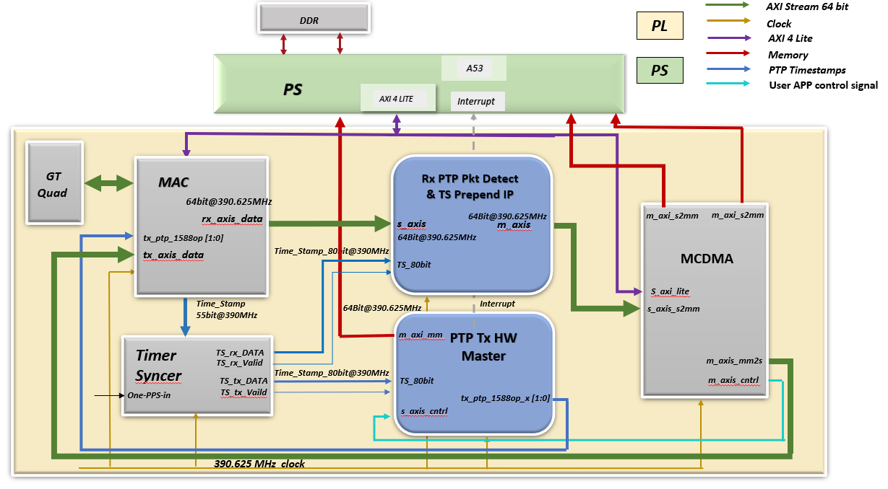
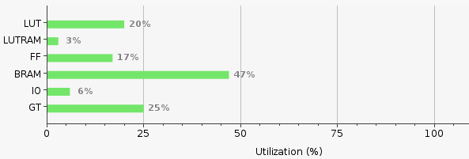

<table class="sphinxhide">
 <tr>
   <td align="center"><h1> ZCU670 Evaluation Kit Tutorial </h1>
   </td>
 </tr>
 <tr>
 <td align="center"><h1> Hardware Architecture of the Platform </h1>

 </td>
 </tr>
</table>

Hardware Architecture of the Platform
=====================================

Introduction
---------------
 This section describes the hardware architecture of the design implemented on the ZCU670 board. The following figure shows the top level hardware architecture of the reference design. The details of various components used in the platform is described in the following section.

* **Processor Subsystem (PS):**
The PS present in xzcu67dr RFSoC devices contains four high performance ARM A53 processors with 2 GB of DDR RAM access. 

* **Programmable Logic (PL):**
The hardware design for the IEEE 1588 PTP + SyncE + Ethernet subsystem majorly comprise of the following IPs:

  * XXV Media Access Control (XXV MAC) 
  
    The XXV MAC IP is configured to enable two ethernet interfaces. Each interface has AXI stream ports at the transmit and receive ends. The ethernet packets are transmitted or received via these AXI streaming ports. It has an AXI-Lite interface for accessing the control and status registers of the IP.

  * Quad Base Gigabit Transceiver Interface (GTY) 
  
    The Quad Base GT receives ethernet data from the external world and transmits it to the XXV MAC IP. It also takes the Ethernet data from XXV MAC and transmits it to the outside world. Each GT channel is capable of recovering the clock from the incoming data and the recovered clock can be used for downstream transmission of data.

  * AXI Direct Memory Access (AXI-MCDMA) 
  
    This is a standard AXI Multi Channel Direct Memory Access IP used in the PL. This facilitates the transfer of the Ethernet packets from memory to XXV MAC and from MAC to memory.

  * Tx PTP HW Master on the Transmission path to detect PTP packet and store timestamp in memory.

  * Rx PTP logic to detect PTP packets and prepend the PTP Timestamps to all received packets. 
  
The following is the packet flow for the normal Ethernet packets in both direction:

* **Transmit:**

  * Application software generate ethernet packet and passes down to transport layer where it is encapsulated as TCP or UDP segments.

  * Network layer converts this segments into IP packets and adds source and destination IPs.

  * XXV MAC in the data link layer takes these IP packets via MCDMA MM2S interface and encapsulates them into Ethernet frames and add frame check sequence for error detection.

  * The PCS/PMA in the MAC converts these ethernet frames into electrical signals.

  * GTY transceiver will serialize the data and transmit the data over the serial link.

* **Receive:**

  * GTY transceiver receives the serial data and convert the signals back into ethernet frames using PCS/PMA.
	
  * MAC checks the frames for errors using the frame check sequence and pass the packets to higher layers via MCDMA S2MM interface.
	
  * The network layer process the IP packet, checks the IP addresses, and if the packet is intended for the system, it removes the IP header and passes the segment to the transport layer. 	
  * Finally transport layer process the received segment and delivered to the appropriate application 
    
* The PL based PTP Packet processors present in the datapaths of receive and transmit direction is used to Timestamp the packets while entering and leaving the system respectively.

* Further details on the PTP Packet processors can be found in this page. [Hardware Architecture of the PTP Packet Processor](hw_arch_ptp_pkt_proc.md)

Resource Utilization
--------------------------
The resouces utilized by the IEEE 1588 PTP + Ethernet subsystem is given below.

 

**Next Steps**

* [Hardware Architecture of the PTP Packet Processor](hw_arch_ptp_pkt_proc.md)
* Go back to the [ZCU670 Ethernet TRD design start page](../platform_landing.md)

**License**

Licensed under the Apache License, Version 2.0 (the "License"); you may not use this file except in compliance with the License.

You may obtain a copy of the License at
[http://www.apache.org/licenses/LICENSE-2.0](http://www.apache.org/licenses/LICENSE-2.0)

Unless required by applicable law or agreed to in writing, software distributed under the License is distributed on an "AS IS" BASIS, WITHOUT WARRANTIES OR CONDITIONS OF ANY KIND, either express or implied. See the License for the specific language governing permissions and limitations under the License.

 Copyright © 2024 Advanced Micro Devices, Inc 

