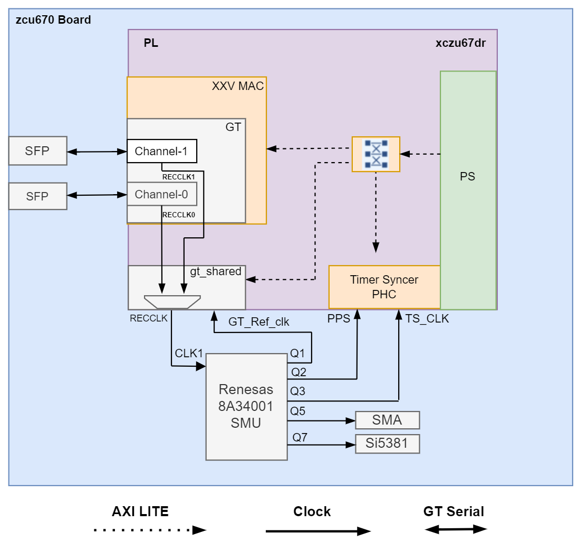

<table class="sphinxhide">
 <tr>
   <td align="center"><h1> ZCU670 Evaluation Kit Tutorial</h1>
   </td>
 </tr>
 <tr>
 <td align="center"><h1> SyncE Architecture of the Platform </h1>

 </td>
 </tr>
</table>

Synchronous Ethernet (syncE) Architecture of the Platform 
=========================================================

Introduction
-------------

Synchronous Ethernet, often referred to as syncE, is an ITU-T networking standard standard designed to synchronize physical ethernet clocks over a network to a Primary Reference Time clock (PRTC) source. SyncE is mainly used in cellular networks providing synchronization signal to network resources that requires precise timing using the traditional ethernet infrastructure. The clocking architecture used in the platform to enable SyncE solution is given in below figure. 

syncE Hardware and Software Architecture
----------------------------------------

* Renesas 8A34001 Synchronization Management unit (SMU) chip is used as a Clock Synthesizer/Jitter Cleaner for the GT_Ref_Clock, GT recovered clock, Timer syncer Clock and PPS signal.

* For SyncE to work, along with the hardware platform described in [Hardware Architecture of the platform](hw_arch_platform.md) section, the platform includes circuitry that enable the GT recovered clock generated from GT to be used as GT Ref clock for transmiting data in the downstream direction.

* The platform has two ethernet interface connected to two GT channels (channel-0 and channel-1). The recovered clock from each GT channels are connected to the MUX in GT primitive OBUF_DS_GTE3/4_ADV present in gt_shared IP. For more details refer <a href="https://docs.amd.com/v/u/en-US/ug578-ultrascale-gty-transceivers">UG578 </a>

* An AXI Lite interface connected to gt_shared IP will write to internal DRP register (001Fh) to switch recovered clock based on syncE clock management MUX control selection API.

* `synced` is a user space application runs on PS, interacts with the DPLLs in 8A34001 chip through the <a href="https://github.com/renesas/linux-ptp-driver-package"> Linux driver module package</a> to support SyncE applications.
* `synced` utility select the best clock, based on Quality Level (QL) of the clock and propogate it to the connected nodes via syncE Ethernet Synchronization Message Channel (ESMC).
 
**Next Steps**

You can choose any of the following next steps:

* Go to the [Application deployment page](app_deployment.md)
* Go back to the [ZCU670 Ethernet TRD start page](../platform_landing.md)

**License**

Licensed under the Apache License, Version 2.0 (the "License"); you may not use this file except in compliance with the License.

You may obtain a copy of the License at
[http://www.apache.org/licenses/LICENSE-2.0](http://www.apache.org/licenses/LICENSE-2.0)

Unless required by applicable law or agreed to in writing, software distributed under the License is distributed on an "AS IS" BASIS, WITHOUT WARRANTIES OR CONDITIONS OF ANY KIND, either express or implied. See the License for the specific language governing permissions and limitations under the License.

 Copyright © 2024 Advanced Micro Devices, Inc 

